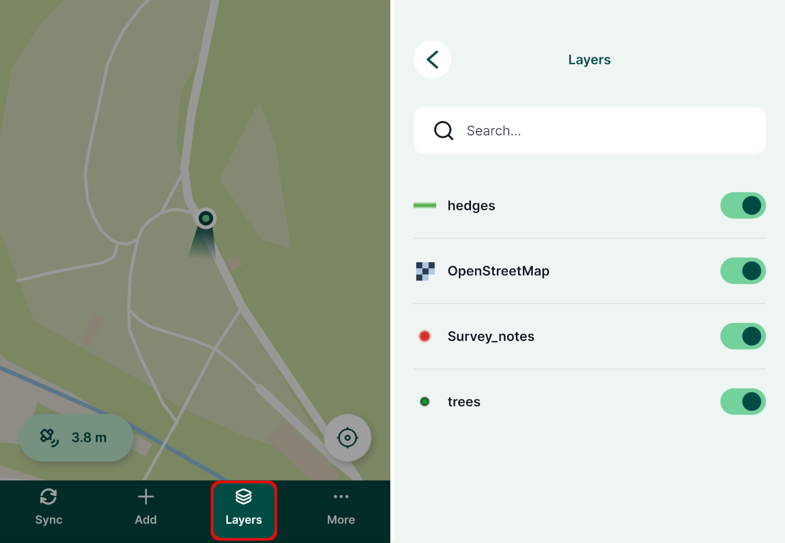

# Searching for Values in Attribute Fields
[[toc]]

In <MobileAppName />, you can search for the content of fields in spatial layers and non-spatial tables, as well as searching values from multiple fields.

## Setting identifiable layers in QGIS project
To be able to browse the attributes of a layer, it needs to be set as *Identifiable* in your <QGISHelp ver="3.22" link="user_manual/introduction/qgis_configuration.html?highlight=properties#data-sources-properties" text="QGIS project" />.

1. Open your QGIS project
2. In the Menu > Project > Properties click on **Data Sources**
3. Check and uncheck layers in the **Identifiable** column to define which layers you want to be able to browse in your project.

:::warning
If you define a layer as **not identifiable**, you won't be able to tap it in <MobileAppName /> or use the **Identify tool** in QGIS to see its attribute form.
:::

## Exclude a field from the search
By default, all attributes are searchable. You can exclude a field from the search in the **Layer properties**. 
1. Navigate to the **Fields** tab
2. Check the **Not searchable** option in the **Configuration** column

:::warning
If a field is marked in a field configuration as **Not searchable**, it will be omitted from the search. There will be no search results, even if you search for a specific existing value of this field.
:::

## Searching for values in Mergin Maps mobile app
Attribute data can be browsed in <MobileAppName /> by tapping **Layers**. 

In the **Layers** window, choose a layer or a table from the list to open the attribute table.

Here, you can browse the features. The search bar can be used to shortlist matching records. 

Tap on the record to zoom to the feature on the map and display its form.

:::tip
The search looks up for a match in all searchable attributes values and is not case sensitive.
:::

