# Sorting and Search Setup
[[toc]]

There are some settings related to sorting, searching and browsing features in <MobileAppName />  that can be done in the QGIS project, such as define the order of features and values or include/exclude layers and fields from the search.

Working with layers in the <MobileAppNameShort />, including browsing features and values, is described in [Layers in <MobileAppName />](../../field/layers/).

## Sorting features and value list
The <MobileAppNameShort /> follows the sorting of features in the attribute table and of values in the value relation widget as set in the QGIS project.

###  Order value list by value
The [Value relation](../../layer/form-widgets/#value-relation) widget has the option *Order by value*. When checked, values in the drop-down list will be listed in alphabetical or numerical order. 

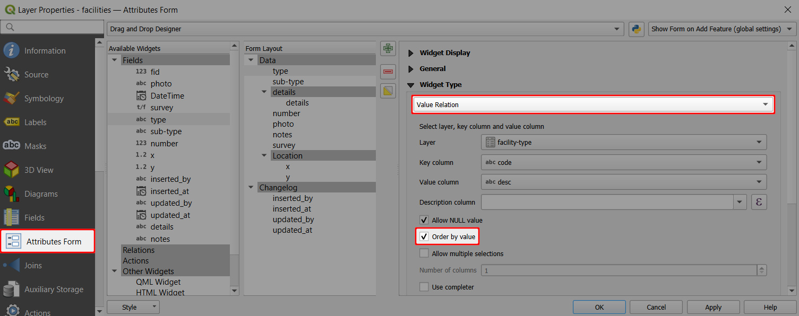

This setting is also followed by the <MobileAppNameShort />. 

On the left, you can see the default list of options in the drop-down menu. On the right, the option *Order by value* is used and observed by the <MobileAppNameShort />.
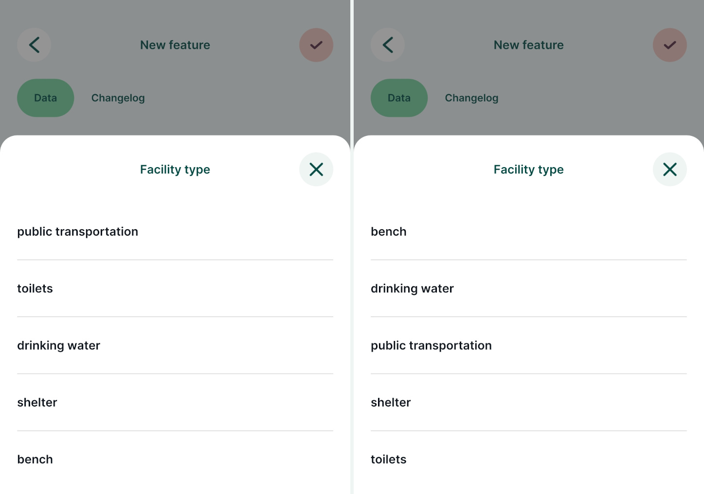

###  Sorting features by field value
By default, the <MobileAppNameShort /> orders features in a layer based on their `Feature ID`. The order of features can be defined in the Attribute table in QGIS.

Simple sorting based on ascending or descending value of the attributes can be used:

1. Open your project in QGIS
2. Right-click on a survey layer and open the **Attribute table**
3. In the **Attribute table**, click on the name of a field to sort the features according to the field values.
   Here, we use the `update_at` field to sort features by the last update. The feature that was updated last will be the first in the list.
   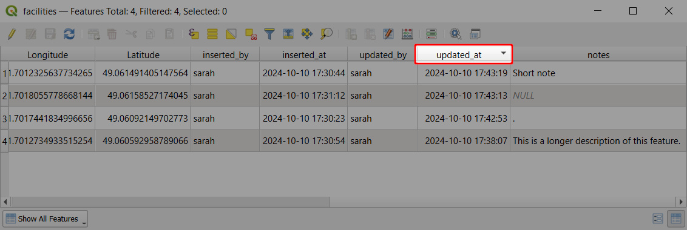
4. Save and synchronise the project.

In the <MobileAppNameShort />, features in a layer can be browsed by tapping the **Layers** button and selecting the layer from the list.
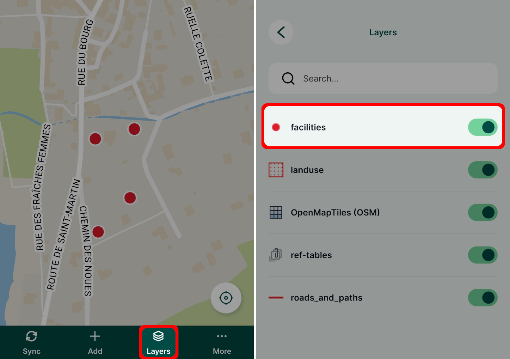

Features in this layer are sorted by the same field value as was defined in the QGIS project. So, instead of the default sorting by the `Feature ID`, the features are ordered by the date and time of their last update.
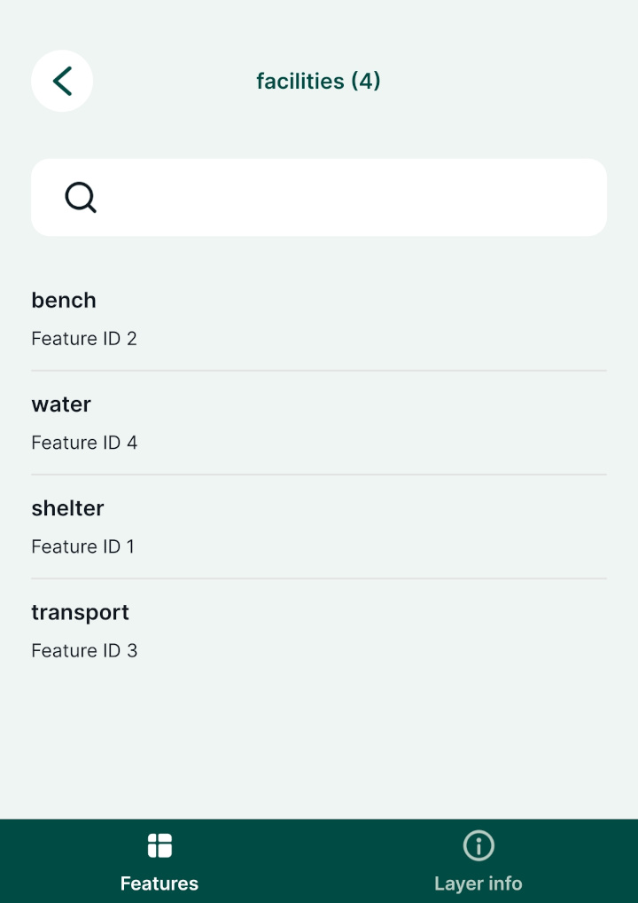

###  Sorting features by expression
Similarly, an expression can be used to sort features in the Attribute table and subsequently in the <MobileAppNameShort />.

1. Open your project in QGIS
2. Right-click on a survey layer and open the **Attribute table**
3. Right-click on a field name that you want to use for sorting features and use the **Sort...** option
   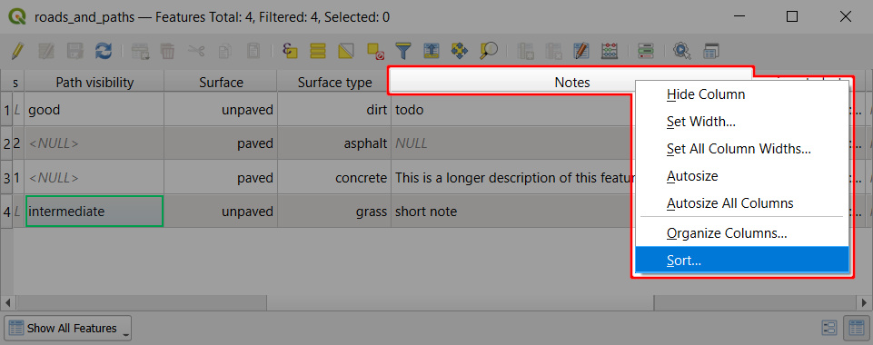
4. Enter the expression you want to use to sort this field.
   Here, we use `length( "notes" )` to sort features based on the length of the text in the `notes` field.
   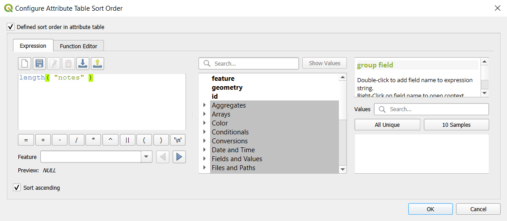
   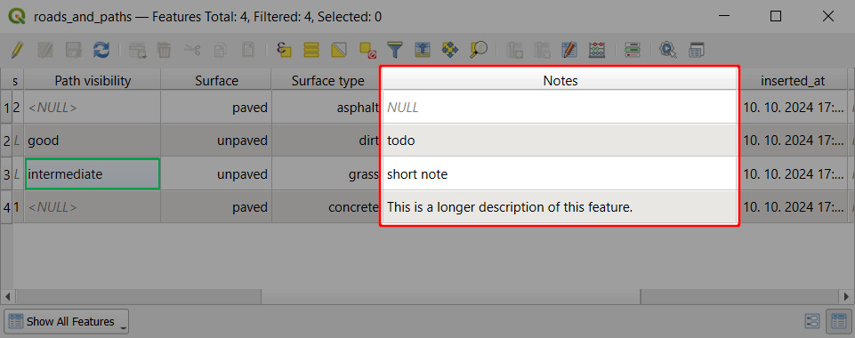
5. Save and synchronise the project.

When browsing features in the <MobileAppNameShort />, they will be sorted by the text length.
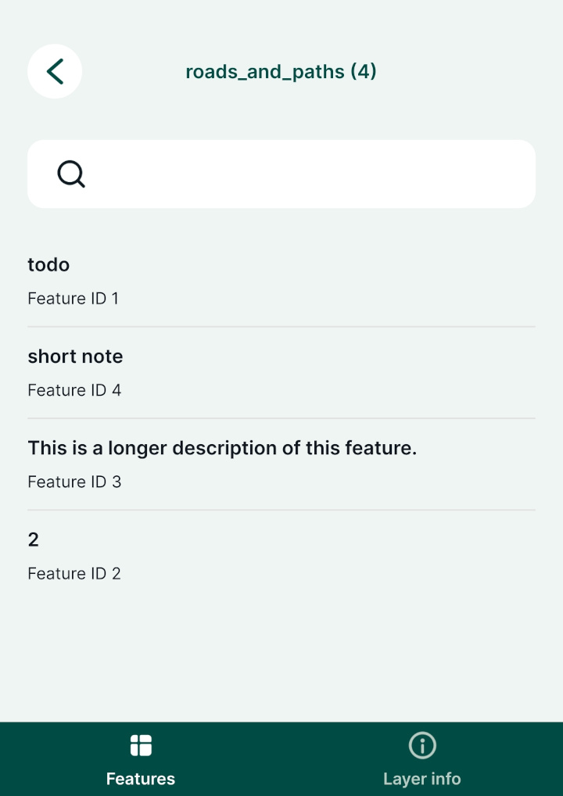

## Setting identifiable layers in QGIS project
To be able to browse the attributes of a layer, it needs be *Identifiable* in your <QGISHelp ver="latest" link="user_manual/introduction/qgis_configuration.html?highlight=properties#data-sources-properties" text="QGIS project" />. Layers are *identifiable* by default.

If you define a layer as **not identifiable**, you won't be able to tap it in the <MobileAppNameShort /> or use the **Identify tool** in QGIS to see its attribute form. This may be useful for layers that are only used as background layers.

1. Open your QGIS project
2. In the Menu > Project > Properties click on **Data Sources**
3. Check and uncheck layers in the **Identifiable** column to define which layers you want to be able to browse in your project.

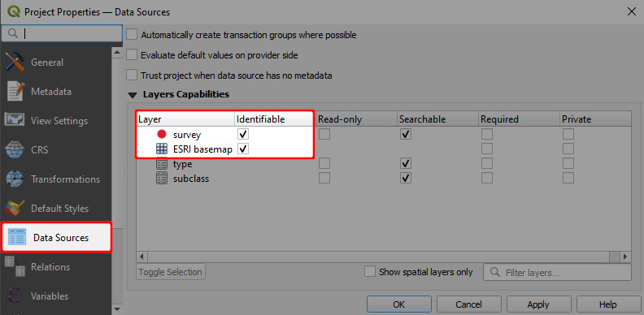

## Exclude a field from the search
By default, all attributes are searchable. You can exclude a field from the search in the **Layer properties**. 

If a field is marked in a field configuration as **Not searchable**, it will be omitted from the search. There will be no search results, even if you search for a specific existing value of this field.

1. Navigate to the **Fields** tab
2. Check the **Not searchable** option in the **Configuration** column
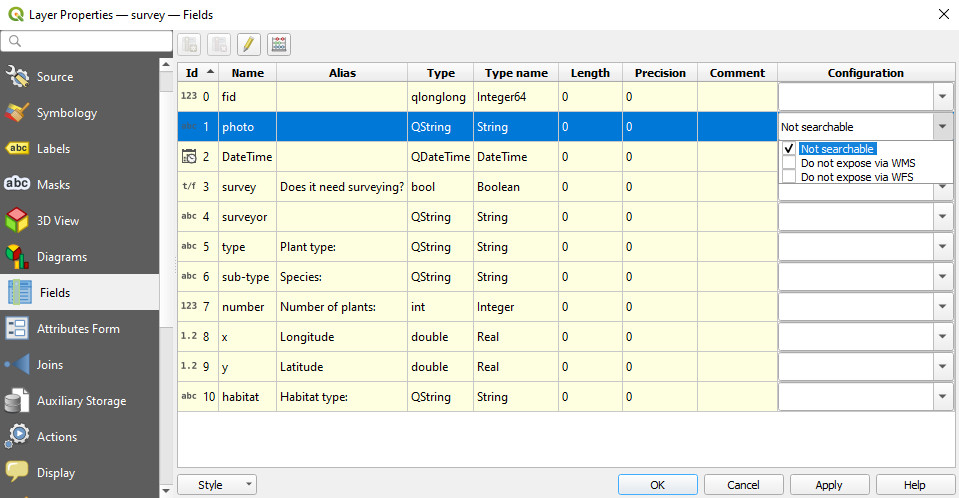

