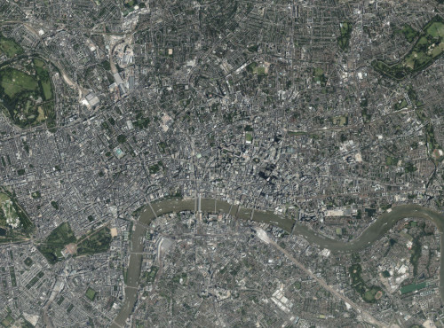
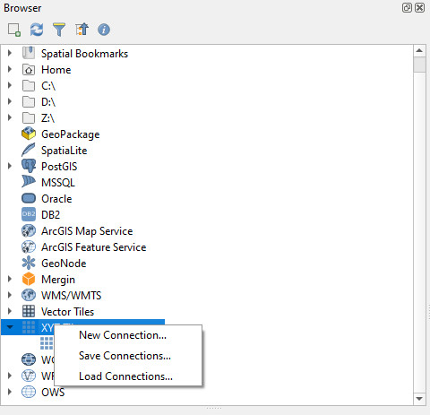
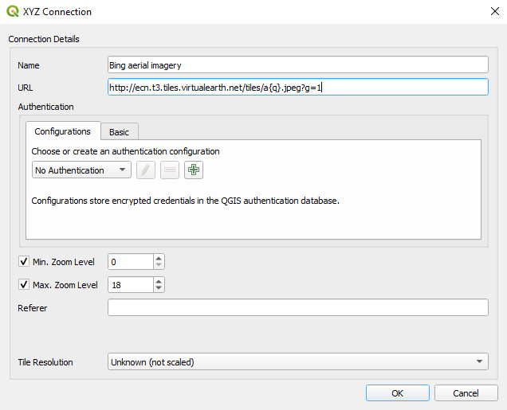
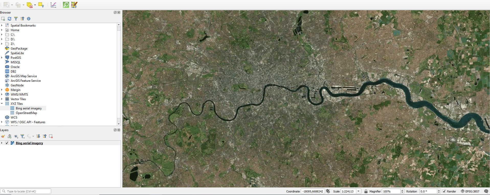
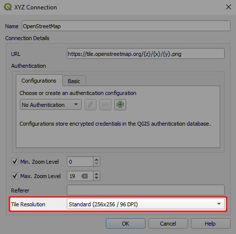
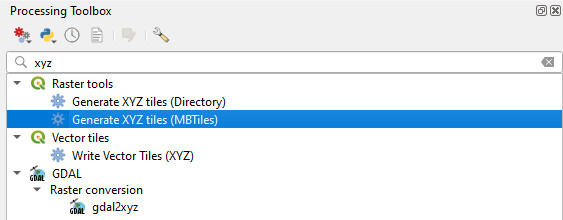
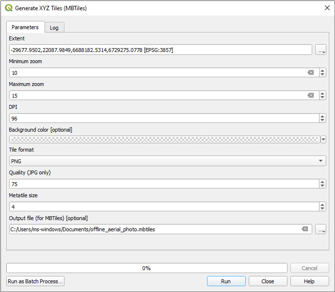
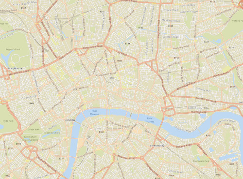
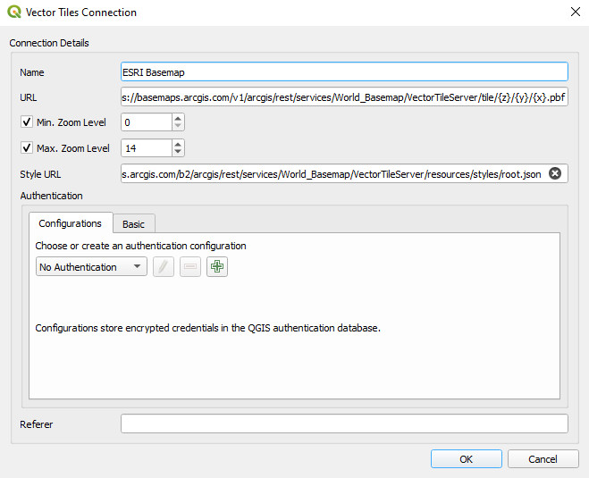
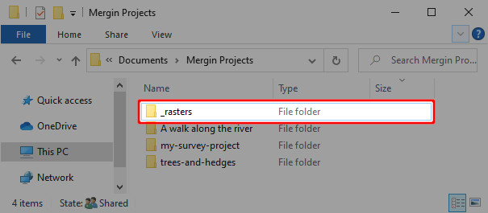

# Background Maps
[[toc]]

When surveying in the field, it is essential to have appropriate background maps. There are several sources of online and offline background maps you can use in your QGIS project. Note that you need to comply with the terms of use of the background maps and their data sources. This page simply explains how to add the data to your QGIS maps and use it in <MainPlatformNameLink />. It is the sole responsibility of the end user to comply with such terms and conditions.

The following sections will cover two types of background maps for online and offline use in <MobileAppName />: raster and vector tiles.

## Raster tiles 
Raster tiles are ideal for aerial imagery or terrain visualisations. They can be large in size and can appear pixelated when zoomed in.

### Online services
QGIS comes by default with the <QGISHelp ver="3.22" link="user_manual/managing_data_source/opening_data.html?highlight=xyz#using-xyz-tile-services" text="OpenStreetMap online services for XYZ tiles" />. When adding a cartographic basemap, ensure you set the tile size correctly, so that the texts and labels are readable on mobile devices with high resolution display.

You can also add [other sources](https://gis.stackexchange.com/questions/20191/adding-basemaps-from-google-or-bing-in-qgis/217670#217670) of XYZ tiles to your QGIS.

To add Bing aerial imagery to your QGIS project:
1. In QGIS, navigate to the **XYZ Tiles** in the **Browser** panel
2. Right-click on **XYZ Tiles** and select **New Connection**
   

3. Set the parameters of the **XYZ connection**:
  - **Name**: *Bing aerial imagery*
  - **URL**: `http://ecn.t3.tiles.virtualearth.net/tiles/a{q}.jpeg?g=1`
  Press **OK**.
    

Now, the **XYZ Tiles** in the **Browser** panel should contain the *Bing aerial imagery*. Double click on it to add it to your project and zoom to your area of interest.

::: tip
When using XYZ tiles that contain labels, ensure to set the tile resolution to *Standard* in the connection settings. This will ensure the fonts are readable on the high resolution screens (the majority of the recent smartphones comes with high DPI screens).
:::

### Generating raster tiles for offline use

QGIS also offers a <QGISHelp ver="3.22" link="user_manual/processing_algs/qgis/rastertools.html" text="processing algorithm" /> to generate [your own XYZ tiles](https://ocw.un-ihe.org/mod/book/tool/print/index.php?id=5497&chapterid=491) for offline use.

Make sure that you:
- added the *Bing aerial imagery* to the QGIS project
- zoomed to your area of interest

To generate an offline copy of the aerial imagery from your map view extent:
1. In QGIS, select **Processing** > **Toolbox** from the main menu. The **Processing** panel will appear on the right side of QGIS window.
2. In the search section on the top of the **Processing** panel, type *xyz* to display relevant tools.
3. In **Raster tools**, double-click on **Generate XYZ tiles (MBTiles)**
   

4. Set the parameters of **Generate XYZ tiles (MBTiles)** tool:
   - **Extent**: click on the right-side drop-down menu and select **Use Map Canvas Extent**
   - **Minimum zoom**: 10
   - **Maximum zoom**: 15
   - **Output file (for MBTiles)**: click on the right side drop-down menu and select **Save to file**. Browse to the folder where you want to save the MBTiles and name the file. 
   Here: `offline_aerial_photo.mbtiles`
   - Click **Run**
   

:::warning
Depending on the size of your study area and the zoom level, the output file can be very large. See how to [work with large files](#how-to-work-with-very-large-files-android) in <MobileAppName />.
:::

## Vector tiles
Vector tiles are a better alternative for cartographic maps as background data. They are smaller in size, have flexible styling and your maps will not be pixelated even when zoomed in. 

### Online services

There are several online services. For example, we can add *ESRI Basemap* vector tile (QGIS 3.16+):
1. In QGIS, navigate to the **Vector Tiles** in the **Browser** panel
2. Right-click on **Vector Tiles** and select **New Generic Connection**
3. Set the parameters of the **Vector Tiles connection**:
   - **Name**: *ESRI Basemap*
   - **URL**: `https://basemaps.arcgis.com/v1/arcgis/rest/services/World_Basemap/VectorTileServer/tile/{z}/{y}/{x}.pbf`
   - **Min. Zoom Level**: 0
   - **Max. Zoom Level**: 14
   - **Style URL**: `https://basemaps.arcgis.com/b2/arcgis/rest/services/World_Basemap/VectorTileServer/resources/styles/root.json`
   Press **OK**.
   

Another source of online vector tiles are *Qwant maps*. Use following parameters to set the **Vector Tiles connection**:
   - **Name**: *Qwant map*
   - **URL**: `https://www.qwant.com/maps/tiles/ozbasemap/{z}/{x}/{y}.pbf`
   - **Min. Zoom Level**: 0
   - **Max. Zoom Level**: 14
   - **Style URL**: `https://raw.githubusercontent.com/QwantResearch/qwant-basic-gl-style/master/style.json`

### Generating vector tiles for offline use
In QGIS (3.14+), you can generate your own vector tiles.

::: details Generate vector tiles using OpenMapTiles and Docker (advanced)
In the example below, we walk through steps to generate a vector tile using OpenMapTiles for [Limpopo](https://www.openstreetmap.org/relation/349547#map=7/-24.367/29.982).

Note that instructions below require familiarity with the terminal. In addition, your operating system should support **docker**.
  - Clone the OpenMapTiles repository: `git clone git@github.com:openmaptiles/openmaptiles.git`
  - Download osm.pbf file for the country or region where your area falls in from [here](https://download.geofabrik.de/).
  - Search for your area of interest and find the OSM relation ID (from [here](https://nominatim.openstreetmap.org/) using method described <GitHubRepo id="JamesChevalier/cities" desc="here" /> or alternatively download it <GitHubRepo id="JamesChevalier/" desc="from this git repository" /> if available).
  - Clip the *osm.pbf* downloaded in step 2 using the poly downloaded in step 3:
  `osmconvert south-africa.osm.pbf -B=limpopo.poly --complete-ways --complete-multipolygons -o=my.osm.pbf`
  - Place *my.osm.pbf* under *openmaptiles/data/*
  - Run `./quickstart.sh my` from *openmaptiles/* folder (where you cloned your repository): this will generate the tiles with the default settings (i.e. low zoom level of max=7)
  - Edit openmaptiles/data/my.dc-config.yml and change the Max_Zoom to 14
  - Re-run `./quickstart.sh my`
  - The above process should produce an MBTiles for your clipped OSM file
  - You can load the file and style it using one of the <GitHubRepo id="openmaptiles/osm-bright-gl-style" desc="OpenMapTiles styles" />
:::

## How to work with very large files (Android)
<Badge text="Android only" type="warning"/>

Raster and vector tiles generated for offline use can be relatively large files, especially when using high resolution data or a large area of interest. It may be impractical to synchronise these large files through <MainPlatformNameLink /> or to have duplicate copies if they are used in multiple projects.

:::tip
If you do not need to use your background maps offline, consider creating a WMS or WMTS server for online use.
:::

QGIS uses relative paths to load the data. If your <MainPlatformName /> project refers to files located in another folder, this project can be loaded just fine on another computer or in <MobileAppName /> - if the folder with the files can be found in its expected location.

1. On your computer, create a folder that will contain the large datasets (here: `_rasters`). It should be located in the same directory as your <MainPlatformName /> projects.
   
2. Open your <MainPlatformName /> project in QGIS. Load the files from the `_rasters` folder to the project. Save and sync.

3. Connect your mobile device to the computer and copy the `_rasters` folder to the app's project folder `Internal storage/Android/data/uk.co.lutraconsulting/files/projects`. 

   See [Manual data transfer (Android)](../manage/missing-data/#manual-data-transfer-android) for detailed steps.
   
4. Use the project in <MobileAppName /> as usual. 

:::tip
Files from the folder can be loaded into multiple <MainPlatformName /> projects.
:::

:::warning
Files located in the another folder are not synchronised. This saves your storage on <MainPlatformNameLink /> cloud. However, if you want to update or modify these files, you have to connect the mobile device to your computer and do it manually.
:::
