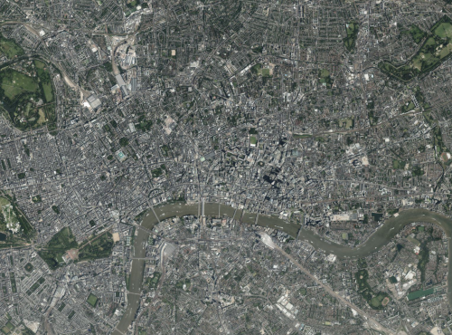
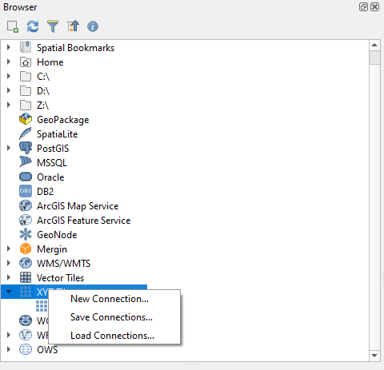
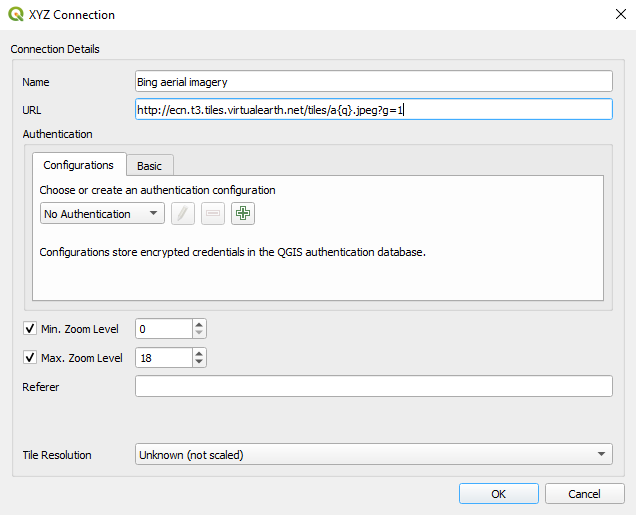
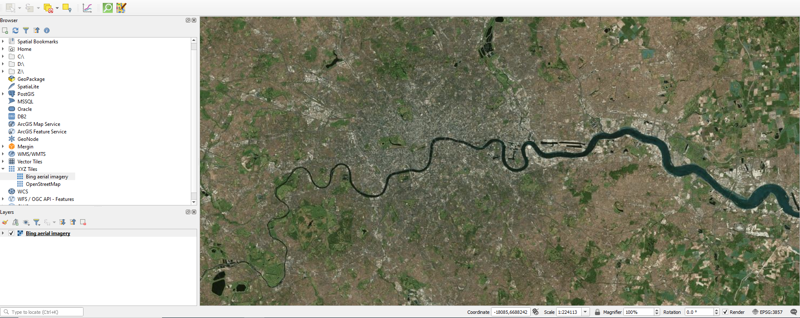
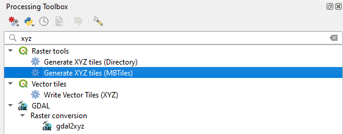
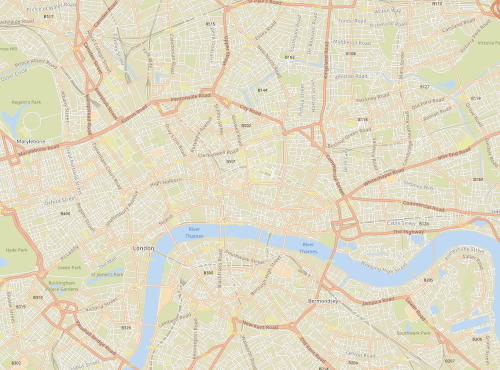
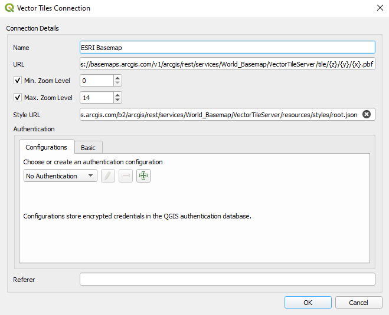

# Background Maps

When surveying in the field, it is essential to have appropriate background maps. There are several sources of online and offline background maps you can use in your QGIS project. Note that you need to comply with the terms of use of the background maps and their data sources. This page simply explains how to add the data to your QGIS maps and use it in Input. It will be the sole responsibility of the end user to comply with such terms and conditions.

The following sections will cover two types of background maps for online and offline use in Input:

## Raster tiles 

::: tip
Ideal for aerial imagery and orthophoto.
:::

Raster tiles can be large in size but an ideal format for aerial imagery.

### Online services

QGIS comes by default with the <QGISHelp ver="3.10" link="user_manual/managing_data_source/opening_data.html?highlight=xyz#using-xyz-tile-services" text="OpenStreetMap online services for XYZ tiles" />. When adding cartographic basemap, ensure you set the tile size correctly, so that the texts and labels are readable on mobile devices with high resolution display.

You can also add [other sources](https://gis.stackexchange.com/questions/20191/adding-basemaps-from-google-or-bing-in-qgis/217670#217670) of XYZ tiles to your QGIS.

To add Bing aerial imagery to your QGIS:

- Open QGIS
- From the Browser panel, right-click on **XYZ Tiles** and select **New Connection ...**
- A new window will appear:
  - For **Name** type **Bing aerial imagery**
  - For **URL** type *<NoSpellcheck id="http://ecn.t3.tiles.virtualearth.net/tiles/a{q}.jpeg?g=1" />*
  - Press OK

**Bing aerial imagery** should appear under your **XYZ Tiles**:
- From the **Browser panel**, double click on **Bing aerial imagery** under **XYZ Tiles**
- Zoom to the extent of your study area

### Generating raster tiles

QGIS also offers a <QGISHelp ver="3.10" link="user_manual/processing_algs/qgis/rastertools.html" text="processing algorithm" /> to generate [your own XYZ tiles](https://ocw.un-ihe.org/mod/book/tool/print/index.php?id=5497&chapterid=491) for offline use.

To generate a raster tile covering the aerial photography of your survey area:

  - Add the Bing aerial imagery link added above
  - Zoom to your study extent

To generate an offline copy of the aerial imagery from your map view extent:

  - In QGIS, from the main menu, select **Processing** > **Toolbox**
  - A new panel should appear on the right side of your QGIS
  - In the search section on the top of the **Processing** panel, type **xyz**
  - Under **Raster**, double-click on **Generate XYZ tiles (MBTiles)**
  - A new window will appear:
    - For **Extent**, click on the right-side drop-down menu and select **Use Map Canvas Extent**
    - For **Minimum zoom**, type **10**
    - For **Maximum zoom**, type **15**
    - For **Output file (for MBTiles)**, click on the right side drop-down menu and select **Save to file**
    - Browse the folder where you want to save **offline_aerial_photo.mbtiles**
    - Click **Run**

Notes:
  - Depending on the size of your study area, the output file can grow significantly
  - Choosing higher zoom level (in the example above, **15** was selected) can result in a very large file

## Vector tiles

::: tip
Ideal for cartography basemaps. 
:::

Vector tiles are a better alternative for cartography maps as background data. It is lighter in size, flexible styling and your maps are not pixelated.

### Online services

There are several online services. For example you can add ESRI Basemap vector tile (QGIS 3.16+):

- In QGIS, from the **Browser panel** right-click on **Vector Tiles**
- Select **New Generic Connection**
- A new window will appear:
    - For **Name** type: **ESRI Basemap**
    - For **URL** type: **<NoSpellcheck id="https://basemaps.arcgis.com/v1/arcgis/rest/services/World_Basemap/VectorTileServer/tile/{z}/{y}/{x}.pbf" />**
    - Set **Min. Zoom Level** to **0**
    - Set **Max. Zoom Level** to **14**
    - For **Style URL** type: **<NoSpellcheck id="https://basemaps.arcgis.com/b2/arcgis/rest/services/World_Basemap/VectorTileServer/resources/styles/root.json" />**

Another source of online vector tiles are Qwant maps:
- In QGIS, from the **Browser panel** right-click on **Vector Tiles**
- Select **New Generic Connection**
- A new window will appear:
    - For **Name** type: **Qwant map**
    - For **URL** type: **<NoSpellcheck id="https://www.qwant.com/maps/tiles/ozbasemap/{z}/{x}/{y}.pbf" />**
    - Set **Min. Zoom Level** to **0**
    - Set **Max. Zoom Level** to **14**
    - For **Style URL** type: **<NoSpellcheck id="https://raw.githubusercontent.com/QwantResearch/qwant-basic-gl-style/master/style.json" />**

### Generating vector tiles for offline use
In QGIS (3.14+), you can generate your own vector tiles. Alternatively, you can generate vector tiles using OpenMapTiles from OpenStreetMap data.

In the example below, we walk through steps to generate a vector tile using OpenMapTiles for [Limpopo](https://www.openstreetmap.org/relation/349547#map=7/-24.367/29.982).

Note that instructions below requires familiarity with terminal. In addition your operating system should support **docker**.

  - Clone the OpenMapTiles repository: `git clone git@github.com:openmaptiles/openmaptiles.git`

  - Download osm.pbf file for the country or region where your area falls in from [here](https://download.geofabrik.de/).

  - Search for your area of interest and find the OSM relation ID (from [here](https://nominatim.openstreetmap.org/) using method described <GitHubRepo id="JamesChevalier/cities" desc="here" /> or alternatively download it <GitHubRepo id="JamesChevalier/" desc="from this git repository" /> if available).

  - Clip the *osm.pbf* downloaded in step 2 using the poly downloaded in step 3:

  `osmconvert south-africa.osm.pbf -B=limpopo.poly --complete-ways --complete-multipolygons -o=my.osm.pbf`

  - Place *my.osm.pbf* under *openmaptiles/data/*

  - Run `./quickstart.sh my` from *openmaptiles/* folder (where you cloned your repository): this will generate the tiles with the default settings (i.e. low zoom level of max=7)

  - Edit openmaptiles/data/my.dc-config.yml and change the Max_Zoom to 14

  - Re-run `./quickstart.sh my`

  - The above process should produce an MBTiles for your clipped OSM file

  - You can load the file and style it using one of the <GitHubRepo id="openmaptiles/osm-bright-gl-style" desc="OpenMapTiles styles" />
