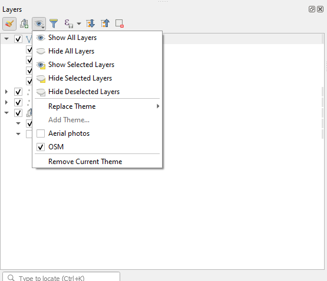
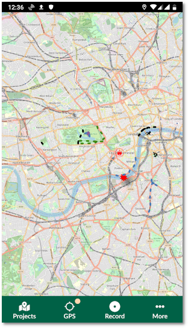
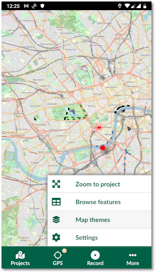
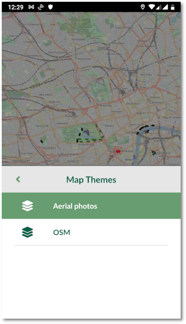
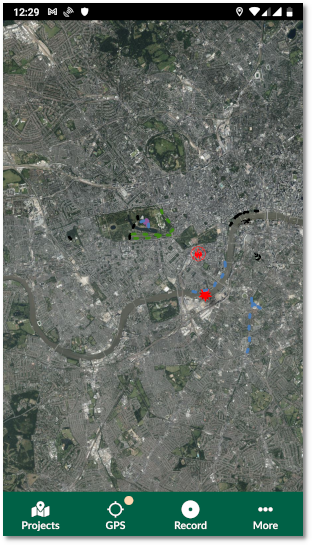

# Map Themes

In Input, you can use different **map themes**. This is ideal for switching between different background maps (e.g. cartography map and aerial photography). The map themes should be first set up in QGIS.

# Setting up QGIS map themes

Read how to <QGISHelp ver="3.22" link="user_manual/introduction/general_tools.html#configuring-map-themes" text="set up a new map theme" /> in QGIS.

- Open QGIS Desktop with you QGIS Project 
- In the Layers Panel, click on "Manage Map Themes" (eye-icon)

- Add new themes or replace existing themes.

# Map themes in Mergin Maps Input
To access the Map Themes in Input, select **More** > **Map themes**. The list of the Map Themes should appear as a pop up.

