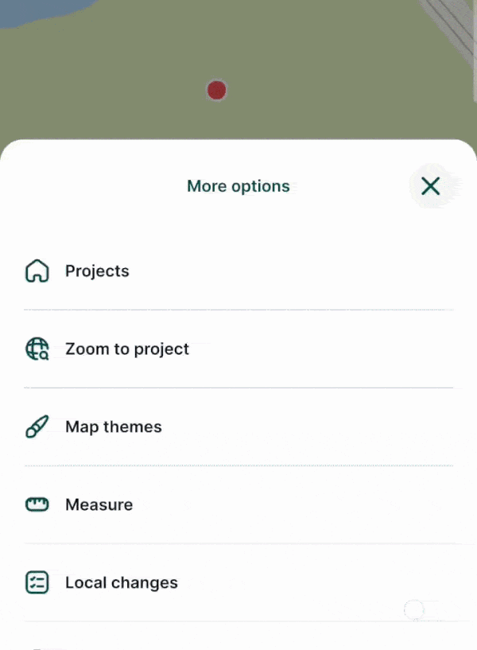
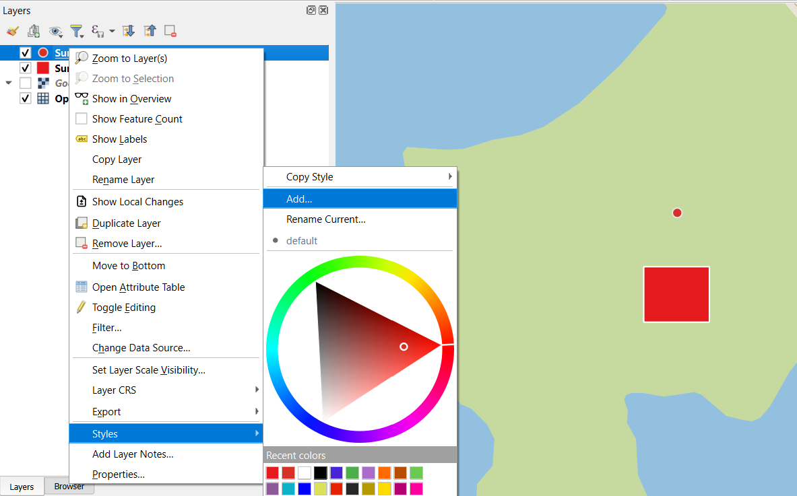
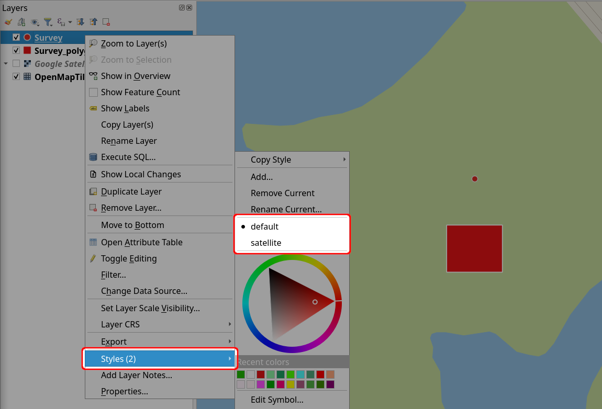
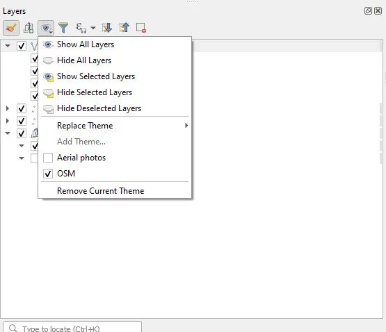
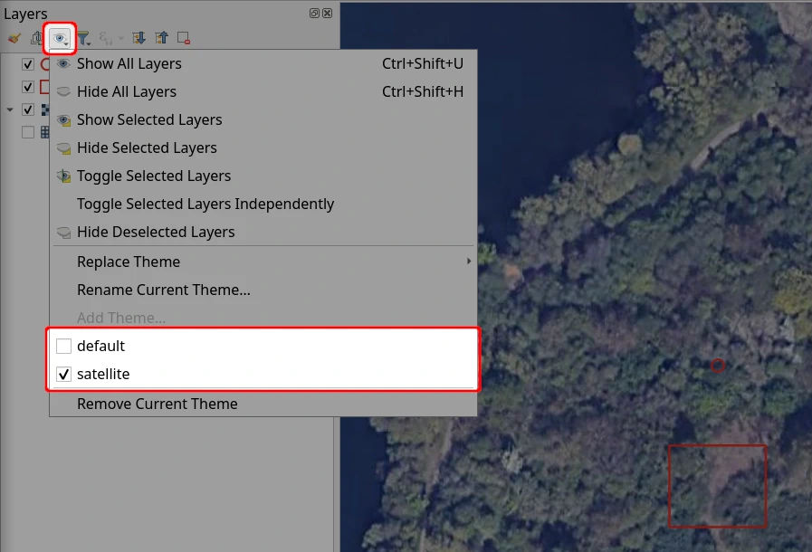
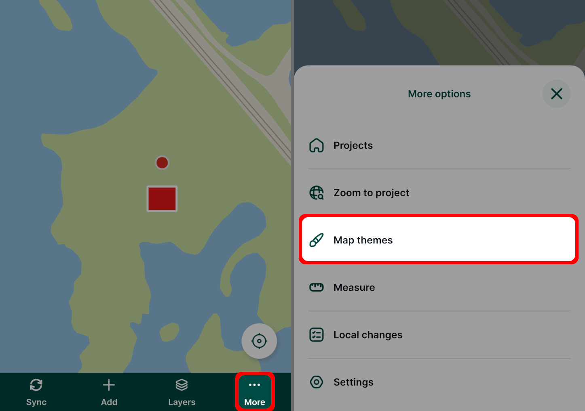
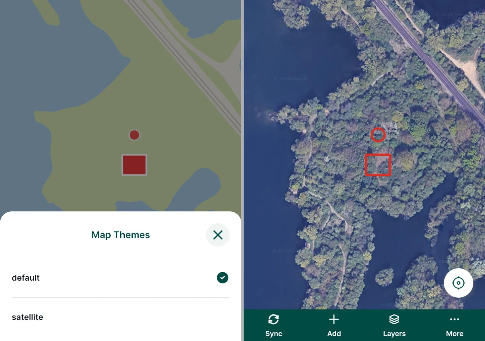

# Map Themes
[[toc]]

In QGIS, you can define different **map themes** for your project to easily switch between different background maps, combinations of visible layers or their styles, and use them in your <MainPlatformName /> project in the <MobileAppNameShort />.

:::tip Example project available
Download or clone our public project <MerginMapsProject id="documentation/map-themes" /> to see how this setup works.
:::

## Setting up styles and map themes in QGIS
Here, we will define different symbology for survey layers depending on the displayed background map using styles. Then we will set up [map themes](#map-themes-1) so that we can switch between the basic and the satellite background maps along with the corresponding layers' styles. 

Note that you can use the [map themes](#map-themes-1) without defining custom styles for layers, simply to switch between different combinations of visible layers.

You can read more about <QGISHelp ver="latest" link="user_manual/introduction/general_tools.html#managing-custom-styles" text="styles" /> and <QGISHelp ver="latest" link="user_manual/introduction/general_tools.html#configuring-map-themes" text="map themes" /> in the QGIS documentation.

### Custom layers style

:::warning Styles store also attributes forms
Note that a style includes more than symbology: the style also stores labels, attributes form, display and other properties of a layer. The complete list can be found in <QGISHelp ver="latest" link="user_manual/introduction/general_tools.html#managing-custom-styles" text="QGIS documentation" />.

This means that you can have different attributes form setup for various styles of the same survey layer. However, this can also mean that there may be discrepancies in input data, say if these forms use different [widgets](../../layer/form-widgets/) or [default values](../../layer/default-values/) for the same fields.

Therefore we recommend setting up styles after configuring the [attributes form](../../layer/overview/).
:::

First, define the symbology (or other properties) for your survey layers. This will be stored as the *default* style that each layer has by default. 

Here we have a point layer `Survey` and a polygon layer `Survey_polygons` that use simple symbols with a non-transparent fill so that they are clearly visible on the basic background map.

Now we will define a new style named *satellite* for survey layers:
1. Right-click on a survey layer and select **Styles** > **Add...**
   
2. Enter the name of the style, here: `satellite`
3. Define the symbology of a feature (or other properties) for the new style.
   
   Here we use a transparent fill so that the outline of a feature is visible on to the satellite background map.

Repeat these steps for each survey layer that should have different styles. One layer can have multiple styles.

Now you can easily switch between the *default* and *satellite* style by right-clicking the survey layer:
  

### Map themes
A map theme records the visibility of layers and their styles.

To define the *default* theme:
1. In the **Layers** panel, make sure that:
   - the survey layers are set to the *default* styles (optional)
   - the survey layers and the basic background map are displayed (hide the satellite background map or other layers)
2. Use the **Manage map themes** button to **Add Theme...**.

   This theme will be named *default*.

   
For the *satellite* theme:
1. In the **Layers** panel, make sure that:
   - the survey layers are set to the *satellite* styles (optional)
   - the survey layers and the satellite background map are displayed (hide the basic background map or other layers)
2. Use the **Manage map themes** button to **Add Theme...** and name this theme *satellite*

Themes can be easily switched using the **Manage map themes** button.

Don't forget to save and synchronise the project.

:::tip Using themes in QGIS
In QGIS, themes can be renamed, removed or replaced using the **Manage map themes** button.

To modify an existing theme, make the desired changes in the **Layers** panel and use the **Replace theme** option.
:::

## Map themes in Mergin Maps mobile app
In the <MobileAppNameShort />, tap **More** and select the **Map themes** option.

Now you will see the map themes that are available in your project. To switch the map theme, tap on it.

Here, we switched from *default* to *satellite*. 

It may be useful to define a *default* map theme for your project. Then, If you change the visibility of layers through the [**Layers**](../../field/layers/) option in the <MobileAppNameShort /> during the survey, you can use this map theme to get back to the default setup.
