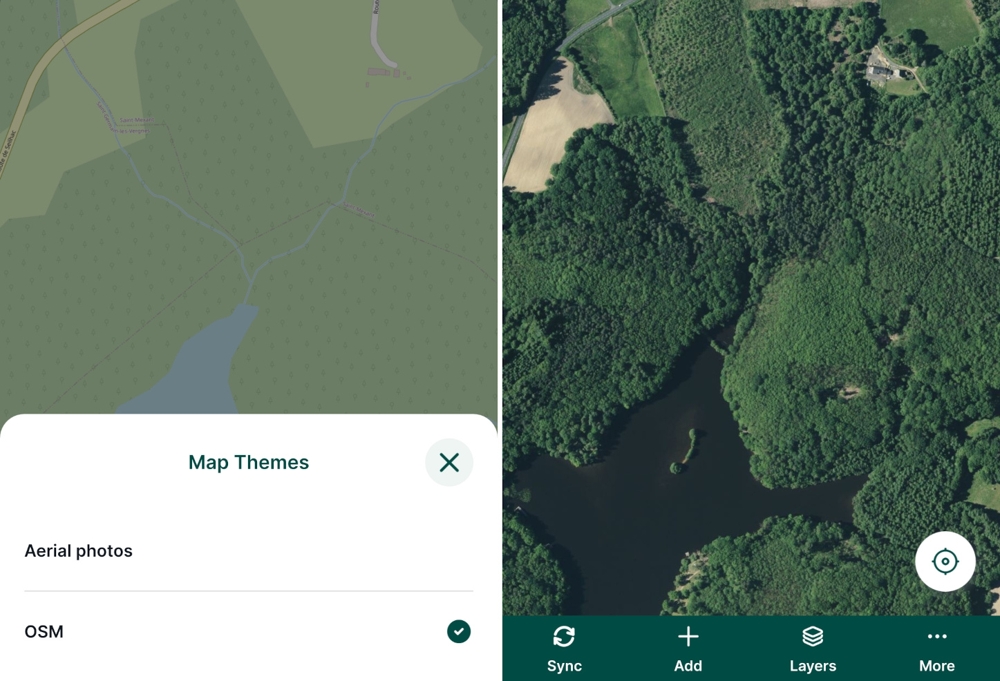

# Map Themes
[[toc]]

In <MobileAppName />, you can use different **map themes**. This is ideal for switching between different background maps (e.g. cartography map and aerial photography), combinations of visible layers or their styles. The map themes should be first set up in QGIS.

## Setting up QGIS map themes

Read how to <QGISHelp ver="latest" link="user_manual/introduction/general_tools.html#configuring-map-themes" text="set up a new map theme" /> in QGIS.

- Open QGIS Desktop with your QGIS Project
- Define the visibility and/or styles of the layers in your project
- In the Layers Panel, click on "Manage Map Themes" (eye-icon) and add a new theme (or replace an existing one)

Here, we created two themes: `OSM` and `Aerial photos` to easily switch between two types of background maps.

## Map themes in Mergin Maps mobile app
In the <MobileAppNameShort />, tap **More** and select the **Map themes** option.

Now you will see the list of map themes that are available in your project. To switch the map theme, tap on it.

Here, we switched from `OSM` to `Aerial photos`. 

It may be useful to define a *default* map theme for your project. Then, If you change the visibility of layers through the [**Layers**](../../field/layers/) option in the <MobileAppNameShort /> during the survey, you can use this map theme to get back to the default setup.
