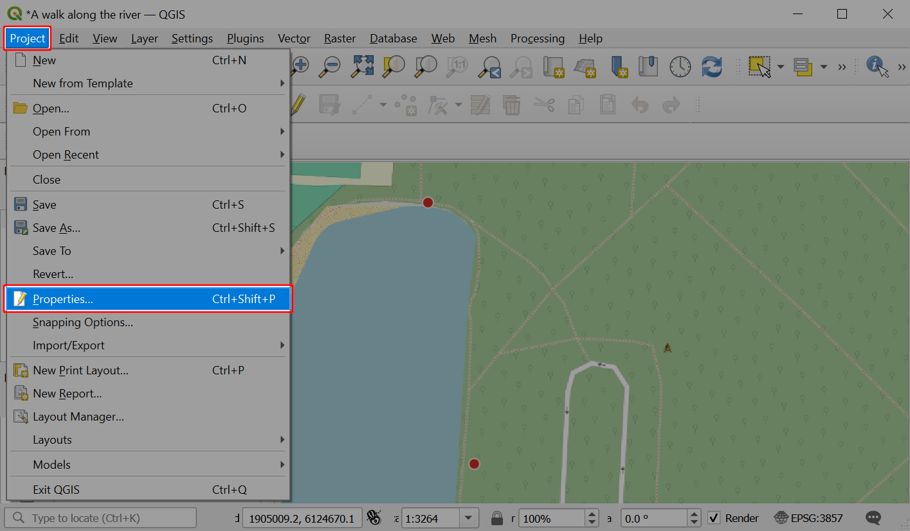
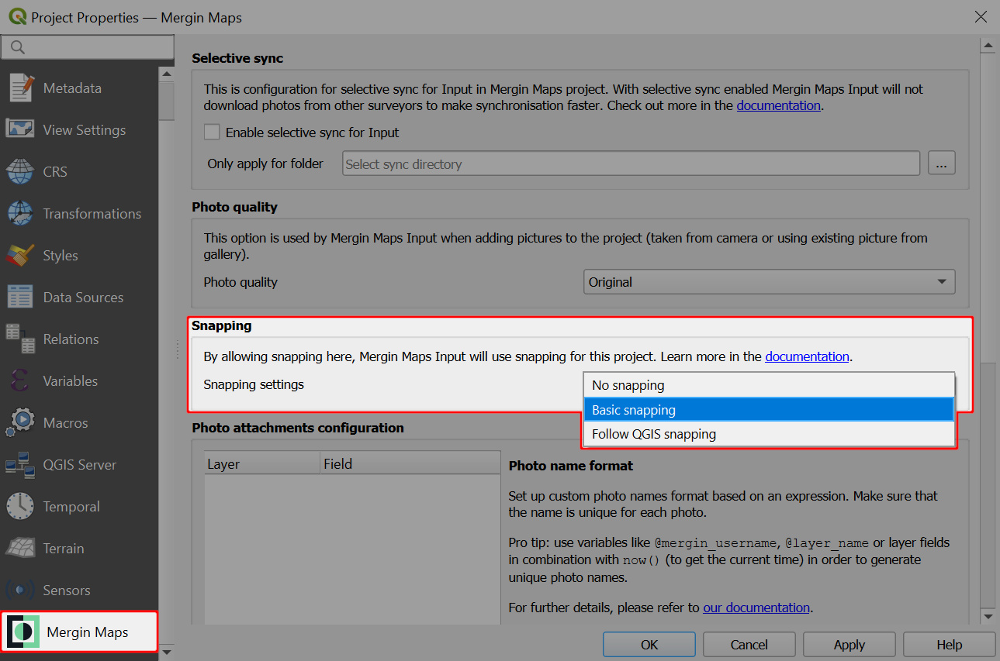

# How to Set Up Snapping for Mergin Maps Mobile App 
[[toc]]

Capturing data in the field using <MobileAppName /> can be easier, if you can snap the vertices of new features to existing geometries. Snapping can also help you avoid creating topological errors in your datasets. 

[<QGISPluginName />](../../manage/plugin/) provides three snapping options:
- *No snapping* - snapping is not enabled (default)
- *Basic snapping* - features are snapped to the vertices and segments of vector features in the project
- *Follow QGIS snapping* - uses the snapping preferences defined in the QGIS project

**Prefer video?** Here is a [video tutorial](https://youtu.be/aFG0iDuZZuI?si=3lBMlGV2Oqw7A3gg) on how to use snapping options in <MainPlatformName />:

<YouTube id="aFG0iDuZZuI" title="Snapping" />

## Basic snapping
To set up basic snapping:
1. Open your <MainPlatformName /> project in QGIS
2. Go to the **Project Properties**

3. Navigate to the **<MainPlatformName />** tab and change the snapping settings to **Basic snapping**

4. Apply the changes, save and sync your project. 
   
   Don't forget to synchronise the project also in <MobileAppName /> before the fieldwork.

Now you can use basic snapping in <MobileAppName />! 

When capturing a new feature near an existing one, the crosshairs will turn purple and snap to its vertex (left) or to its segment (right).

:::tip
If you don't want the crosshairs to snap to a feature, try zooming in. The snapping threshold is 20 pixels, so the more you zoom in, the closer you can place the vertex to the existing geometry without snapping.

If you want to change the snapping threshold, use the *[Follow QGIS snapping](#follow-qgis-snapping)* option and define the snapping tolerance in your <MainPlatformName /> project in QGIS.
:::

## Follow QGIS snapping
The <QGISPluginNameShort /> gives you the option to use the snapping preferences defined in QGIS project. This means you can, for instance, exclude some layers from snapping, choose the snapping mode or change the snapping threshold.

1. Navigate to the **<MainPlatformName />** tab in the **Project Properties** and change the snapping settings to **Follow QGIS snapping**
   

2. Enable snapping in the **Snapping toolbar** and set your snapping preferences.
   
   
   ::: tip
   If you cannot see the **Snapping toolbar** in QGIS, ensure it's enabled under **View** (top-level menu) > **Toolbars**
   :::
   
3. Snapping preferences can also be set through the **Snapping Options** in the **Project** menu
   
   
4. Switch to **Advanced Configuration**
   
   
5. Here, snapping settings can be defined for each layer individually:
   - enable/disable snapping for specific layers. Layers that are not checked will not be used for snapping.
   - in the *Type* column, you can choose if you want to snap to vertices, segments or both
   - set the *Tolerance* (the snapping threshold). This defines how close the crosshairs need to be to an existing feature to snap to its geometry.
   
   
 
4. Save and sync your project.

   Don't forget to synchronise the project also in the <MobileAppNameShort /> before the fieldwork.

Snapping in <MobileAppName /> will now follow the snapping settings as defined in the QGIS project.

:::tip
You can learn more about snapping in QGIS in <QGISHelp ver="3.22" link="user_manual/working_with_vector/editing_geometry_attributes.html?highlight=snapping#snapping-and-digitizing-options" text="QGIS User Guide" />.
:::
