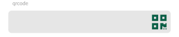
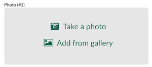
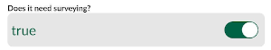
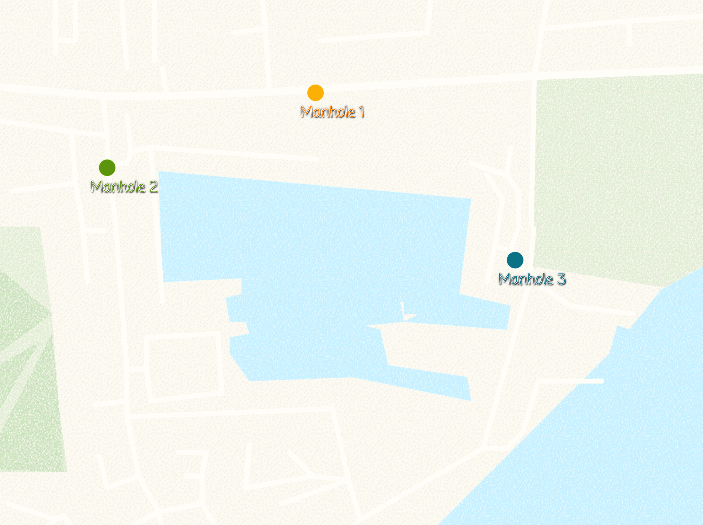
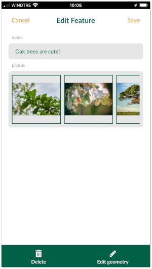

# Setting up form widgets

::: tip
You can follow the examples in this section by cloning the following projects:
  - <MerginMapsProject id="lutraconsulting/test_forms" />
  - <MerginMapsProject id="documentation/form_setup" />
  - <MerginMapsProject id="documentation/form_cascade" />
  - <MerginMapsProject id="documentation/test_qrcode" />
  - <MerginMapsProject id="documentation/forms_one-to-many-relations" />  
  - <MerginMapsProject id="documentation/forms_multiple_photos" />
:::

[[toc]]

When capturing geo-data, it is often required to fill in a form related to the surveyed point, line or area. The forms set up can simplifying filling the data and can also ensure the correct information is populated.

## Widget Gallery
Input supports a number of edit widget types for forms such as: drop-down options, slider, date and time, checkbox, photos.

Setting up forms can be configured using <QGISHelp ver="3.16" link="user_manual/working_with_vector/vector_properties.html#edit-widgets" text="QGIS widget types" /> .

In the sections below, we go through examples of setting up different widgets for forms in QGIS and Input:

|QGIS edit widget name   | Description  |Preview in Input   |
|---|---|---|
|Text Edit  |[Text](#text-widget)   |  |
|QR & barcode scanner  |[Camera to scan QR and barcode](#qr-code-reader)   |  |
|Range   |[Numeric field](#number)   |   |
|Range   |[Slider](#slider)   |   |
|Date&Time   |[Calendar with time](#datetime)  |   |
|Attachment   |[Photos from device's camera or gallery](./settingup_forms_photo.md) |   |
|Checkbox   |[Checkbox](#checkbox)   |   |
|Value Map   |[Drop-down menu with predefined values](#valuemap) |   |
|Value Relation   |[Drop-down menu with values from another table](#value-relation) |   |

In addition to the edit widgets, extra configuration can be done to the fields and form layout to make the data collection easier and more consistent. For example: setting a default value, conditional visibility and constraint enforcement.

## Text Widget

Adding or editing text fields are the most common method for inserting information within the forms.

### QGIS

In QGIS, the default widget for most types of fields is the **Text Edit** widget. In addition to a single line text, you can change the widget to accept multiple lines within a single field:

  - Download and open <MerginMapsProject id="documentation/form_setup" /> in QGIS
  - From the layer panel, right-click on **Points** layer and select **Properties**
  - In the new window, select **Attributes form**

  - Select **text** field under the right column (**Available Widgets**)
  - Under the **Widget Display**:
  - Under **Widget Type** section:
    - Ensure **Text Edit** is selected
    - Select **Multiline**

Ensure to save and synchronise your project.

### Input

To use the multiline text edit widget in the form from Input:

- Open Input on your device and from **Projects** > **Explore** download **lutraconsulting/test_forms**
- Open the project
- Select **Record** and add a point
- The form will appear
- Under **Group1** tab, you can type within the box under **text** field:

## Number

To set a field in your form to a numeric one:

### QGIS

  - Download and open <MerginMapsProject id="documentation/form_setup" /> in QGIS
  - From the layer panel, right-click on **Points** layer and select **Properties**
  - In the new window, select **Attributes form**

  - Select **Number** field under the right column (**Available Widgets**)
  - Under the **Widget Display**:
  - Under **Widget Type** section:
    - Select **Range** for widget type

Ensure to save and synchronise your project.

### Input

To use the numeric widget in your form from Input:

- Open Input on your device and from **Projects** > **Explore** download **lutraconsulting/test_forms**
- Open the project
- Select **Record** and add a point
- The form will appear
- Under **Group1** tab, you can type within the box under **Number** field:

## Slider

For setting up a slider, ensure your field type is an integer.

### QGIS

To set up a slider widget:

  - Download and open <MerginMapsProject id="documentation/form_setup" /> in QGIS
  - From the layer panel, right-click on **survey** layer and select **Properties**
  - In the new window, select **Attributes form**

  - Select **number** field under the right column (**Available Widgets**)
  - Under the **Widget Display**:
  - Under **General**, for **Alias** type **Number of plants**
  - Under **Widget Type** section:
    - From the drop-down menu, select **Range**
    - Set the edit widget to **Slider**
    - Set the **Minimum** to **0**
    - Set the **Maximum** to **10**
    - Set the **Step** to **1**

Ensure to save and synchronise your project.

### Input

To use the slider widget in the form from Input:

- Open Input on your device and from **Projects** > **Explore** download **documentation/form_setup**
- Open the project
- Select **Record** and add a point
- The form will appear
- Under **Data** tab, you can set the **Number of plants:** by moving the slider:

## Advanced value relation with drill-down forms
To have a more advanced form with drill-down menu option, see cascade form setup

## QR code reader
To be able to use your camera in forms to scan QR codes and populate the text in the field

### QGIS

To be able to scan QR codes in your forms, your field or the alias for the field should contain **qrcode** (the text is not case sensitive and it can be be in combination of lower or upper case letters). For an example, see the <MerginMapsProject id="documentation/test_qrcode" />

### Input

To use the QR code scanner in the form from Input:

- Open Input on your device and from **Projects** > **Explore** download **documentation/test_qrcode**
- Open the project
- Select **Record** and add a point
- The form will appear
- Click on one of the QR code signs from the field
- The camera should open, point the camera to a QR
- The text should be populated in the field

## Datetime

If you want to record time and date when you capture the feature, you need to make sure you have a field with **Date** or **Date and Time** type present in your survey layer. Note that all GIS data formats support these types of field. It is assumed, you use Geopackage layer, hence this field type is supported.

### QGIS

To set up a data and time widget:

  - Download and open <MerginMapsProject id="documentation/form_setup" /> in QGIS
  - From the layer panel, right-click on **survey** layer and select **Properties**
  - In the new window, select **Attributes form**

  - Select **DateTime** field under the right column (**Available Widgets**)
  - Under the **Widget Display**, from **Widget Type** section:
    - From the drop-down menu, select **Date/Time**
    - Under **Widget Display**, select **Calendar popup**
  - Under **Defaults**, type **now()**

By setting the default value to **now()**, it will assign the date and time when the feature is captured.

Ensure to save and synchronise your project.

### Input

To use the date/time widget in the form from Input:

- Open Input on your device and from **Projects** > **Explore** download **documentation/form_setup**
- Open the project
- Select **Record** and add a point
- The form will appear, when selecting the field for date and time a calendar will pop up with the current time automatically set:

## Checkbox

Checkbox field becomes handy when you want to set up a Yes/No, True/False or On/Off in your field. Some file formats, such as Geopackage support **Boolean** data type. If you have a field set as **Boolean**, QGIS automatically assigns the checkbox for widget type.

## QGIS

To set up a checkbox widget:

  - Download and open <MerginMapsProject id="documentation/form_setup" /> in QGIS
  - From the layer panel, right-click on **survey** layer and select **Properties**
  - In the new window, select **Attributes form**

  - Select **survey** field under the right column (**Available Widgets**)
  - Under the **Widget Display**:
  - Under **General**, for **Alias** type **Does it need surveying?**
  - Under **Widget Type** section, from the drop-down menu, select **Checkbox**

Ensure to save and synchronise your project.

## Input

To use the date/time widget in the form from Input:

- Open Input on your device and from **Projects** > **Explore** download **documentation/form_setup**
- Open the project
- Select **Record** and add a point
- The form will appear, you can switch the status of the **Does it need surveying?** field to true or false using the checkbox

## Valuemap

To present the options for a field as a drop-down menu in the form, you can use **Value Map** widget in QGIS.

### QGIS

To set up a value map widget:

  - Download and open <MerginMapsProject id="documentation/form_setup" /> in QGIS
  - From the layer panel, right-click on **survey** layer and select **Properties**
  - In the new window, select **Attributes form**

  - Select **habitat** field under the right column (**Available Widgets**)
  - Under the **Widget Display**:
  - Under **General**, for **Alias** type **Habitat type:**
  - Under **Widget Type** section:
    - From the drop-down menu, select **Value Map**
    - For **Value** and **Description** part type the following values: In-door, Woodland, Farmland, Grassland, Marine, Peatlands and Other.

Ensure to save and synchronise your project.

### Input

To use the drop-down widget in the form from Input:

- Open Input on your device and from **Projects** > **Explore** download **documentation/form_setup**
- Open the project
- Select **Record** and add a point
- The form will appear
- Under **Data** tab, you can select the **Habitat type:** from the drop-down menu:

## Value Relation

**Value Relation** widget is very similar to the [Value Map](#valuemap) tool, but the values for the drop-down menu come from another table (e.g. a CSV or another Geopackage table).

The advantage of having this widget:
  - Ability to edit the values in the field. For example, if you have missed a value in your list for the drop-down menu, you can edit the table in Input and add the value. See [Working with non-spatial tables](./working_with_nonspatial_data.md) section for more information.

  - Ability to search the values: when you have a large list of values, it will become cumbersome to find the right value. With this widget, you will be able to search for values in the list.

  - Selecting multiple values

### QGIS

To set up a value relation widget:

  - Download and open <MerginMapsProject id="documentation/test_forms" /> in QGIS
  - Notice the extra table in your layer tree: **<NoSpellcheck id="reftable" />**
  - From the layer panel, right-click on **Points** layer and select **Properties**
  - In the new window, select **Attributes form**

  - Select **<NoSpellcheck id="valuerelation" />** field under the right column (**Available Widgets**)
  - Under the **Widget Display**:
  - Under **Widget Type** section:
    - From the drop-down menu, select **Value Relation**
    - For **Layer** select **<NoSpellcheck id="reftable" />**
    - For **Key column** and **Value column**, select **type**
    - Check the box for **Allow multiple selections**

Ensure to save and synchronise your project.

### Input

To use the drop-down widget in the form from Input:

- Open Input on your device and from **Projects** > **Explore** download <MerginMapsProject id="lutraconsulting/test_forms" />
- Open the project
- Select **Record** and add a point
- The form will appear
- Under **Group2** tab, you can select the **<NoSpellcheck id="valuerelation" />** from the drop-down menu:

## 1-N relations

It is often the case that you have a set of spatial features and you want to record some parameters every now and then. For example, there is a GIS layer representing the manholes and the surveyors carry out regular inspections of the manholes. Instead of duplicating the manhole layer and recording each inspection, you can create a non-spatial table and store each inspection as a new line.

The image below shows the manholes locations:

The manhole point layer has the following attribute table:

In a separate table (which is non-spatial), we can record the inspections:

In QGIS, we are using the **Manhole ID** from the point layer and the inspection table, to create a 1-N relationship between the two tables.

Another example is when you try to capture multiple photos for a single feature.

In the sections below, you can see how this type of relations can be set up in QGIS and utilised in the Input app.

### Project preparation in QGIS

See the example projects:
- Assigning multiple inspections to a single feature: <MerginMapsProject id="documentation/forms_one-to-many-relations" />
- Adding multiple photos to a single feature: <MerginMapsProject id="documentation/forms_multiple_photos" />

To configure 1-N relations in QGIS:
- From the main menu, select **Projects** > **Properties ...**
- In the new window, select the **Relations** tab
- Select **Add Relation** to create a new one
- A new window will appear, where we can define the parent and child layers and the fields to link the two layers:
  - For **Name** type **Inspection**
  - For the **Referenced(parent)** layer, select **manhole_locations**
  - For **Field 1** of the **Referenced(parent)** layer, select **Manhole**
  - For the **Referencing(child)** layer, select **inspections**
  - For **Field 1** of the **Referencing(child)** layer, select **Manhole ID**

This should now allow you to add multiple inspections for each manhole location (**manhole_locations** point layer). The inspections records will be stored in the **inspections** table.

When you open the form for an existing record in the  **manhole_locations** point layer, you should be able to see the existing inspection records and optionally add, delete or edit the records:

The same project when you open add inspection to a manhole in Input will look like the image below:

### Link multiple photos to a single feature

Another use-case for having multiple photos linked to a single feature is using 1-N relation.

To set up a project in QGIS, similar to the previous example, we need a unique field to link the following two tables:
- Survey layer (containing spatial information)
- A non-spatial table containing path to the photos

The key part when linking the above to table is to avoid using **FID** field in the GeoPackage. Mergin uses the FID to consolidate changes and therefore can change the FIDs. This will result in having photos linked to the incorrect feature on the map.

For that, we can create a new field and use the **uuid()** as the default value. To learn more about how this can be configured, you can see <MerginMapsProject id="documentation/forms_multiple_photos" />.

Input detects the type of 1-N relation is for "Attachment" widget and displays the image viewer for the relations.

