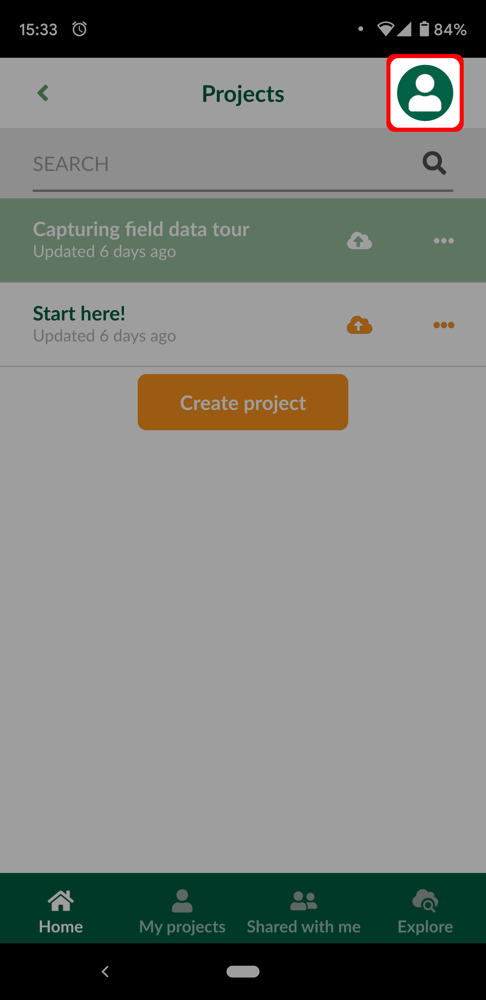
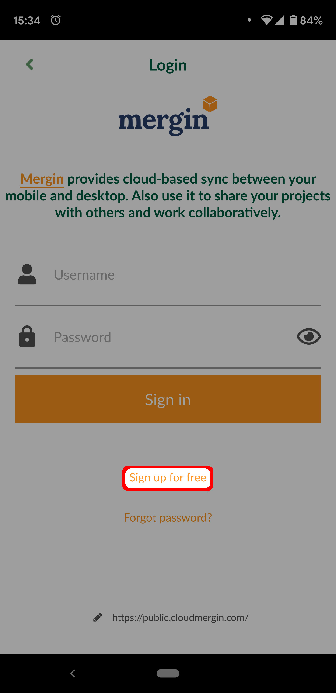

# Sign up to Mergin Maps

## From <MainDomainName />

1. Navigate to <MainDomainNameLink />

2. Click on *Sign up* in the top-right of the page:

   
   
3. Complete the sign up form

   You can now [skip to the last section](./index.md#next-steps).

## From <MobileAppName />

If you already have [installed <MobileAppName />](../install-mergin-maps-mobile/index.md) installed then you can sign up from there.

[Skip this section](./index.md#next-steps) if you've already signed up from <MainDomainName /> as described above.

1. Open <MobileAppName /> on your mobile device

2. Go to the *Home* tab of the *Projects* screen and press the *Person* button:

   
   
3. Press the ***Sign up for free*** button:
   
   
   
4. Complete the sign up form

## Next steps

Welcome to <MainPlatformName />!

You can get up-to-speed quicky by following our [Quick Start tutorials](../../tutorials/capturing-first-data/index.md).
