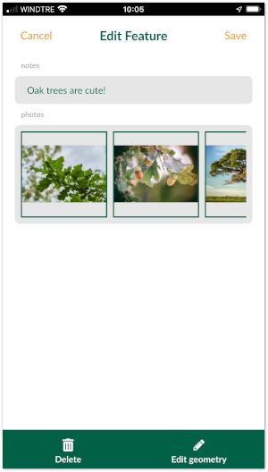

# How to Attach Multiple Photos to Features

:::tip
To see this setup in practice, clone the following project: <MerginMapsProject id="documentation/forms_multiple_photos" />.
:::

To link multiple photos to a single feature, we need a **unique field** to link following tables:
- Survey layer containing spatial information
- A non-spatial table containing path to the photos (see [how to setup simple photo forms](../settingup_forms_photo.md)).

:::danger
**Do not use the FID field to link these tables**. FIDs can be changed during synchronisation, which can result in having photos linked to the incorrect feature. You can learn more about synchronisation in [Behind Data Synchronisation](../../manage/synchronisation/#synchronisation). 
:::

To create 1:N relation between these tables correctly, you need to:
1. Create a new text field in the survey layer.

2. Use the **uuid()** as the default value for this field. This assigns a unique identifier to every created feature, even when different surveyors create features simultaneously.

3. Create a new text field in the non-spatial table that will be used to store the UUID of features from the survey layer (the foreign key).
4. Configure 1:N relation in the QGIS project:

<MobileAppName /> detects the type of 1-N relation and uses the [Attachment widget](../settingup_forms_photo.md) to display the image viewer for the relations. 

