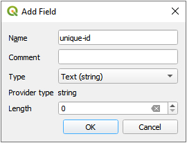

# How to Attach Multiple Photos to Features

::: warning
Our mobile app was redesigned. We are in the process of updating this content to reflect these changes.
:::

In some situations, it might be useful to take more than one picture of a feature during the field survey. Attaching multiple photos to one feature is a 1-N relation. You can read more about 1-N relations and how they can be used in <MainPlatformNameLink /> in [How to link multiple records to one feature](../one-to-n-relations/).

<YouTube id="NCa_Nb_CYno" />

:::tip
To see this setup in practice, you can download the following project: 
<MerginMapsProject id="documentation/forms_multiple_photos" />.
:::

To link multiple photos to a single feature, we need a **unique field** to link following tables:
- Survey layer containing spatial information
- A non-spatial table containing path to the photos (see [how to setup simple photo forms](../settingup_forms_photo.md))

:::danger WARNING
**Do not use the FID field to link these tables**. FIDs can be changed during synchronisation, which can result in having photos linked to the incorrect feature. You can learn more about synchronisation in [Behind Data Synchronisation](../../manage/synchronisation/#synchronisation). 
:::

To set 1:N relation between these tables correctly:
1. Create a new text field in the survey layer, here: `unique-id`
   
2. Use the `uuid()` as the **default value** for this field in **Layer Properties**. This function assigns a unique identifier to every created feature, even when different surveyors create features simultaneously.
   
3. Create a new text field in the non-spatial table (here: `photos`) that will be used to store the UUID of features from the survey layer (the foreign key), here: `external-pk`.

Now we need to configure a [1-N relation](../one-to-n-relations/):
4. From the main menu, select **Project** > **Properties ...**
5. In the **Relations** tab, select **Add Relation**
   

6. Define the parent and child layer and the fields to link these layers. Here:
   - **Name** is the name of the relation, can be left blank
   - **Referenced (parent)** is the spatial layer `Survey`
   - **Field 1** of the **Referenced (parent)** is the field `unique-id` that contains the UUID 
   - **Referencing (child)** is the non-spatial layer `photos`
   - **Field 1** of the **Referencing (child)** layer is the `external-pk` that contains the foreign key to link photos with surveyed features.
   

7. Navigate to the **Attributes Form** tab in the **Properties** of the `photos` layer. Set the **Widget Type** of the foreign key `external-pk` to **Relation Reference**:
   

<MobileAppName /> detects the type of 1-N relation and displays the image viewer for the relations. 

