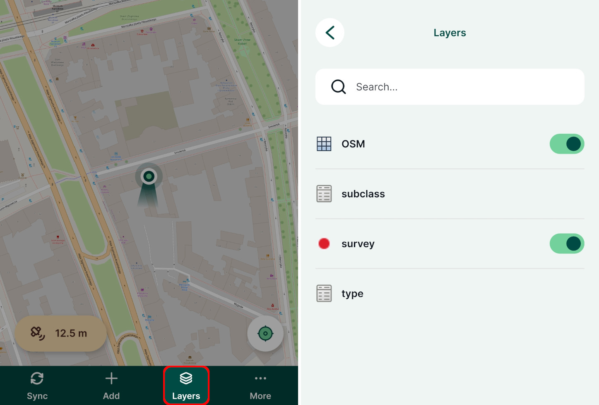

# Overview
[[toc]]

Capturing field data often requires filling some attributes in the form to record the properties of surveyed points, lines or polygons. Attribute forms can simplify the data entry and even ensure to some extent that the correct information is filled in. Here, we will explore the possibilities of various <QGISHelp ver="latest" link="user_manual/working_with_vector/vector_properties.html#attributes-form-properties" text="QGIS widgets" /> that can be used in <MobileAppName />. 

Extra configuration of attribute forms can be done to make data collection easier and more consistent, such as using default values, conditional visibility or constraint enforcement. These topics are covered in [Attributes Form Configuration](../form-configuration/) and [Attributes Form Layout](../form-layout/).

Prefer video? Check out this tutorial on how to configure QGIS widgets for survey forms.
<YouTube id="jc4p1PpXj3k" />

Here are some best practice tips to make your work easier in the long run.

## Working with layers
- Making changes in the data schema of layers can lead to issues in the synchronisation process. Be careful to [**deploy the revised project properly**](../../manage/deploy-new-project/). Design the data schema carefully when creating a layer to avoid the need to change it later.
- **Always use GeoPackage for survey layers**. If you use other formats, such as ESRI shapefile, it is not possible to detect changes from other users and they may be overwritten. Overwritten files are stored in a conflict file.
- **Add some extra back-up field attributes** when creating a survey layer with different types (e.g. a couple of texts, int, real, date/time) and hide them in the form design. These can serve as a backup: if you need extra fields later in the survey, just alias these extra fields and add them to form. 
- If you do not need a field, **remove it from the form**. You don't need to delete it from the table.
- **Instead of renaming a field, change its alias**.
- **Add new layers to your project as separate GeoPackages**. Do not add a new table to your existing GeoPackage that contains a survey layer. Just to be safe, it is better to have one GeoPackage for each of your survey layers.
- use **GeoTIFF** format for your raster files or store them in a separate GeoPackage database

<!--
## Working with forms
- when there is a lot of attributes, use tabs
- conditional visibility
- constraints
-->

Non-spatial tables are often a key part of a survey project. The tables can be used either on their own to add new data or linked to a spatial layer, e.g. when linking multiple [photos](../attach-multiple-photos-to-features/) or [records](../one-to-n-relations/). They can be also used in [value relation](../form-widgets/#value-relation) widgets.

We recommend using **GeoPackage** format to save your non-spatial table. With this format, you can collaboratively edit the data and track changes.

## Enable editing and browsing of non-spatial layers
Ensure you have [enabled editing and browsing](../../gis/search_data/) of your non-spatial table in **Project Properties** in QGIS.

## Non-spatial layers in Mergin Maps mobile app
Non-spatial tables can be browsed, searched and edited in the <MobileAppNameShort />.

Tap the [**Layers**](../../field/layers/) button to open the list of layers, including non-spatial tables, in the project.

Tap on a layer to open its attributes table where you can browse the data and [search for values](../../field/layers/#browsing-features). It is also possible to [add and edit](../../field/mobile-features/#add-or-edit-non-spatial-features) entries in the table.

