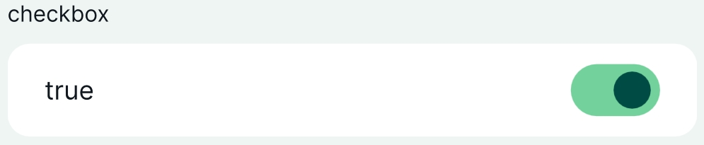
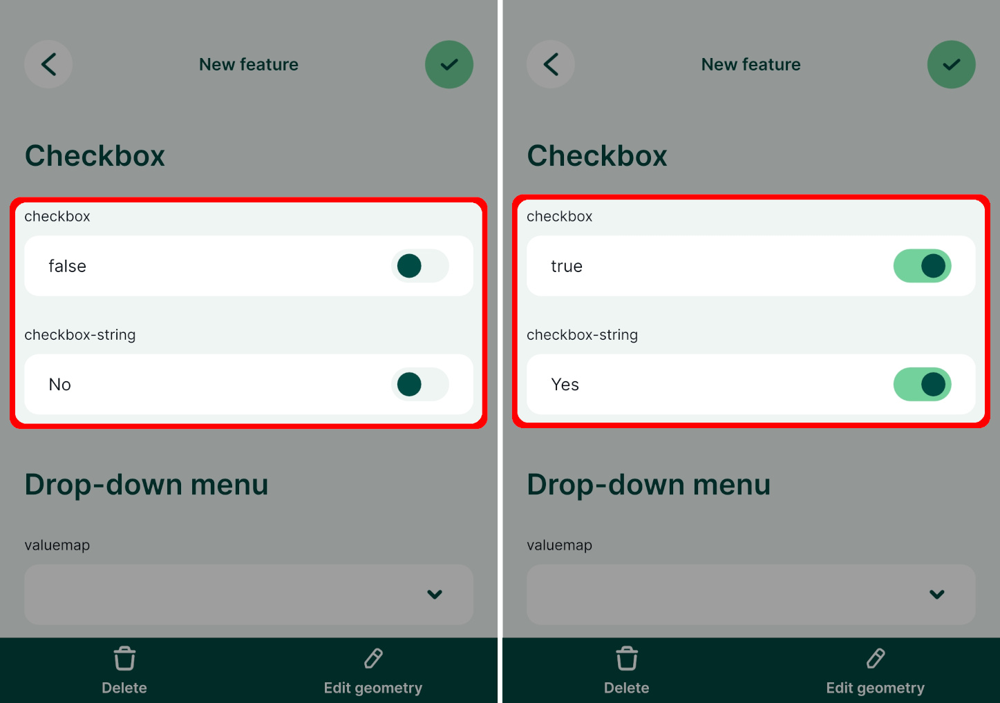

# Checkbox

The checkbox widget is handy when you want to set up a field that can have two values, such as true/false, Yes/No, or On/Off. 

|
 Widget 
 |Preview in the <MobileAppNameShort />|
|:---:|:---:|
| True/false checkbox  |   |

:::tip Example project available
Checkbox widget is used in this public project <MerginMapsProject id="documentation/form-widgets" />. Download or clone it to see the setup.
:::

Prefer a video? Here is a short tutorial about the checkbox widget:

<YouTube id="rtBdJzizdug" />

## True/false checkbox for Boolean fields

If you have a field with a `Boolean` data type, QGIS assigns the checkbox widget type by default. It is also possible to use it for fields with [other data types](#checkbox-with-custom-values-yes-no).

1. Right-click on a layer, select **Properties** and go to the **Attributes form** tab.
2. In the list of **Available Widgets** select the field you want to work with (here: `checkbox`).
3. In the **Widget Type** tab, the **Checkbox** widget should be set by default (if not, select it from the drop-down menu).
4. **Apply** the changes. Don't forget to save and sync your project!

## Checkbox with custom values (yes/no) 
You might want to use the checkbox with custom values, such as Yes/No or On/Off. This is possible for fields with `Text (string)` data type:
1. Right-click on a layer, select **Properties** and go to the **Attributes form** tab.
2. In the list of **Available Widgets** select the field you want to work with (here: `checkbox-string`).
3. In the **Widget Type** tab, select the **Checkbox** widget and define values for the *Checked* and for the *Unchecked* state. Here we use `Yes` and `No`.
4. **Apply** the changes. Don't forget to save and sync your project!

Similarly, you could set up the checkbox widget for fields with integer data types and use numerical values, e.g. `0` and `1`, for the *Checked* and for the *Unchecked* state. 

In the <MobileAppNameShort />, the checkbox can be easily toggled on/off.

