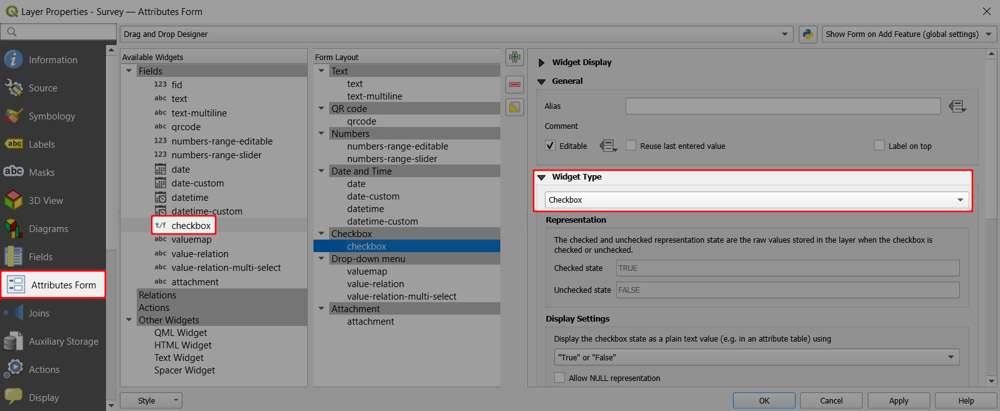
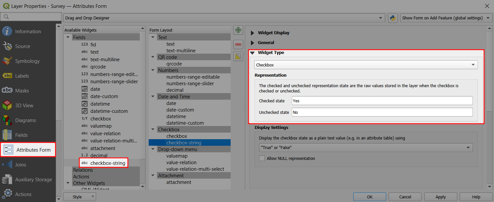

# Checkbox

:::tip Example project available
Checkbox widget is used in this public project <MerginMapsProject id="documentation/form-widgets" />. Download or clone it to see the setup.
:::

<YouTube id="rtBdJzizdug" />

Checkbox field becomes handy when you want to set up a Yes/No, True/False or On/Off in your field. 

If you have a field set as **Boolean** in your GeoPackage layer, QGIS assigns the checkbox widget type by default.

1. Right-click on a layer, select **Properties** and go to the **Attributes form** tab.
2. In the list of **Available Widgets** select the field you want to work with (here: `checkbox`).
3. In the **Widget Type** tab, the **Checkbox** widget should be set by default (if not, select it from the drop-down menu).
4. **Apply** the changes. Don't forget to save and sync your project!

Checkbox widget can be also used for **Text** (string) fields:
1. Right-click on a layer, select **Properties** and go to the **Attributes form** tab.
2. In the list of **Available Widgets** select the field you want to work with (here: `checkbox-string`).
3. In the **Widget Type** tab, select the **Checkbox** widget and define values for the *Checked* and for the *Unchecked* state. Here we use `Yes` and `No`.
4. **Apply** the changes. Don't forget to save and sync your project!

In the <MobileAppNameShort />, the status of the checkbox field can be easily toggled on/off.

