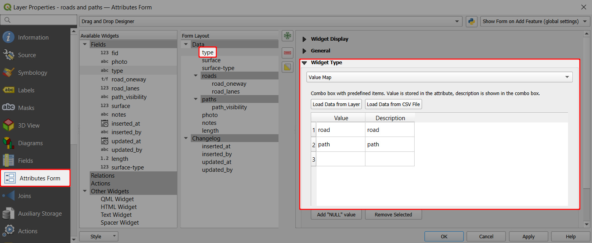
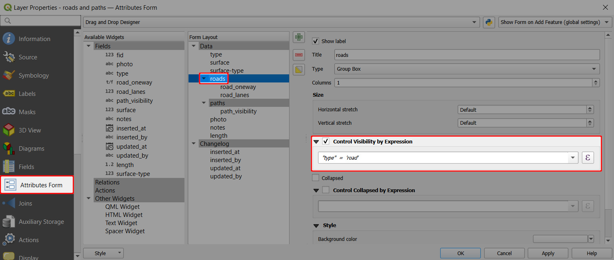
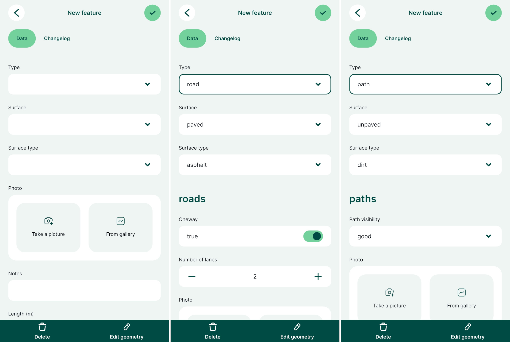

# Show and hide fields depending on a field value (conditional visibility)
Conditional visibility can be applied to groups and tabs, meaning they will be displayed or hidden depending on the value of a field.

:::tip Example project available
You can explore this functionality in <MerginMapsProject id="documentation/form_setup" />. 
:::

Here we will use a line layer named `roads and paths`. It is designed for surveying both roads and paths and most of the fields are relevant for every type of feature in this layer. However, there are some attributes that are specific for roads (e.g. the number of lanes) or for paths (e.g. the visibility of the path). 

The form uses the value of the `type` field to display the relevant set of attributes. The `type` field is set up as [value map](../form-widgets/#value-map) with defined values `road` and `path`.

To set the visibility of groups in the attributes form:
1. Click on the **roads** group in the **Form Layout**
2. Check the **Control Visibility by Expression** option :heavy_check_mark:
3. Define the expression. Here we use: `"type" = "road"`

4. Same steps are used for the **path** group using the expression `"type" = "path"`

In the <MobileAppNameShort />, the form displays these groups only when the condition is met. So, there are different sets of attributes depending on the value that is entered in the `type` field.

