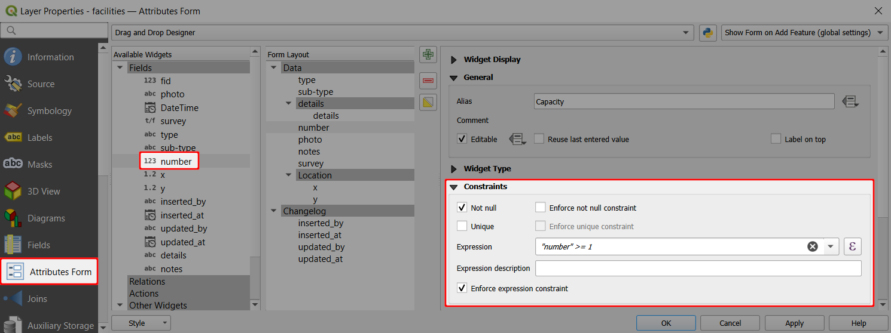
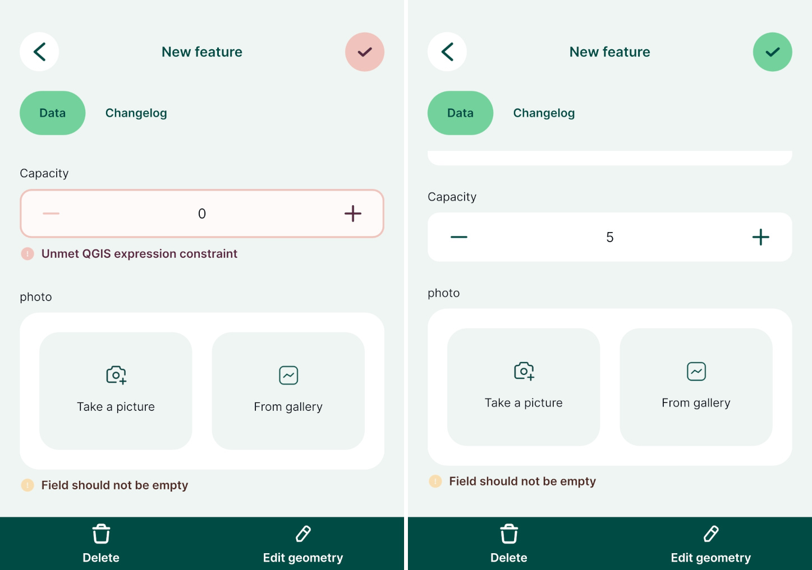

# Constraints
Constraints help to avoid mistakes when filling in the values or to highlight mandatory fields. Fields with constraints have a warning displayed next to them in the form. 

There are multiple options of setting up constraints in <QGISHelp ver="latest" link="user_manual/working_with_vector/vector_properties.html#constraints" text="QGIS" />, such as *Not null* (the field has to be filled in), *Unique* (the field has to have a unique value), or using a custom *expression*. 

Check the **enforce constraint** option :heavy_check_mark: to use a hard constraint, meaning that the feature cannot be saved if the constraints are not met.

### Using hard and soft constraints in the form

:::tip Example project available
Constraints are used in this project <MerginMapsProject id="documentation/form_setup" />. Clone or download it to try it to see how it works.
:::

Here, we will first set up a constraint to a field that represents the facility capacity. The value has to be a number that is higher than 0. This will be a *hard* constraint: if the value is not higher than 0, the feature cannot be saved.

1. Right-click on a survey layer and select **Properties**
2. In the **Attributes form** tab, select a numeric field in the **Available Widgets** column that you want to use (here: `number`)
3. In the **Constraints** tab:
   - Use the following **Expression**: `"number" >= 1` 
   - Check the **Enforce expression constraint** option :heavy_check_mark:

Now we will set up a *soft* constraint to a photo field. A photo should be taken during the survey, but the feature can be saved without one.

1. In the **Attributes form** tab, select a photo field in the **Available Widgets** column (here: `photo`)
2. In the **Constraints** tab:
   - Check the **Not null** constraint :heavy_check_mark:

In the <MobileAppNameShort />, you will be unable to save a feature unless the field value meets the *enforced* constraint (here: `Capacity`). If the constraint is *not enforced* (here: `photo`), there will be a warning, but the feature can be saved regardless.

