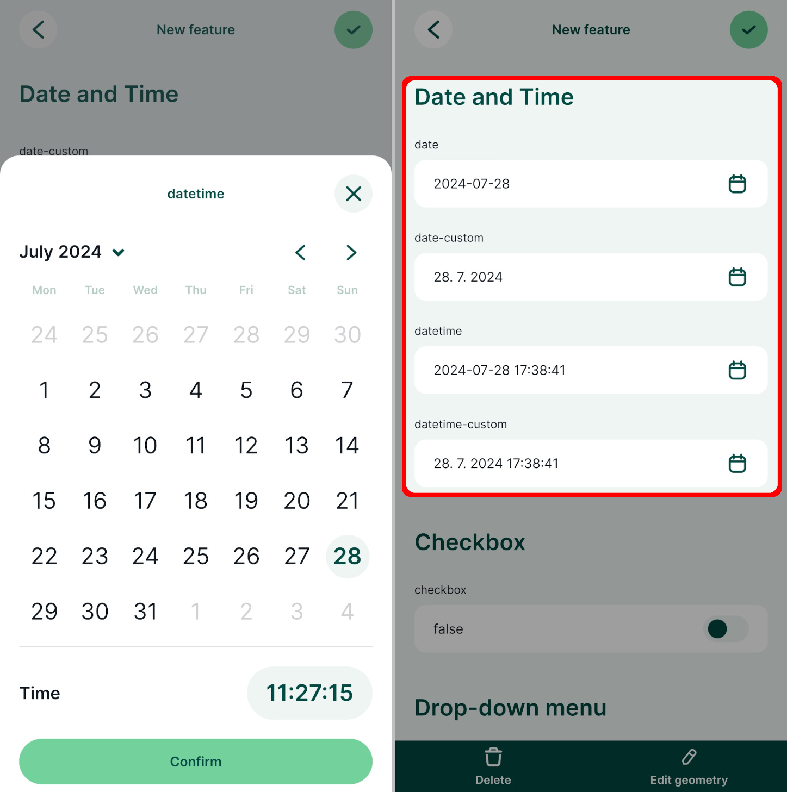

# Date and time

**Date** or **Date and Time** fields can be used to record date and time. The most common use is to record when a feature was created or updated. This can be done manually or automatically by using [default values](../default-values/).

|
 Widget 
 |Preview in the <MobileAppNameShort />|
|:---:|:---:|
|[Date/time](#date-time-widget)  |   |

:::tip Example project available
Various options of setting up Date and Date&Time fields are included in this public project: <MerginMapsProject id="documentation/form-widgets" />. Download or clone it to explore it in more detail.
:::

Prefer a video? Here is a short tutorial about date widgets:
<YouTube id="EoIqYIl4-Xk" />

## Date/Time widget

To set up the **Date/Time** widget:

1. Right-click on a layer, select **Properties** and go to the **Attributes form** tab.

2. In the list of **Available Widgets** select the Date and Time field you want to work with (here: `datetime`).

3. In the **Widget Type** tab and select the **Date/Time** widget. 
   - use the default display format or set a custom display format (see [custom date and time formats](#custom-date-and-time-formats))
   - check the **Calendar popup** option :heavy_check_mark:
   - use the preview to confirm that this is the format you want to use to store your timestamps 
  
  

4. If you want to automatically insert the date (or date and time) when the feature is created, use `now()` as a [default value](../default-values/) in the **Defaults** tab.

5. **Apply** the changes. Don't forget to save and sync your project!

In the <MobileAppNameShort />, the date can be edited using a calendar pop up. If you tap the icon next to the field, the current date and time will be filled in.

## Custom date and time formats
Date and time fields can use custom display format.

Here are some common examples:

|   Custom Display Format   |    Preview   |
|:-------------------------------:|:-------------------:|
|   `dd.MM.yyyy`   |   12.01.2024   |
|   `MMMM d yyyy`   |   January 12 2024   |
|   `HH:mm:ss`   |   12:34:56   |
|   `yyyy-MM-dd HH:mm:ss`   | 2020-09-09 12:34:56   |
|   `dd/MM/yyyy HH-mm-ss`   | 09/09/2020 12-34-56   |
