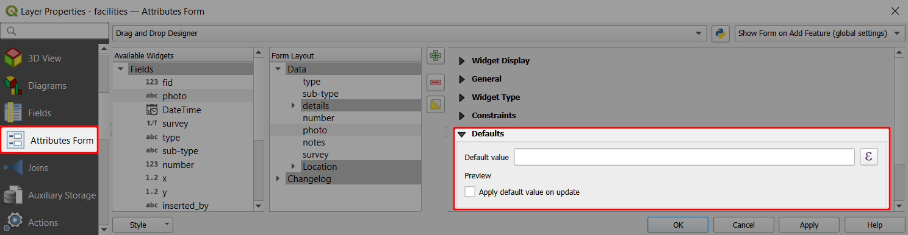
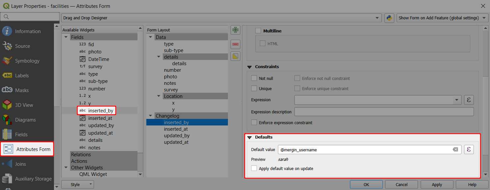
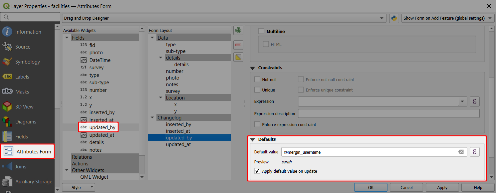
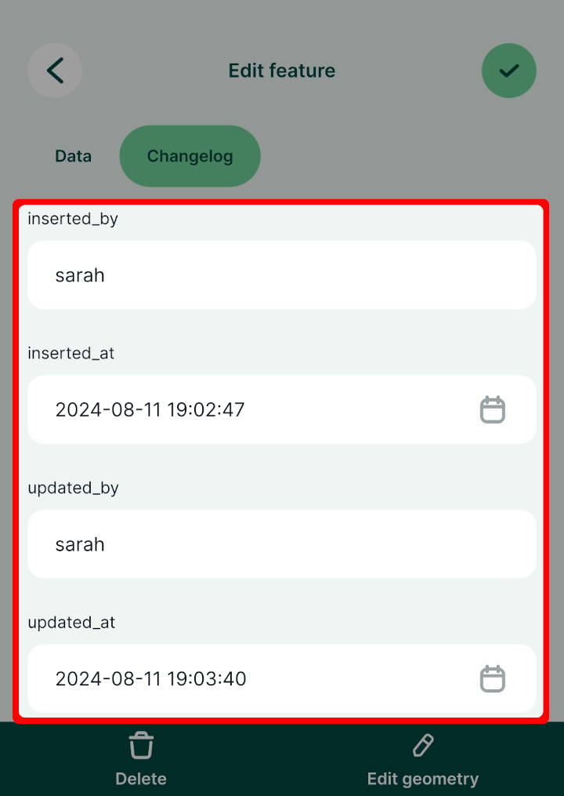
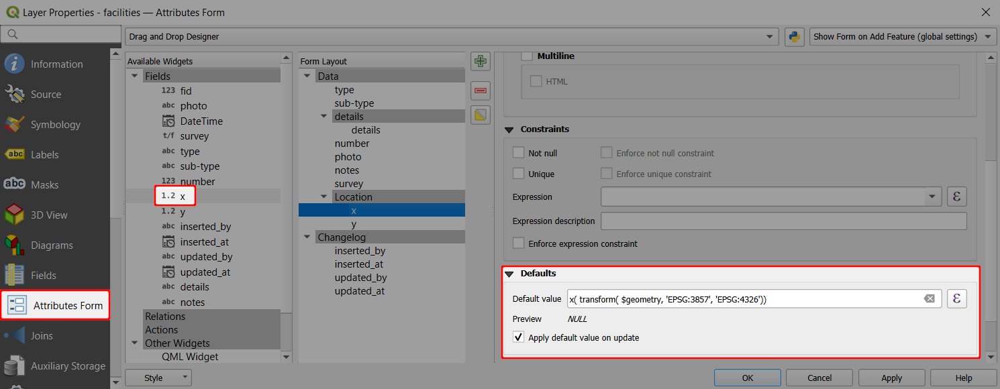
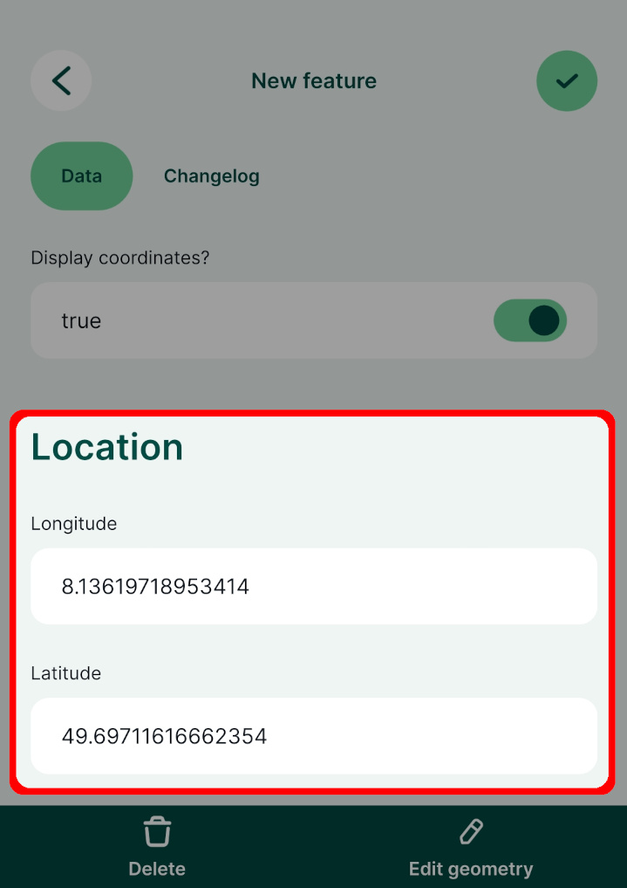
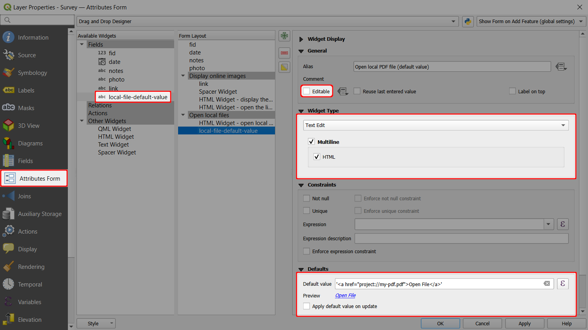
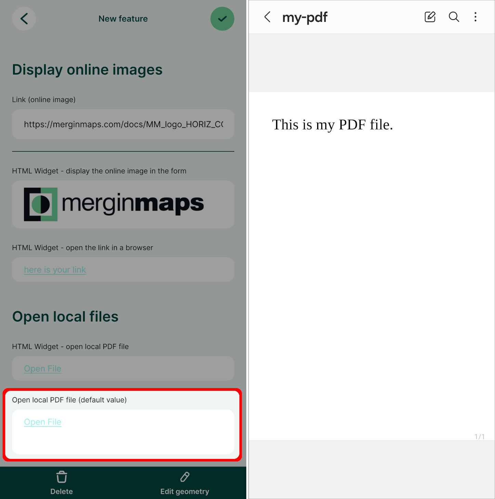

# Default values, extra variables
Default values can be used to automatically record, e.g, the name of the surveyor, date and time of the survey, latitude and longitude of a feature or to have frequently used values filled in advance (see <QGISHelp ver="latest" link="user_manual/working_with_vector/vector_properties.html#default-values" text="QGIS documentation" />). 

Fields with default values can be hidden from the attributes form if they are used to store data that are not expected to be modified manually.

The default value can be a text, number or a QGIS expression. The data format of the field has to match the result of the default value expression you want to use.

In QGIS, default values can be set up in the **Attributes Form** tab in **Layer Properties**. In the **Defaults** tab, you can enter the default value of the selected field (manually or using an expression). 



Check the option **Apply default value on update** :heavy_check_mark: to update the field value after every change of a feature. Note that this means that the value of this field cannot be changed manually in QGIS or in the <MobileAppNameShort /> as any user input will be overwritten by the default value. 

This option is therefore useful for fields that can be recorded automatically without the need of modification, such as parameters derived from geometry (e.g. [coordinates, length, area](#examples-of-useful-default-values)) or [usernames, dates, times](#recording-usernames-dates-and-times-automatically).

::: tip Example project available
Various usage of default values can be explored in more detail by downloading or cloning this public project <MerginMapsProject id="documentation/form_setup" />.
:::

### Recording usernames, dates and times automatically

Let's set up an attributes to record the <MainPlatformName /> username of the surveyor who *created* a feature:
1. Right-click on a layer, select **Properties** and go to the **Attributes form** tab.
2. In the list of **Available Widgets** select the text field you want to use (here: `inserted_by`)
3. In the **Defaults** tab, define the **Default value** as `@mergin_username`. 
   Do not check the **Apply default value on update** option :white_large_square:.



To save the <MainPlatformName /> username of the surveyor who *modified* this feature, the steps are similar:
1. In the list of **Available Widgets** select the text field you want to use (here: `updated_by`)
2. In the **Defaults** tab, define the **Default value** as `@mergin_username`. 
   Check the **Apply default value on update** option :heavy_check_mark:. The field will be updated anytime the feature is modified, saving the name of the surveyor who made the changes.



Follow the same steps for attributes to store the timestamps of when the feature was created and updated (here: `inserted_at`, `updated_at`), using the `now()` expression as **Default value**.

When the form is opened in the <MobileAppNameShort />, the default values are automatically filled in:



### Automatically transform and record coordinates of a point
Here we are going to set the default values for `x` and `y` field to be longitude and latitude.

1. Right-click on the survey layer and select **Properties**
2. In the **Attributes form** tab, select the `x` field in the **Available Widgets** column on the left
3. In the **Widget Display**, set the **Alias** to *Longitude*
4. In **Defaults** tab, define the **Default value** as:
   ```
   x( transform( $geometry, 'EPSG:3857', 'EPSG:4326'))
   ```
   Note that the expression transforms the point from EPSG:3857 (map and layer coordinate reference system) to EPSG:4326.
5. Check the **Apply default value on update** option :heavy_check_mark:.



Repeat the same steps for `y` field and setting the **Alias** to *Latitude* and the default value to

```
y( transform( $geometry, 'EPSG:3857', 'EPSG:4326'))
```

Don't forget to save and synchronise your project!

When adding or editing features in the <MobileAppNameShort />, the coordinates are automatically filled in:



### Examples of useful default values
There are some commonly used default values that can be useful in your field survey.

- It is convenient to know when a feature was created and when it was last updated. Use fields with **Date** or **Date&Time** data types with the `now()` function to record this information. You can change the formatting using the [Date/Time](../form-widgets/#date-and-time) widget.

- The name of the <MainPlatformName /> user who created or modified the feature can be recorded using the `@mergin_username` variable. These fields should use **Text (string)** data type. 
  There are also other [extra QGIS variables](../position_variables/) related to your <MainPlatformName /> account or service that can be used as default values.

- The coordinates of a point feature can be recorded as well using the `$x` and `$y` function in QGIS. To record the coordinate accurately, these fields should have the **Decimal number (real)** data type.  If the coordinates are in metres, values can be rounded to, say, 2-3 decimal places. When working with geographic coordinates that use degrees, you may want to round the coordinates to 8 decimal places. Use the *apply default value on update* option so that you have correct values when the position of the point feature changes.

- Parameters such as **length** of a line feature or **area** of a polygon feature can be calculated from the geometry. These fields should have the **Decimal number (real)** or **Integer** data type. Use the *apply default value on update* option to update the field in case there is a change in the feature.

- [Extra Position Variables](../position_variables/) can be used to record GPS information from your mobile devices

Here are some examples:

| Variable name               | Sample value                  | Apply default value on update   | Description |
|-----------------------------|-------------------------------|---------|-------------|
| `@now`          | `2024-06-30 10:00:00`                      | **no**  | The timestamp of when the feature was created. |
| `@now`          | `2024-06-30 10:30:00`                     | **yes**  | The timestamp of when the feature was last **updated**. |
| `@mergin_username`          | `sarah`                      | **no**  | Name of the user who created this feature.|
| `@mergin_username`          | `jack`                      | **yes**  | Name of the user who **updated** this feature last.|
| `round($x,2)`          | `1898789.92`                      | **yes**  | The X coordinate of a point feature, rounded to 2 decimal places.|
| `$length`          | `123.45`                      | **yes**  | The length of a line feature.|
| `$area`          | `1234.56`                      | **yes**  | The area of a polygon feature.|
| `uuid()`          | `{9d0150eb-a36f-40f1-a768-540db8a36f7c}`                      | **no**  | Generates <QGISHelp ver="latest" link="user_manual/expressions/functions_list.html#uuid" text="UUID" /> (Universally Unique Identifier).|


### Open local files using default values
Default values can also be used to open local files (e.g. a PDF file) from within the form. This file needs to be packaged with the project, so it should be stored somewhere in the [project folder](../../manage/project/#mergin-maps-project-folder).

There is a public project <MerginMapsProject id="documentation/forms-display-images-and-files" /> you can download or clone to see how the setup works.
- A PDF file named `my-pdf.pdf` is stored in the main project folder.
- The survey layer has a field named `local-file-default-value` with **Text (string)** data type.
   - This field is set to *not editable* (the form will refer to the same file for all features and does not need to be changed).
   - This field uses the **Text Edit** widget with the *Multiline* and *HTML* options enabled.
   - The **default value** is set to:
   ```
   '<a href="project://my-pdf.pdf">Open File</a>'
   ```



In the <MobileAppNameShort />, you can tap the *Open File* link to open the PDF file using the default application of your device.



::: tip Open local files using the HTML widget
Local files can be displayed in the form also using [the HTML widget](../form-layout/#using-html-widget-to-open-local-files). 

In the <MerginMapsProject id="documentation/forms-display-images-and-files" /> project, you can explore and compare both alternatives.
:::

## Extra QGIS Variables

The <QGISPluginName /> adds several variables that can be used in QGIS expressions:

| Variable name               | Sample value                  | Scope   | Description |
|-----------------------------|-------------------------------|---------|-------------|
| `@mergin_username`          | `martin`                      | global  | Name of the user currently logged in to <MainPlatformNameLink /> |
| `@mergin_user_email`        | `martin@example.com` | global  | Email of the user currently logged in to <MainPlatformName />|
| `@mergin_url`               | `https://app.merginmaps.com`  | global  | URL of the <MainPlatformName /> service |
| `@mergin_project_name`      | `Tree survey`                 | project | Name of the active <MainPlatformName /> project  |
| `@mergin_project_owner`     | `martin`                      | project | Name of the owner of the active project |
| `@mergin_project_full_name` | `martin/Tree survey`          | project | Owner and project name joined with a forward slash |
| `@mergin_project_version`   | `42`                          | project | Current version of the active project |

A common use case is to use `@mergin_username` as the [default value](./form-configuration/#default-values) for one of the fields in a survey layer to automatically track who has added (and/or modified) a particular record.

## Extra Position Variables

With <MobileAppName />, it is possible to access GPS information using extra position variables. Note that location permission has to be allowed and location service enabled.

Extra position variables can be used as [default values in feature forms](./form-configuration/#default-values).

Following variables are supported:
 - `@position_coordinate` - A point with the coordinates in WGS84.
 - `@position_latitude` - Latitude
 - `@position_longitude` - Longitude
 - `@position_altitude` - Altitude
 - `@position_direction` - The bearing measured in degrees clockwise from true north to the direction of travel.
 - `@position_ground_speed` - The ground speed, in meters/sec.
 - `@position_vertical_speed` - The vertical speed, in meters/sec.
 - `@position_magnetic_variation` - The angle between the horizontal component of the magnetic field and true north, in degrees. Also known as magnetic declination. A positive value indicates a clockwise direction from true north and a negative value indicates a counter-clockwise direction.
 - `@position_horizontal_accuracy` - The accuracy of the provided latitude-longitude value, in meters.
 - `@position_vertical_accuracy` - The accuracy of the provided altitude value, in meters.
 - `@position_from_gps` - True, if recorder/edited feature's geometry correspond with current user's position (Position marker has the same location as the crosshairs marker).
 - `@position_satellites_visible` - Number of visible satellites.
 - `@position_satellites_used` - Number of satellites used to calculate the position.
 - `@position_gps_fix` - GPS fix, e.g. "RTK float"
 - `@position_gps_antenna_height` - Antenna height as defined in [GPS settings](../field/mobile-app-ui/#gps-settings)
 - `@position_provider_type` - GPS device type.
   - for internal GPS, returns "internal"
   - for external GPS, returns "external"
 - `@position_provider_name` - GPS device name.
   - for internal GPS, returns "Internal"
   - for external GPS, returns the name of the external device
 - `@position_provider_address` - GPS device address.
   - for internal GPS, returns "<NoSpellcheck id="devicegps" />"
   - for external GPS, returns the MAC address
 - `@position_hdop` - Horizontal dilution of precision (HDOP)
 - `@position_vdop` - Vertical dilution of precision (VDOP)
 - `@position_pdop` - Position (3D) dilution of precision (PDOP)

:::tip
**Dilution of precision** (DOP) is a useful value that reflects the confidence level of achieved position precision. In addition to the horizontal and vertical accuracy, the appropriate DOP value (horizontal, vertical, or 3D) can be used to assess the overall quality of your survey accuracy.

You can read more about this topic e.g. on [Wikipedia](https://en.wikipedia.org/wiki/Dilution_of_precision_(navigation)).
:::

