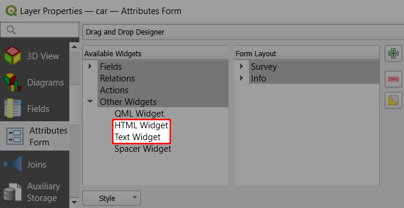
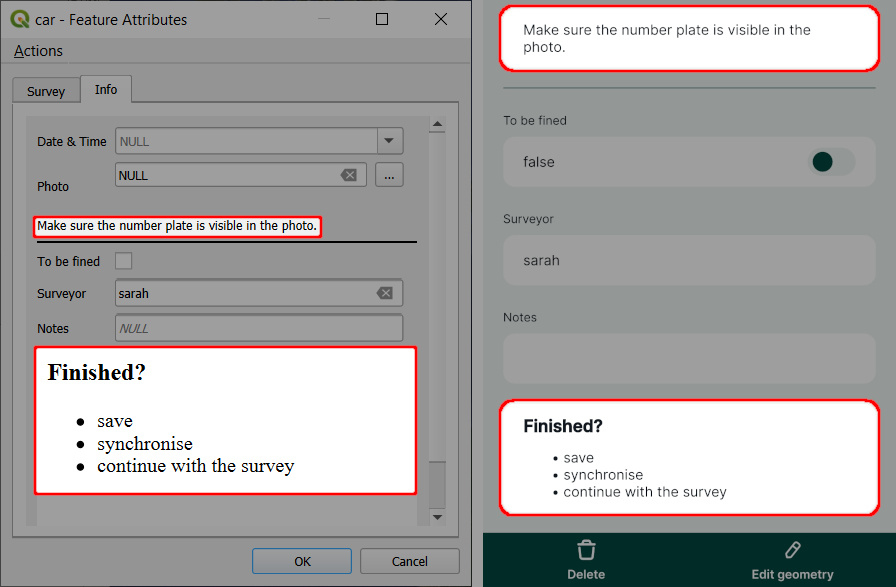
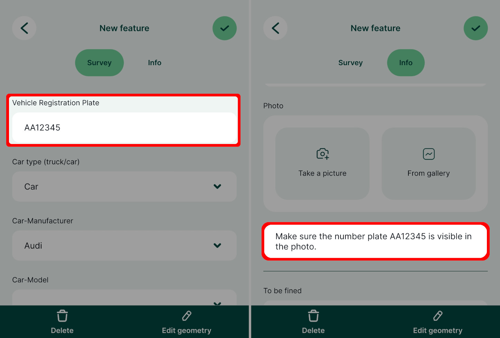

# How to Display Instructions in the Form
The HTML and Text widgets can be used to display instructions in the form, as described in [Informational Widgets ](../info-widgets/).

Sometimes, you may want to include instructions or tips for surveyors in your forms. <QGIS link="" text="QGIS" /> offers Text and HTML widgets that can be used for this purpose. Your text instructions can include [expressions and field values](#using-expressions-in-text-and-html-widgets) as well. The HTML widget supports various [HTML tags](https://doc.qt.io/qt-6/richtext-html-subset.html#supported-tags), so it can be also used, for instance, to display [online images](../embed-image/).

These widgets can be found in **Available Widgets** in the **Other Widgets** section when using the [Drag and Drop Designer](../form-layout/#qgis-drag-and-drop-designer).

To configure the **Text** widget, enter the text you want to display in the form. On the right, you will see the preview.

If you prefer your text to be formatted, you may do so in the **HTML** widget. HTML widget supports these [HTML tags](https://doc.qt.io/qt-6/richtext-html-subset.html#supported-tags).

...and this is how the Text and HTML widgets look like in the form in QGIS (left) and in the mobile app (right).

## Expressions in Text and HTML widgets {#using-expressions-in-text-and-html-widgets}
Expressions and variables can be used both in the Text and the HTML widget.

:::tip
Clone <MerginMapsProject id="documentation/form_cascade" /> to follow this example.
:::

1. When configuring the Text or HTML widget, click on the **Expression Builder** button
2. Enter the expression that will be used in your text and click **OK**.

   Field values can be selected from the **Fields and Values** list. There are other variables and expressions that can be used.

3. Click on the **+** button to add the expression to the text.

   Here, we configured the widget with this text:
   `Make sure the number plate [% "VRP" %] is visible in the photo.`
   
   In this case, `VRP` is the name of a field aliased as `Vehicle Registration Plate` in the form.

4. Save and synchronise your project. 

... and this is how it works during the field survey. `[% "VRP" %]` expression displays the current value of the `Vehicle Registration Plate` field.

