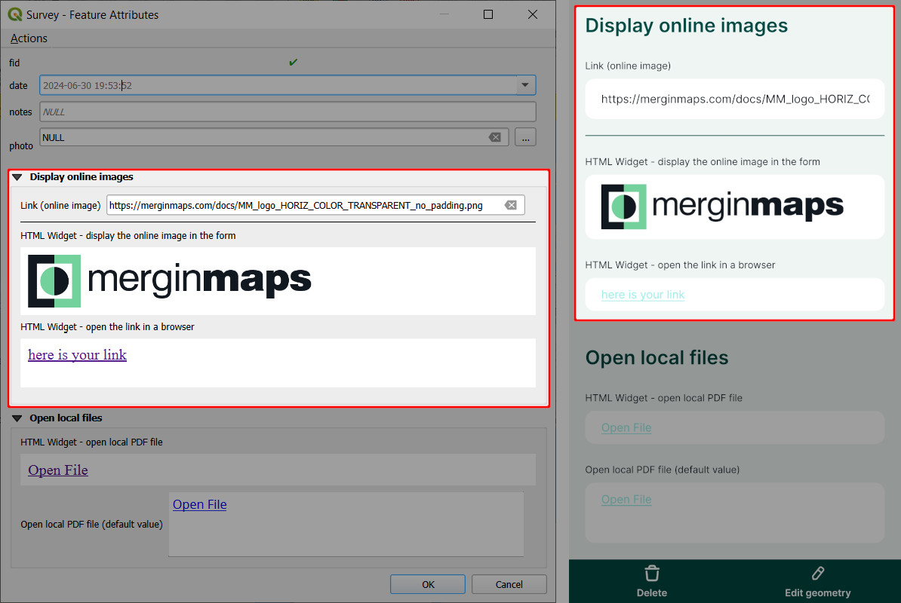

# Using HTML widget to display online images and other online resources
The **HTML widget** can be also used to display online images in the mobile app or open online resources, such as PDF files, videos or websites, in the browser of your device.

::: tip
Clone <MerginMapsProject id="documentation/forms-display-images-and-files" /> to how this works.
:::

Here are HTML samples you can use to [configure the HTML widget](#using-expressions-in-text-and-html-widgets). Your form should contain a text field for storing the full URL link (here: `link`).

To use these samples, replace `link` by the name of the appropriate field in your layer. 

- show image in the form

```html
<script>document.write(expression.evaluate("'<a href=\"'||attribute( @feature, 'link' )||'\"></a>'"));</script>
```

- display a text (`here is your link`) with a link that can be opened in a browser
```html
<script>document.write(expression.evaluate("'<a href=\"'||attribute( @feature, 'link' )||'\">here is your link</a>'"));</script>
```

Make sure that the HTML widget works before taking it to the field by testing it in the <MobileAppNameShort />. It should look something like this:



::: warning Image preview in QGIS 3.36+
QGIS may not display the preview of the online image if you use QGIS 3.36 or higher. Despite this behaviour, the <MobileAppNameShort /> displays it correctly. Therefore we recommend trying the setup by opening the form in the <MobileAppNameShort /> to make sure it works as intended.
:::
