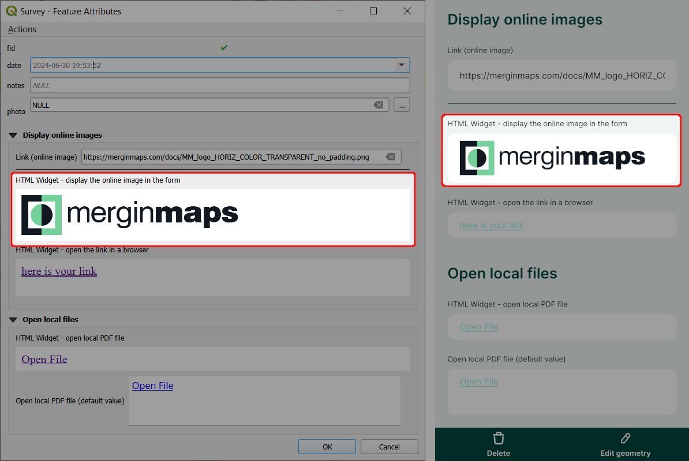

# How to Embed an Image
The [**HTML widget**](/info-widgets/) can be used to display online images in the <MobileAppNameShort />.

::: tip Example project available
Clone <MerginMapsProject id="documentation/forms-display-images-and-files" /> to how this works.
:::


Your layer should contain a text field for storing the full URL link (here: `link`). 

To show an online image in the form, configure the HTML widget with this expression (replace `link` with the name of the appropriate field in your layer): 

```html
<script>document.write(expression.evaluate("'<a href=\"'||attribute( @feature, 'link' )||'\"></a>'"));</script>
```

Make sure that the HTML widget works before taking it to the field by testing it in the <MobileAppNameShort />. It should look something like this:



::: warning Image preview in QGIS 3.36+
QGIS may not display the preview of the online image if you use QGIS 3.36 or higher. Despite this behaviour, the <MobileAppNameShort /> displays it correctly. Therefore we recommend trying the setup by opening the form in the <MobileAppNameShort /> to make sure it works as intended.
:::
