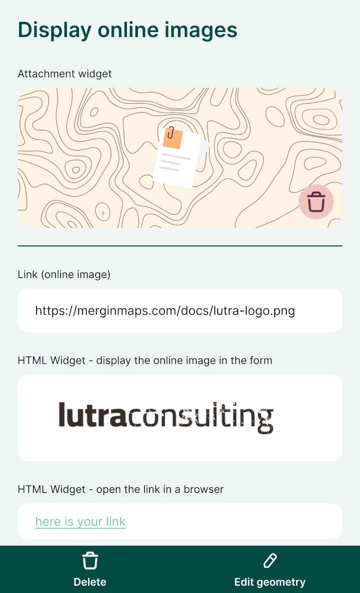
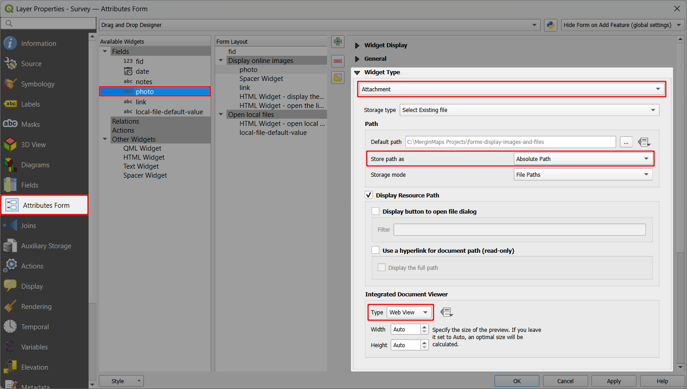
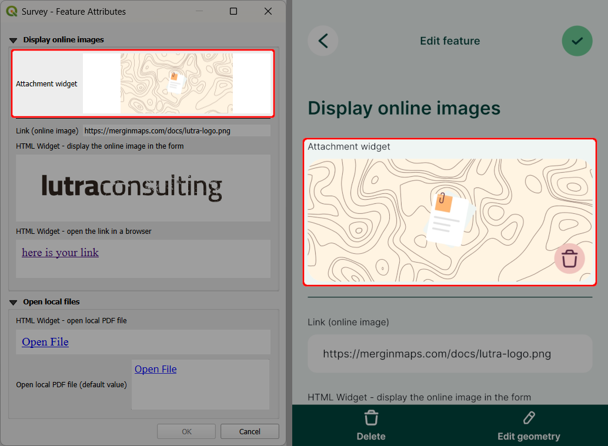
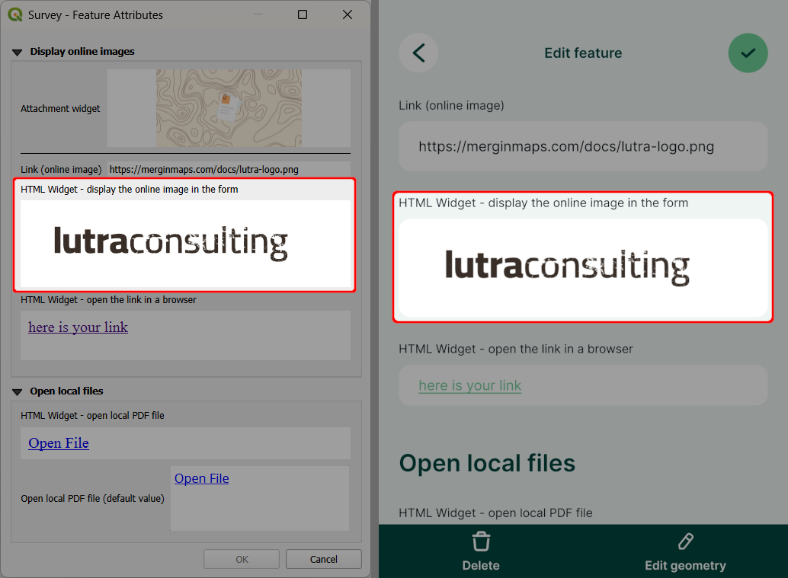

# How to Embed an Image
Online images can be displayed in the attributes form of a survey layer. There are two options:
- [Using the Attachment widget](#using-the-attachment-widget) is a straight-forward option to preview an online image in the form. Tapping the image in the form in the <MobileAppNameShort /> opens the image, so you can explore it in more detail directly in the app.
- [The HTML widget](#using-the-html-widget) uses a link stored in a field to display the image. Tapping the image in the form in the <MobileAppNameShort /> opens the image in a web browser (outside of the app).



::: tip Example project available
Both options are included in our example project <MerginMapsProject id="documentation/forms-display-images-and-files" />. Clone it to see how they work.
:::

## Using the attachment widget
The attachment widget can be configured to display online images in the form of a survey layer.

The survey layer needs to have a text field for storing the full URL link (here: `photo`).

1. Right-click on the survey layer, select **Properties** and go to the **Attributes form** tab.
2. In the list of **Available Widgets** select the text field you want to work with (here: `photo`).
3. In the **Widget Type** tab:
   - From the drop-down menu, select the **Attachment** widget
   - Store the path as **Absolute path**
   - Set the **Integrated Document Viewer** to use the type **Web View**, so that QGIS can display the online image in the form (this is not needed by the <MobileAppNameShort />)



4. **Apply** the changes

Online images can now be displayed in the form, both in QGIS (left) and in <MobileAppName /> (right):


When you click or tap on the image, it will open directly in the form and you can zoom in.

::: details Image preview in QGIS
Some QGIS versions may not display the preview of the image correctly. This issue does not occur in <MobileAppNameShort />. Therefore we recommend trying the setup by opening the form in the <MobileAppNameShort /> to make sure it works as intended.
:::

## Using the HTML widget <Badge text="Advanced" type="warning"/>

The [**HTML widget**](../info-widgets/#html-widget) can be used to display online images in the <MobileAppNameShort />.

Your layer should contain a text field for storing the full URL link (here: `link`). 

To show an online image in the form, [add the HTML widget to the form](../info-widgets/) and configure it with this expression (replace `link` with the name of the appropriate field in your layer): 

```html
<script>document.write(expression.evaluate("'<a href=\"'||attribute( @feature, 'link' )||'\"></a>'"));</script>
```

Make sure that the HTML widget works before taking it to the field by testing it in the <MobileAppNameShort />. It should display the online image both in QGIS (left) and in the <MobileAppNameShort /> (right):



When you click or tap on the image, it will open in a web browser.

::: details Image preview in QGIS
Some QGIS versions may not display the preview of the image correctly. This issue does not occur in <MobileAppNameShort />. Therefore we recommend trying the setup by opening the form in the <MobileAppNameShort /> to make sure it works as intended.
:::
