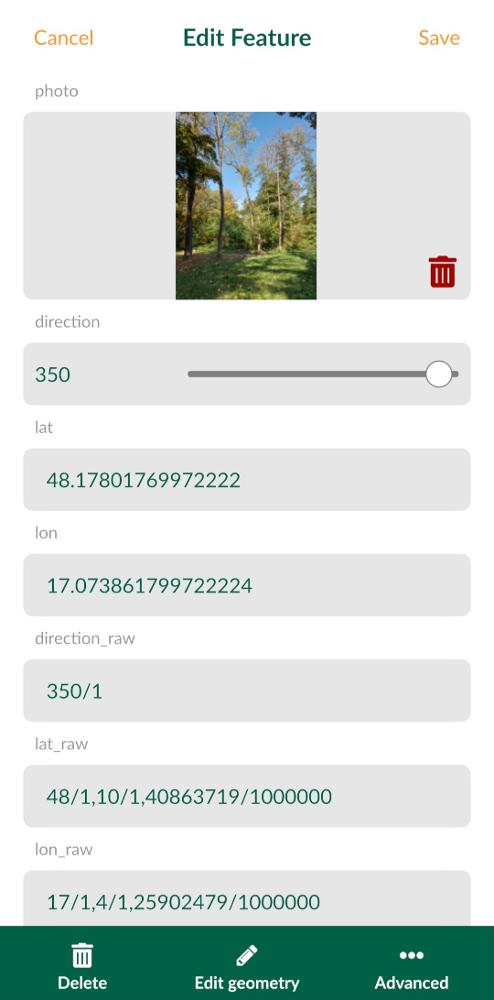

# Exif Metadata
[[toc]]

::: warning
Our mobile app was redesigned. We are in the process of updating this content to reflect these changes.
:::

EXIF is a file format for storing metadata in image files, such as the camera settings, image metrics, date and time or location information (see, e.g., [Wikipedia](https://en.wikipedia.org/wiki/Exif)). 

<MobileAppName /> supports some default value expression functions that can be used to read EXIF metadata and store their values in the fields of your survey layer.

To store GPS EXIF metadata, both the <MobileAppNameShort /> and your camera app have [location permissions](#allowing-location-tags) allowed on your mobile device.

::: tip
Clone <MerginMapsProject id="documentation/exif-metadata" /> to see how it works!
:::

## How to use EXIF metadata
To store EXIF metadata values in the fields of your survey layer:
1. In QGIS, open the **Properties** of your survey layer and navigate to the **Attributes Form** tab.
2. Now we need to set the [default values](./settingup_forms_settings/#default-values) of fields that should store EXIF metadata. 
   
   [Supported EXIF functions](#supported-exif-functions) are listed below. In general, EXIF functions looks like this: 
   `read_exif('<ABSOLUTE_PATH_TO_IMAGE>', '<EXIF_TAG_STRING>')` 
   
   This expression requires the **absolute path** to an image. The absolute path can be defined using the field where the image is stored (here: `photo`, this is a [text field with attachment widget](./settingup_forms_photo/)) and the `@project_home` variable that refers to the project home folder. 
   
   For example, the default value expression for the direction of the image (EXIF tag `GPSImgDirection`) can be defined as follows:
   
   `read_exif(@project_home + '/' + "photo", 'GPSImgDirection')`
      
   
   
   The preview shows a warning *Function is not known*. **This is OK, <MobileAppName /> will know what to do with it!**

3. Save and sync your project. 

4. Open the project in <MobileAppName />. Once you capture a photo during the field survey, the EXIF metadata values will be automatically filled in:
   

## Supported EXIF functions
EXIF function supported by <MobileAppName />:
- `read_exif_img_direction('<ABSOLUTE_PATH_TO_IMAGE>')` returns the direction of the image when captured. The direction is represented by a number.
- `read_exif_latitude('<ABSOLUTE_PATH_TO_IMAGE>')` returns GPS Latitude as a decimal number.
- `read_exif_longitude('<ABSOLUTE_PATH_TO_IMAGE>')` returns GPS Longitude as a decimal number.
- `read_exif('<ABSOLUTE_PATH_TO_IMAGE>', '<EXIF_TAG_STRING>')`, where **EXIF tag string** defines the EXIF property, such as:
   - `GPSImgDirection` returns the direction of the image when captured as a rational. The direction is represented by a rational, e.g. 350/1.
   - `GPSLatitude` returns GPS Latitude as rationals, e.g. 48/1, 6/1, 309275/10000.
   - `GPSLongitude` returns GPS Longitude as rationals, e.g. 17/1, 6/1, 244907/10000.
   - `ImageWidth` returns the image width in pixels.

The list of **EXIF tags** can be found in the Android developer documentation for [<NoSpellcheck id="ExifInterface" /> ](https://developer.android.com/reference/android/media/ExifInterface) or in [ExifTool documentation](https://exiftool.org/TagNames/EXIF.html). 

Note that some of the tag names listed in [ExifTool documentation](https://exiftool.org/TagNames/EXIF.html) can differ from the EXIF specification. As an example, while `ImageWidth` tag is valid, `ImageHeight` is not and you have to use `ImageLength` tag name (defined by EXIF specification) when [recording EXIF metadata](#how-to-use-exif-metadata) in <MobileAppName />.

:::details
EXIF tags that can be retrieved from your images can vary depending on how they were created (e.g. what type of device you used to capture photos). EXIF tags that are recorded in your image can be displayed, e.g., using [ExifTool](https://exiftool.org/):
```
exiftool -n -S <PATH_TO_IMAGE>
```

However, keep in mind that the EXIF tag names that you get from ExifTool can differ from EXIF specification. To store EXIF metadata using <MainPlatformNameLink />, you have to use the latter.
:::

## Allowing location tags
**Location tags have to be allowed** in the camera settings to store GPS EXIF metadata.

- **Android**: Open Camera app -> Camera settings -> Location tags. 
   

- **iOS**: Open Settings -> Privacy -> Location Services -> Camera (app).
   
