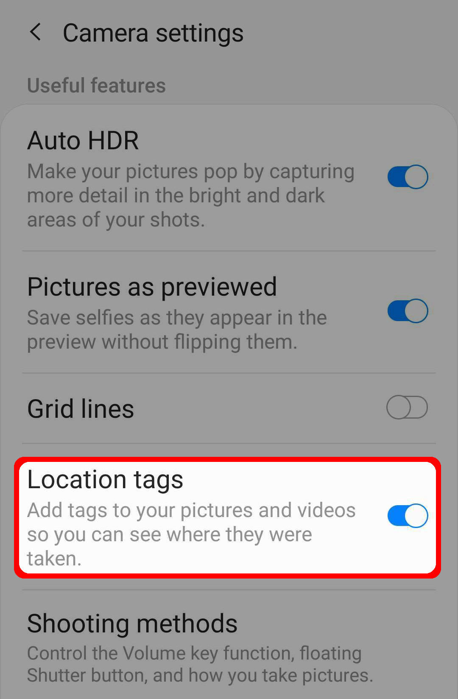
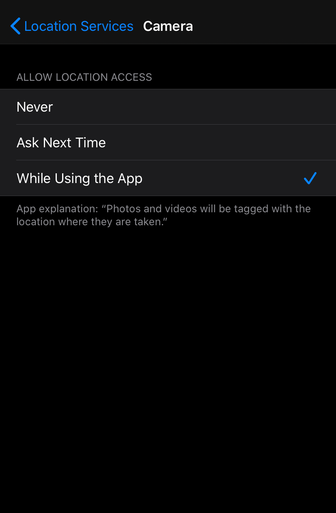
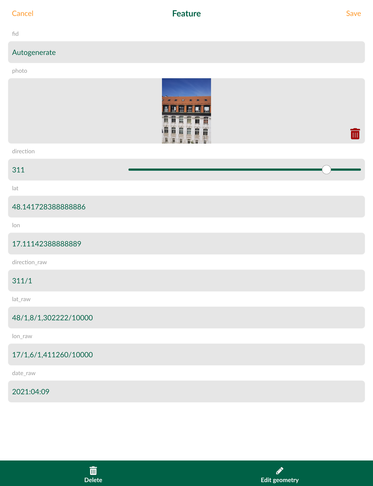

# Exif Metadata
[[toc]]

<MobileAppName /> comes with predefined default value expression functions which can be used to read an image EXIF metadata.

## Supported functions

Following functions are supported:

- `read_exif('<ABSOLUTE_PATH_TO_IMAGE>', '<EXIF_TAG_STRING>')` 
    - returning string
- `read_exif_img_direction('<ABSOLUTE_PATH_TO_IMAGE>')` 
    - returning number
- `read_exif_latitude('<ABSOLUTE_PATH_TO_IMAGE>')` 
    - returning decimal number
- `read_exif_longitude('<ABSOLUTE_PATH_TO_IMAGE>')` 
    - returning decimal number

## Allowing location tags
Note that **location tags have to be allowed** in a camera settings. You can find the option as following:

### Android
Open Camera app -> Camera settings -> Location tags. 

### iOS
Open Settings -> Privacy -> Location Services -> Camera (app).

## Use it with photo widget
The parameter `<ABSOLUTE_PATH_TO_IMAGE>` can be set with an expression using value of another field. Therefore you can use a value from a text field of an attachment type as a parameter for <MobileAppName />'s EXIF functions as following:

`read_exif(@project_home + '/' + "photo", 'GPSImgDirection')`

You can use both `Take a photo` or `From gallery` actions of the attachment widget. While capturing a photo with a camera, GPS EXIF data are added to the photo metadata. Make sure that location permissions are allowed in <MobileAppName /> and also for your camera app.

For further examples you can check fields definitions of project <MerginMapsProject id="lutraconsulting/test_exif" /> accessible on Mergin.

