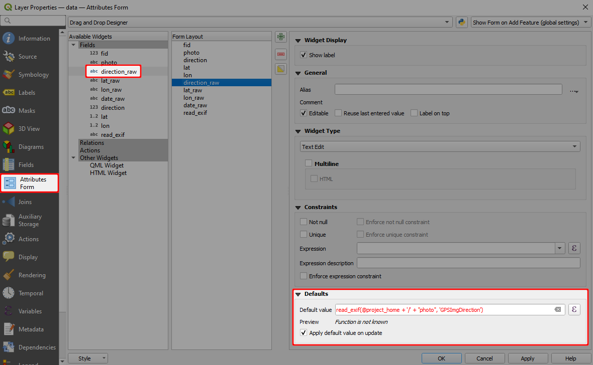

# Exif Metadata
[[toc]]
EXIF is a file format for storing metadata in the image file, such as the camera settings, image metrics, date and time or location information (see, e.g., [Wikipedia](https://en.wikipedia.org/wiki/Exif)). 

<MobileAppName /> supports some default value expression functions that can be used to read EXIF metadata and store their value in the fields.

::: tip
Clone this project <MerginMapsProject id="documentation/exif-metadata" /> to see how this works!
:::

## How to use EXIF metadata 
To store EXIF metadata values in the fields of your survey layer:
1. In QGIS, open the **Properties** of your survey layer and navigate to the **Attributes Form** tab.
2. Here, we need to set the [default values](./settingup_forms_settings/#default-values) of fields that should store EXIF metadata. 
   
   [Supported EXIF functions](#supported-exif-functions) are listed below. In general, an EXIF function looks like this: 
   `read_exif('<ABSOLUTE_PATH_TO_IMAGE>', '<EXIF_TAG_STRING>')` 
   
   This expression requires the **absolute path** to an image. The absolute path can be defined using the field where the image is stored (here: `photo`, this is a [text field with attachment widget](./settingup_forms_photo/)) and the `@project_home` variable that refers to the project home folder. 
   
   For example, the default value expression for the direction of the image (EXIF tag `GPSImgDirection`) can be defined as follows:
   
   `read_exif(@project_home + '/' + "photo", 'GPSImgDirection')`
      
   
   
   **Preview** will show a warning *Function is not known* because QGIS does not recognize `read_exif` function. **This is OK, <MobileAppName /> knows what to do with it!**

3. Save and sync your project. 

4. Open the project in <MobileAppName />. Once you capture a photo during the field survey, the EXIF values will be automatically filled in:
   

   :::warning
   Make sure that both <MobileAppName /> and your camera app have [location permissions](#allowing-location-tags) on your mobile device.
   :::

## Supported EXIF functions
EXIF function supported by <MobileAppName />:

Generic function: `read_exif('<ABSOLUTE_PATH_TO_IMAGE>', '<EXIF_TAG_STRING>')`, returns string, e.g.:
- `read_exif('<ABSOLUTE_PATH_TO_IMAGE>', 'GPSImgDirection')`, returning string (number fraction)
- `read_exif('<ABSOLUTE_PATH_TO_IMAGE>', 'GPSLatitude')`, returning string
- `read_exif('<ABSOLUTE_PATH_TO_IMAGE>', 'GPSLongitude')`, returning string
- `read_exif('<ABSOLUTE_PATH_TO_IMAGE>', 'GPSDateStamp')`, returning string
  
You may also use:
- `read_exif_img_direction('<ABSOLUTE_PATH_TO_IMAGE>')`, returning number
- `read_exif_latitude('<ABSOLUTE_PATH_TO_IMAGE>')`, returning decimal number
- `read_exif_longitude('<ABSOLUTE_PATH_TO_IMAGE>')`, returning decimal number
  
        
::: tip
Explore <MerginMapsProject id="documentation/exif-metadata" /> to see the setup of fields that use these functions.
:::

::: warning
The data type of the field needs to match the EXIF tag data type.
:::
    
## Allowing location tags
**Location tags have to be allowed** in the camera settings.

- **Android**: Open Camera app -> Camera settings -> Location tags. 
   

- **iOS**: Open Settings -> Privacy -> Location Services -> Camera (app).
   
