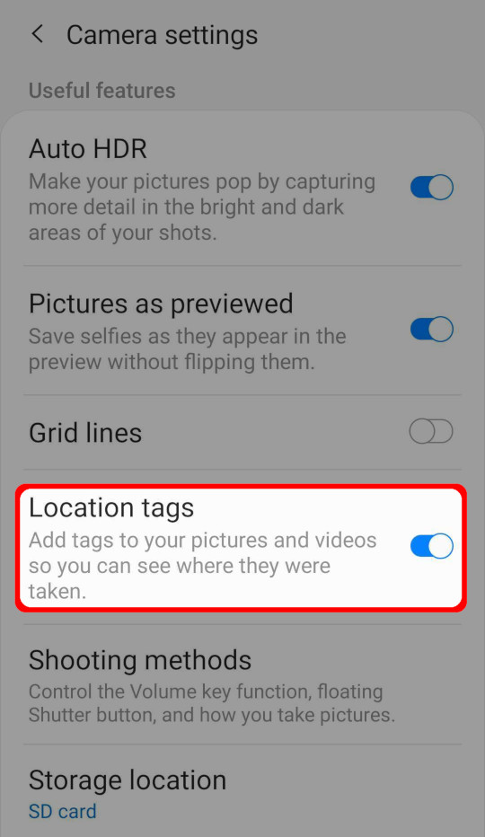

# Exif Metadata
[[toc]]
EXIF is a file format for storing metadata in the image file, such as the camera settings, image metrics, date and time or location information (see, e.g., [Wikipedia](https://en.wikipedia.org/wiki/Exif)). 

<MobileAppName /> supports some default value expression functions that can be used to read EXIF metadata and store their value in the fields.

## How to use EXIF metadata 
To store EXIF metadata values in the fields of your survey layer:
1. Open your <MainPlatformName /> project in QGIS. If needed, create new fields to store EXIF values in your survey layer.
2. Set the [default values](./settingup_forms_settings/#default-values) of EXIF fields using the expression:
   `read_exif('<ABSOLUTE_PATH_TO_IMAGE>', '<EXIF_TAG_STRING>')` 
   
   This expression requires the absolute path to an image. The absolute path can be defined using the field where the image is stored (here: `photo`, it should be a [text field with attachment widget](./settingup_forms_photo/).) and the `@project_home` variable that refers to the project home folder.
   
   For example, the default value expression for the direction of the image (`GPSImgDirection`) can be defined as follows:
   `read_exif(@project_home + '/' + "photo", 'GPSImgDirection')`
      
   [Supported EXIF functions](#supported-exif-functions) are listed below.

3. Save and sync your project. 

In <MobileAppName />, the EXIF values will be automatically filled in once you capture a photo

:::warning
Make sure that both <MobileAppName /> and your camera app have location permissions on your mobile device.
:::

## Supported EXIF functions
EXIF function supported by <MobileAppName /> 

`read_exif('<ABSOLUTE_PATH_TO_IMAGE>', '<EXIF_TAG_STRING>')` 

- `read_exif_img_direction('<ABSOLUTE_PATH_TO_IMAGE>')` 
    - returning number
- `read_exif('<ABSOLUTE_PATH_TO_IMAGE>', 'GPSImgDirection')`
    - returning string (number fraction)
- `read_exif_latitude('<ABSOLUTE_PATH_TO_IMAGE>')` 
    - returning decimal number
- `read_exif('<ABSOLUTE_PATH_TO_IMAGE>', 'GPSLatitude')`
    - returning string
- `read_exif_longitude('<ABSOLUTE_PATH_TO_IMAGE>')` 
    - returning decimal number
- `read_exif(@project_home + '/' + "photo", 'GPSLongitude')`
    - returning string
- `read_exif(@project_home + '/' + "photo", 'GPSDateStamp')`
    - returning string     
        
::: tip
Explore <MerginMapsProject id="documentation/exif-metadata" /> to see the setup of fields that use these functions.
:::
    

## Location tags
To use this functionality, **location tags have to be allowed** in the camera settings.

### Allowing location tags on Android
Open Camera app -> Camera settings -> Location tags. 

### Allowing location tags on iOS
Open Settings -> Privacy -> Location Services -> Camera (app).

