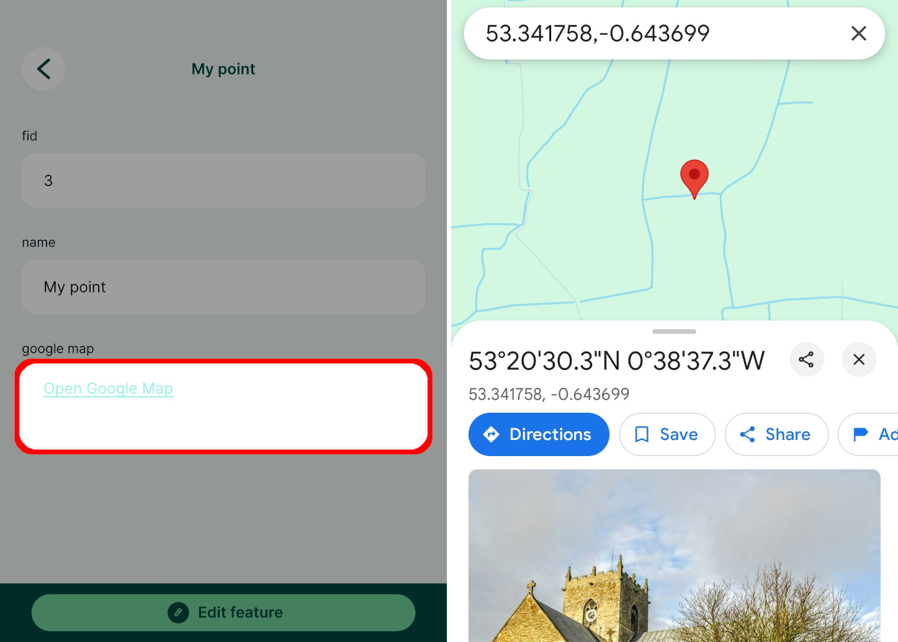

# External links
[[toc]]

## Open link in a browser

1. Right-click on a layer, select **Properties** and go to the **Attributes form** tab.
2. In the list of **Available Widgets** select the field you want to work with. 
3. In the **Widget Type** tab:
   - Ensure that **Text Edit** is selected
   - Check the **Multiline** and **HTML** options
4. In the **Defaults** tab, use a string such as this as **Default value**:
   `'<a href="https://www.lutraconsulting.co.uk/">Open link</a>'`
   :::details
   The default value defines the hyperlink and how it will be displayed in the form using HTML:
   `<a href="your link here">display text</a>`
   Individual links can be generated for each feature based on a value from another field. Let's say there is a field called **name** with a sample value *my-page*:
   `'<a href="'||'www.web-page.com/'||"name"||'">Open link</a>'` will result in *www.web-page.com/my-page*.
   :::
5. If the link changes based on a value from a different field, check the **Apply default value on update** option.
6. **Apply** the changes. Don't forget to save and sync your project!

When you click on a feature in <MobileAppName />, the form will contain a clickable link.

## Open link to a navigation app

:::tip
Clone <MerginMapsProject id="documentation/forms-navigation-link" /> to follow this example!
:::

Let's say you want to find your surveyed features on Google Maps. It is possible to do so directly from <MobileAppName />, you just need to set up a **text field** that will open Google Maps and enter the coordinates of the feature to the Google Maps search bar.

1. Right-click on a layer, select **Properties** and go to the **Attributes form** tab.
2. In the list of **Available Widgets** select the field you want to work with. 
3. In the **Widget Display** tab:
   - Ensure that **Text Edit** is selected
   - Check the **Multiline** and **HTML** options
4. In the **Defaults** tab, use this string as **Default value**:
   `'<a href="'||'https://www.google.co.uk/maps/place/' || to_string( y(transform( $geometry, 'EPSG:3857', 'EPSG:4326'))) || ',' || to_string( x( transform( $geometry, 'EPSG:3857', 'EPSG:4326'))) || '">Open Google Map</a>'`
5. Check the **Apply default value on update** option
6. **Apply** the changes. Don't forget to save and sync your project!

When you tap a feature in the <MobileAppNameShort />, the form will display a clickable link **Open Google Map** that opens the Google Map app at the position of the feature.

