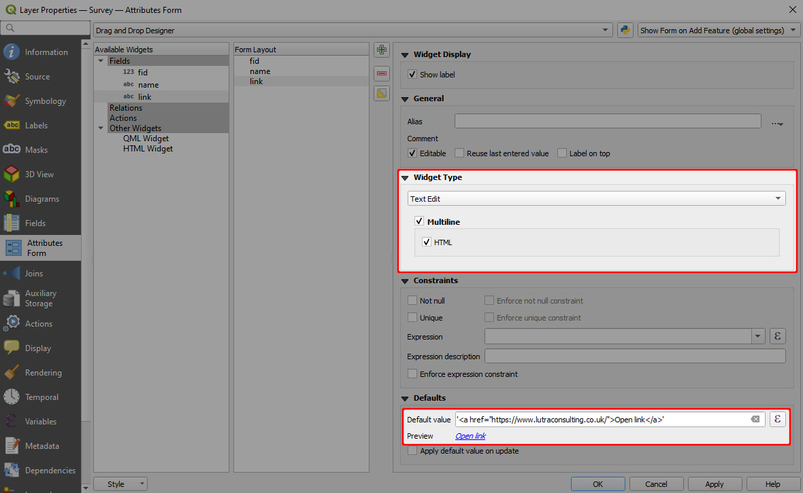
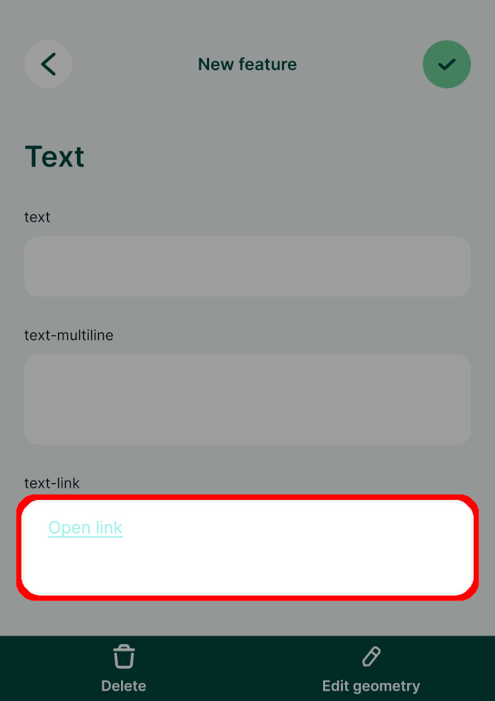

# How to Use Hyperlinks

Attributes forms can include clickable links that can be used to open a link in a browser directly from the form in <MobileAppName />.  

1. Right-click on a layer, select **Properties** and go to the **Attributes form** tab.
2. In the list of **Available Widgets** select the field you want to work with. 
3. In the **Widget Type** tab:
   - Ensure that **Text Edit** is selected
   - Check the **Multiline** and **HTML** options
4. In the **Defaults** tab, use a string such as this as **Default value**:
   `'<a href="https://www.lutraconsulting.co.uk/">Open link</a>'`
   :::details
   The default value defines the hyperlink and how it will be displayed in the form using HTML:
   `<a href="your link here">display text</a>`
   Individual links can be generated for each feature based on a value from another field. Let's say there is a field called **name** with a sample value *my-page*:
   `'<a href="'||'www.web-page.com/'||"name"||'">Open link</a>'` will result in *www.web-page.com/my-page*.
   :::
5. If the link changes based on a value from a different field, check the **Apply default value on update** option.
6. **Apply** the changes. Don't forget to save and sync your project!

When you click on a feature in <MobileAppName />, the form will contain a clickable link.

:::tip
Hyperlinks can be used in the attributes form also to open a [link to a navigation app](../link-to-navigation/).
:::
