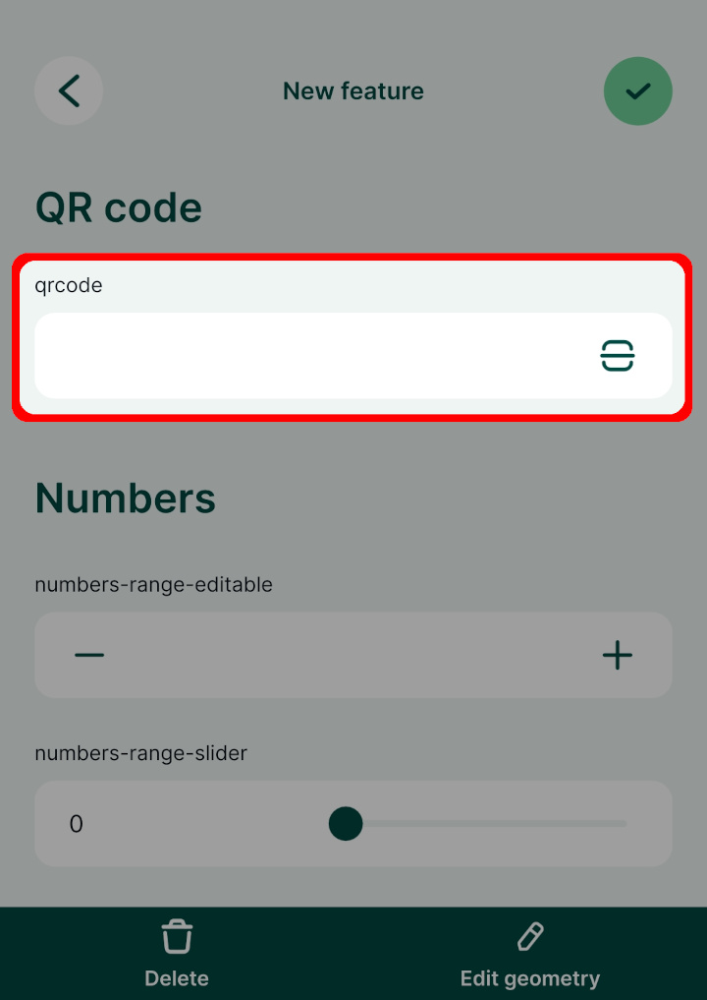

# Fields - QR code

:::tip Example project available
A QR code field is used in this public project: <MerginMapsProject id="documentation/form-widgets" />. Download or clone it to see this setup.
:::

To be able to scan QR codes using your camera, the field name or the field alias has to contain the word `qrcode` (the text is not case sensitive, it can be in combination of lower or upper case letters). 

In the <MobileAppNameShort />, there will be a QR code icon next to the field. Tap on it to scan the QR code using your camera and the content (a number, text, link, etc.) will be filled in automatically to your field.

