# Attributes Form Configuration
[[toc]]

::: warning
Our mobile app was redesigned. We are in the process of updating this content to reflect these changes.
:::

In addition to setting up [edit widgets](../form-widgets/) and designing [form layout](../form-layout/), extra configuration can be done to the fields in QGIS to make the data collection easier and more consistent.

<YouTube id="jc4p1PpXj3k" />

## Default values
Default values can be used to automatically record, e.g, the name of the surveyor, date and time of the survey, latitude and longitude of the feature, or to have frequently used values filled in advance.

:::tip
Clone <MerginMapsProject id="documentation/form_setup" /> to follow this example!
:::

The default value can be a text, number or a QGIS expression. Here we are going to set the default values for **x** and **y** field to be longitude and latitude.

1. Right-click on **survey** layer and select **Properties**
2. In the **Attributes form** tab, select the **x** field in the **Available Widgets** column on the left
3. In the **Widget Display**, set the **Alias** to *Longitude*
4. In **Defaults** tab, define the **Default value** as:
   `x( transform( $geometry, 'EPSG:3857', 'EPSG:4326'))`
   Note that the expression transforms the point from EPSG:3857 (map and layer coordinate reference system) to EPSG:4326.
5. Check the **Apply default value on update**

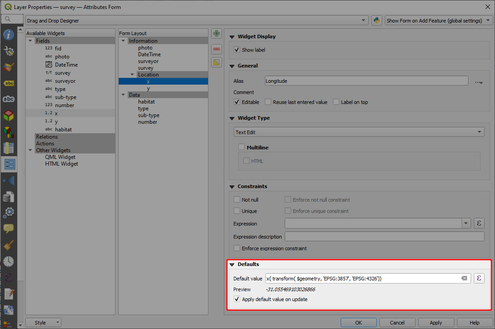

Repeat the same steps for **y** field and setting the **Alias** to *Latitude* and the default value to
`y( transform( $geometry, 'EPSG:3857', 'EPSG:4326'))`

Don't forget to save and synchronise your project!

When you survey a new point in <MobileAppName />, you will see the values are automatically filled in:

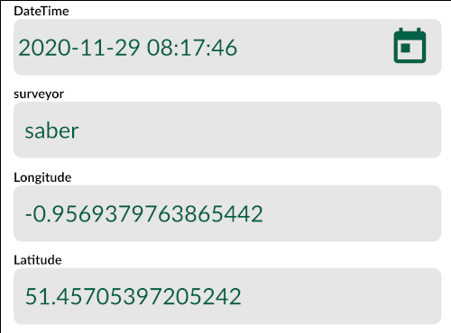

### Examples of useful default values
There are some commonly used default values that can be useful in your field survey. As they are filled in automatically, they can be hidden from attributes form.

* It is convenient to know when a feature was created and when it was last updated. Use fields with **Date** or **Date&Time** data types with the `now()` function to record these information. You can change the formatting using [Date/Time](../form-widgets/#date-and-time) widget.
* Similarly, the name of the <MainPlatformName /> user who created or modified the feature can be recorded using the `@mergin_username` [QGIS plugin variable](../plugin-variables/). These field should have the **Text (string)** data type.
* The coordinates of a point feature can be recorded as well using the `$x` and `$y` function in QGIS. To record the coordinate accurately, these fields should have the **Decimal number (real)** data type.  If the coordinates are in meters, values can be rounded to, say, 2-3 decimal places. When working with geographic coordinates that use degrees, you may want to round the coordinates to 8 decimal places. Use the *apply default value on update* option so that you have correct values when the position of the point feature changes.


| Variable name               | Sample value                  | Apply default value on update   | Description |
|-----------------------------|-------------------------------|---------|-------------|
| `@now`          | `2024-06-30 10:00:00`                      | **no**  | The timestamp of when the feature was created. |
| `@now`          | `2024-06-30 10:30:00`                     | **yes**  | The timestamp of when the feature was last **updated**. |
| `@mergin_username`          | `sarah`                      | **no**  | Name of the user who created this feature.|
| `@mergin_username`          | `jack`                      | **yes**  | Name of the user who **updated** this feature last.|
| `round($x,2)`          | `1898789.92`                      | **yes**  | The X coordinate of a point feature, rounded to 2 decimal places.|
| `round($y,2)`          | `6134520.89`                      | **yes**  | The Y coordinate of a point feature, rounded to 2 decimal places.|

### Open local files using default values
Default values can also be used to open local files (e.g. a PDF file) from within the form. This file needs to be packaged with the project, so it should be stored somewhere in the [project folder](../../manage/project/#mergin-maps-project-folder).

There is a public project <MerginMapsProject id="documentation/forms-display-images-and-files" /> you can download or clone to see how the setup works.
- A PDF file named `my-pdf.pdf` is stored in the main project folder.
- The survey layer has a field named `local-file-default-value` with **Text (string)** data type.
   - This field is set to *not editable* (the form will refer to the same file for all features and does not need to be changed).
   - This field uses the **Text Edit** widget with the *Multiline* and *HTML* options enabled.
   - The **default value** is set to:
   ```
   '<a href="project://my-pdf.pdf">Open File</a>'
   ```


In the <MobileAppNameShort />, you can tap the *Open File* link to open the PDF file using the default application of your device.

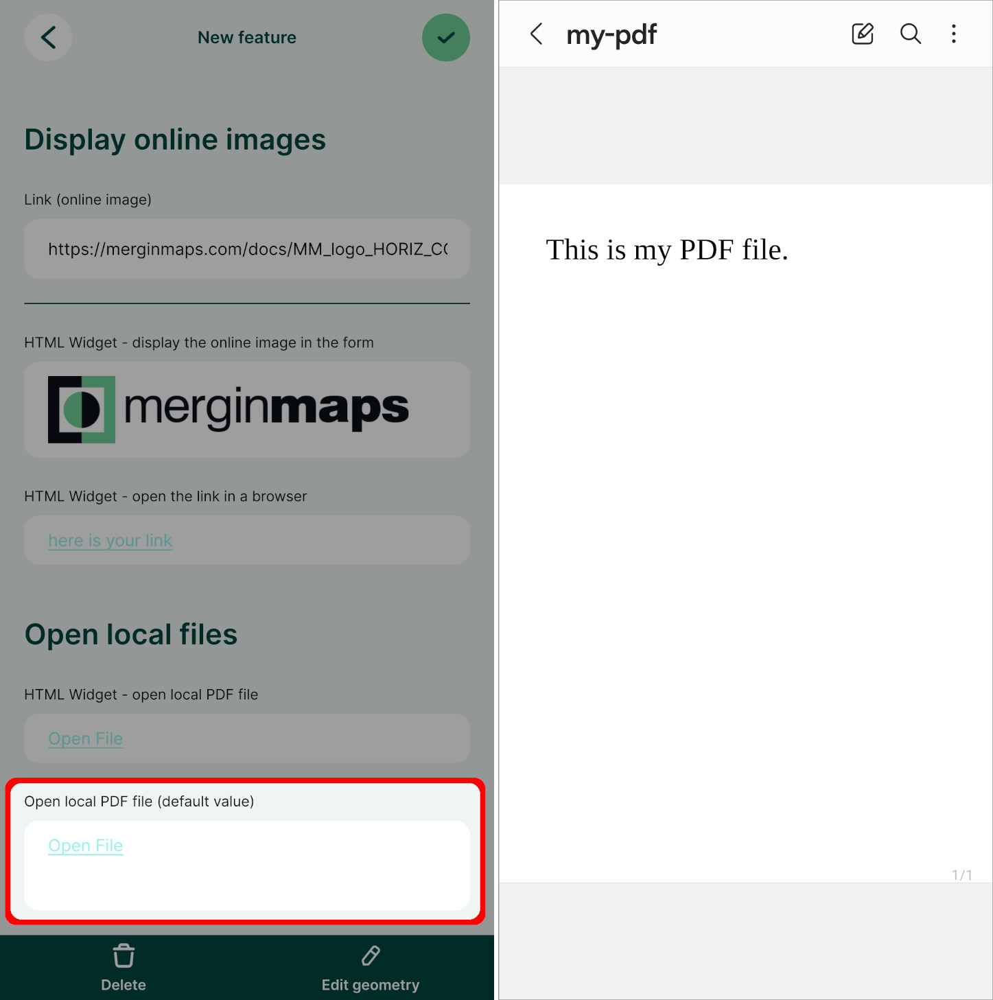

::: tip Open local files using the HTML widget
Local files can be displayed in the form also using [the HTML widget](../form-layout/#using-html-widget-to-open-local-files). 

In the <MerginMapsProject id="documentation/forms-display-images-and-files" /> project, you can explore and compare both alternatives.
:::

## Constraints
When collecting data, you may want to apply constraints to certain field(s) to avoid mistakes when the values are filled in in the field.

:::tip
Clone <MerginMapsProject id="documentation/form_setup" /> to follow this example!
:::

Here, we will set up a constraint to the **number** field that represents the number of plants.

1. Right-click on **survey** layer and select **Properties**
2. In the **Attributes form** tab, select the **number** field in the **Available Widgets** column on the left
3. In the **Widget Display**, define the **Constraints**:
   - check the **Not null** and **Enforce not null constraints**
   - **Expression** type `"number" >= 1` and check the **Enforce expression constraint** option

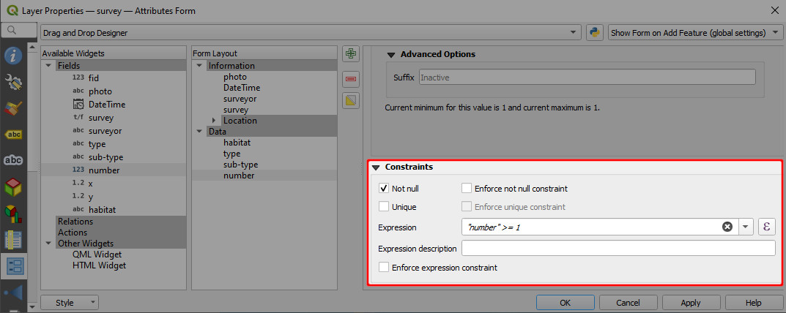

When surveying new features in <MobileAppName />, this field will have to be filled in using a value higher than or equal to 1. Otherwise, you will get a warning.
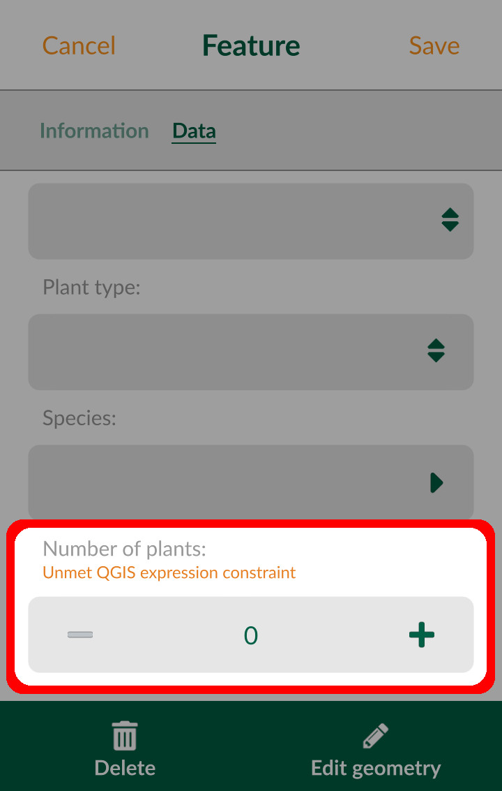

## Drill-down forms
Cascade or drill-down forms enable to list values in a field depending on a value selected in another field.

:::tip
Clone <MerginMapsProject id="documentation/form_cascade" /> to follow this example!
:::

In this project, we will work with the point layer named **car**. The survey tab in the form contains information about cars, such as **Car-Type**, **Car-Manufacturer**, or **Car-Model**. These attributes refer to non-spatial tables using [value relations](../form-widgets/#value-relation). 
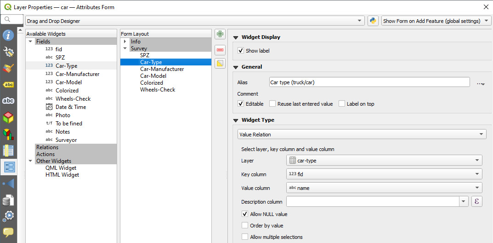

To make the survey easier, we will set the drill-down form so that the values in the drop-down menus are filtered based on the previously selected values. For example, if **Car type (truck/car): Trucks** is selected, the **Car-Manufacturer** field will offer only truck manufacturers *DAF Trucks*, *Scania*, *MAN*. Likewise, the next drop-down menu for **Car-Model** will change accordingly based on the **Car-Manufacturer** selection, showing only relevant car models.

To set the drill-down form:
1. Right-click on the **car** layer and select **Properties**. 
2. Navigate to the **Attributes form** tab. We will set the value relations for the **Car-Type**, **Car-manufacturer**, **Car-model** fields, which are located in the Survey tab of the form.
3. The **Car-Type** field refers to the **car-type** table. The key column is the `fid` and the value column is the `name` field:
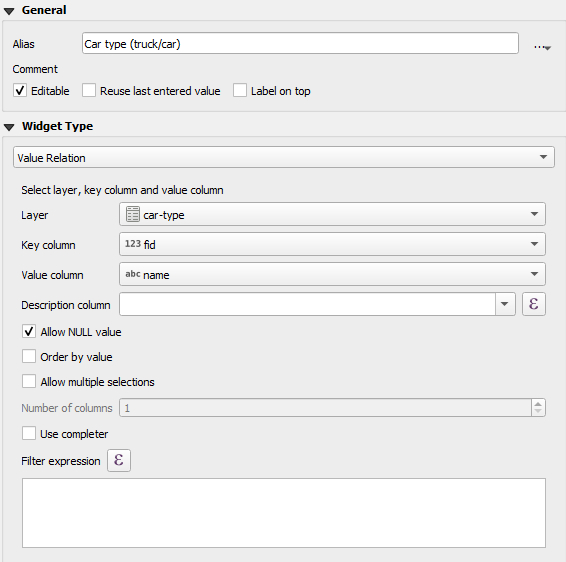

   The **car-type** table is structured as follows:
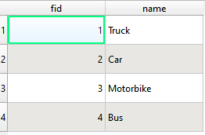

   When entering data into this field, the user can choose from these four `name` values. 
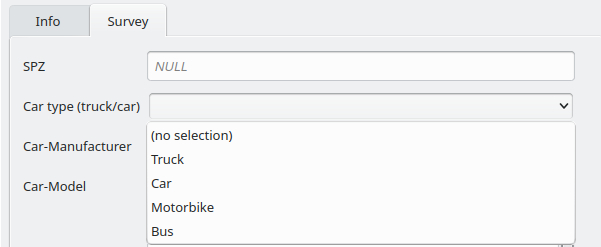

4. The **Car-manufacturer** field refers to the **car-manufacturer** table. This table contains the fields `fid`, `name`, and `type`.
   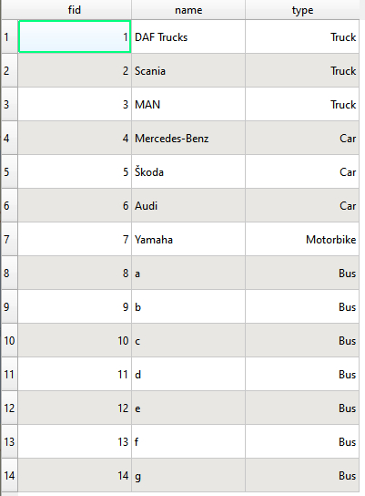

   - Set the `fid` field as the key column and `name` as the value column. 
   - Use the `type` field to define which values will be shown in the form based on the selected **Car-type** by entering this **Filter expression**: 
   `"type" = current_value('Car-Type')`

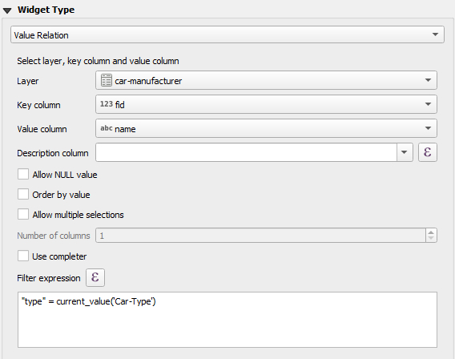

   Now, the form will offer only options, where the **Type** field of the **car-manufacturer** table matches the current value of the **Car-type**. When entering data, we will get a drill-down form: since *Truck* is selected as the **Car type**, only three manufacturers are available in the **Car-Manufacturer** field.

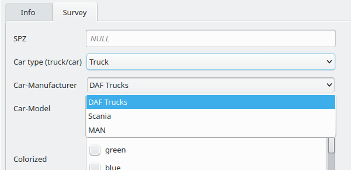

5. **Car-model** works similarly. It refers to the **car-model** table, limiting options based on the **Car-manufacturer** field.
   - Set the `fid` field as the key column and `name` as the value column. 
   - Use the `manufacturer` field to filter the values using this **Filter expression**:
   `"manufacturer" = current_value('Car-Manufacturer')`

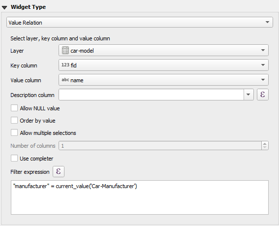

When doing the survey <MobileAppName />, you will see that after selecting **Car-type: Car**, the **Manufacturer** field will only offer **Mercedes-Benz**, **Skoda** and **Audi**. After selecting **Audi**, the **Car-Model** field will only offer the appropriate car models.

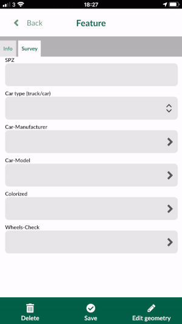
