# Attributes Form Configuration
[[toc]]

In addition to setting up [edit widgets](../form-widgets/) and designing the [form layout](../form-layout/), extra configuration can be done to the fields in QGIS to make the data collection easier and more consistent.


<YouTube id="jc4p1PpXj3k" />


## Default values
Default values can be used to automatically record, e.g, the name of the surveyor, date and time of the survey, latitude and longitude of the feature, or to have frequently used values filled in advance (see <QGISHelp ver="latest" link="user_manual/working_with_vector/vector_properties.html#default-values" text="QGIS documentation" />).

The default value can be a text, number or a QGIS expression. The data format of the field has to match the result of the default value expression you want to use.

In QGIS, default values can be set up in the **Attributes Form** tab in **Layer Properties**. In the **Defaults** tab, you can enter the default value of the selected field (manually or using an expression). Check the option *Apply default value on update* :heavy_check_mark: to update the field value whenever there is a change in the feature.

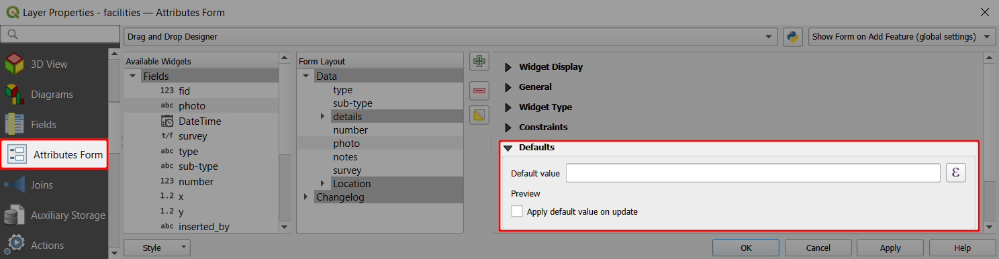


::: tip Example project available
Various usage of default values can be explored in more detail by downloading or cloning this public project <MerginMapsProject id="documentation/form_setup" />.
:::

### Recording usernames and timestamps automatically

Let's set up an attributes to record the <MainPlatformName /> username of the surveyor who *created* a feature:
1. Right-click on a layer, select **Properties** and go to the **Attributes form** tab.
2. In the list of **Available Widgets** select the text field you want to use (here: `inserted_by`)
3. In **Defaults** tab, define the **Default value** as `@mergin_username`. 
   Do not check the **Apply default value on update** option :white_large_square:.


To save the <MainPlatformName /> username of the surveyor who *modified* this feature, the steps are similar:
1. In the list of **Available Widgets** select the text field you want to use (here: `updated_by`)
2. In **Defaults** tab, define the **Default value** as `@mergin_username`. 
   Check the **Apply default value on update** option :heavy_check_mark:. The field will be updated anytime the feature is modified, saving the name of the surveyor who made the changes.

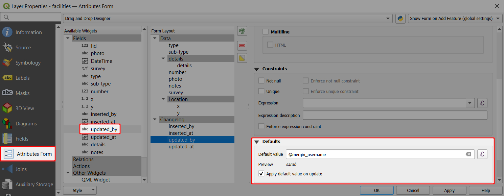


Follow the same steps for attributes to store the timestamps of when was the feature created and updated (here: `inserted_at`, `updated_at`), using the `now()` expression as **Default value**.

When the form is opened in the <MobileAppNameShort />, the default values are automatically filled in:

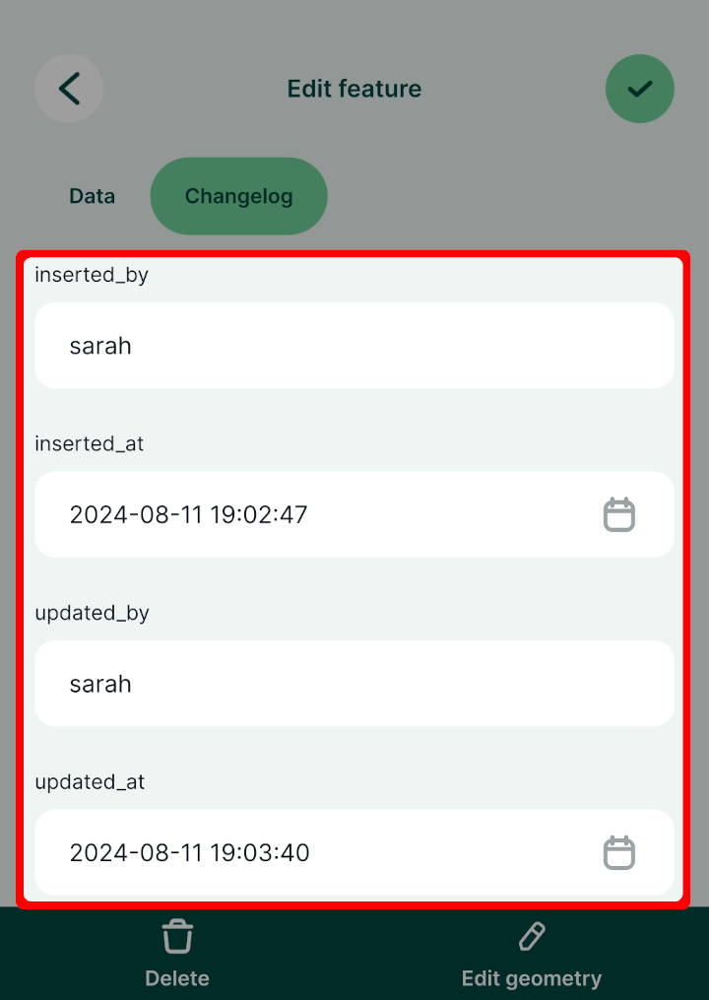

### Automatically transform and record coordinates of a point
Here we are going to set the default values for `x` and `y` field to be longitude and latitude.

1. Right-click on the survey layer and select **Properties**
2. In the **Attributes form** tab, select the `x` field in the **Available Widgets** column on the left
3. In the **Widget Display**, set the **Alias** to *Longitude*
4. In **Defaults** tab, define the **Default value** as:
   ```
   x( transform( $geometry, 'EPSG:3857', 'EPSG:4326'))
   ```
   Note that the expression transforms the point from EPSG:3857 (map and layer coordinate reference system) to EPSG:4326.
5. Check the **Apply default value on update** option :heavy_check_mark:.


Repeat the same steps for `y` field and setting the **Alias** to *Latitude* and the default value to

```
y( transform( $geometry, 'EPSG:3857', 'EPSG:4326'))
```

Don't forget to save and synchronise your project!

When adding or editing features in the <MobileAppNameShort />, the coordinates are automatically filled in:

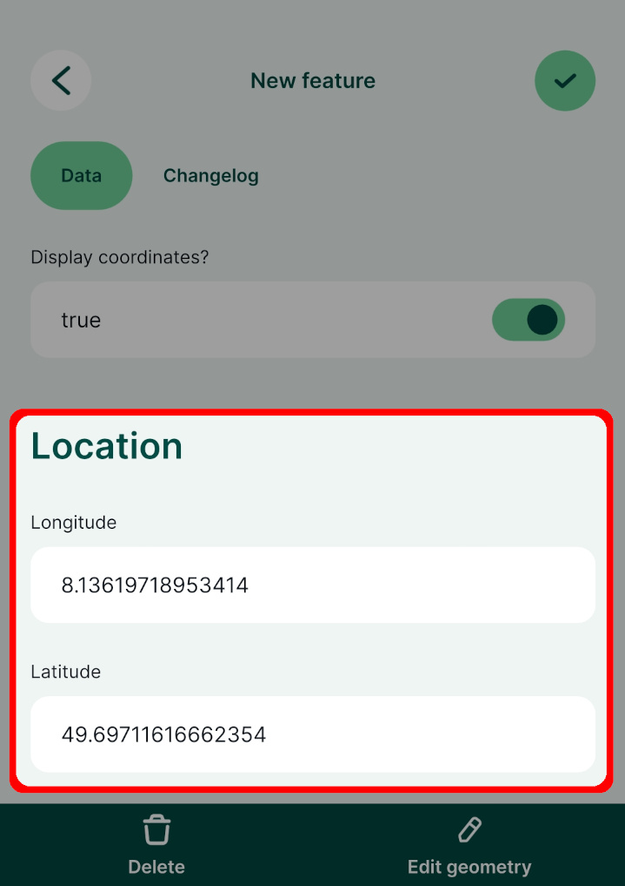

### Examples of useful default values
There are some commonly used default values that can be useful in your field survey. As they are filled in automatically, they can be hidden from attributes form.

- It is convenient to know when a feature was created and when it was last updated. Use fields with **Date** or **Date&Time** data types with the `now()` function to record these information. You can change the formatting using [Date/Time](../form-widgets/#date-and-time) widget.
- Similarly, the name of the <MainPlatformName /> user who created or modified the feature can be recorded using the `@mergin_username` [QGIS plugin variable](../plugin-variables/). These field should have the **Text (string)** data type.
- The coordinates of a point feature can be recorded as well using the `$x` and `$y` function in QGIS. To record the coordinate accurately, these fields should have the **Decimal number (real)** data type.  If the coordinates are in meters, values can be rounded to, say, 2-3 decimal places. When working with geographic coordinates that use degrees, you may want to round the coordinates to 8 decimal places. Use the *apply default value on update* option so that you have correct values when the position of the point feature changes.
- Parameters such as **length** of a line feature or **area** of a polygon feature can be calculated from the geometry. These fields should have the **Decimal number (real)** or **Integer** data type. Use the *apply default value on update* option to update the field in case there is a change in the feature.

| Variable name               | Sample value                  | Apply default value on update   | Description |
|-----------------------------|-------------------------------|---------|-------------|
| `@now`          | `2024-06-30 10:00:00`                      | **no**  | The timestamp of when the feature was created. |
| `@now`          | `2024-06-30 10:30:00`                     | **yes**  | The timestamp of when the feature was last **updated**. |
| `@mergin_username`          | `sarah`                      | **no**  | Name of the user who created this feature.|
| `@mergin_username`          | `jack`                      | **yes**  | Name of the user who **updated** this feature last.|
| `round($x,2)`          | `1898789.92`                      | **yes**  | The X coordinate of a point feature, rounded to 2 decimal places.|
| ` $length`          | `6134520.89`                      | **yes**  | The length of a line feature.|
| ` $area`          | `6134520.89`                      | **yes**  | The area of a polygon feature.|

::: tip Extra position and QGIS variables
There are extra variables that can be used with <MainPlatformName /> and that can be helpful as default values:
- [Extra Position Variables](../position_variables/) use GPS information from your mobile devices
- [Extra QGIS Variables](../position_variables/) variables related to your <MainPlatformName /> account or service
:::

### Open local files using default values
Default values can also be used to open local files (e.g. a PDF file) from within the form. This file needs to be packaged with the project, so it should be stored somewhere in the [project folder](../../manage/project/#mergin-maps-project-folder).

There is a public project <MerginMapsProject id="documentation/forms-display-images-and-files" /> you can download or clone to see how the setup works.
- A PDF file named `my-pdf.pdf` is stored in the main project folder.
- The survey layer has a field named `local-file-default-value` with **Text (string)** data type.
   - This field is set to *not editable* (the form will refer to the same file for all features and does not need to be changed).
   - This field uses the **Text Edit** widget with the *Multiline* and *HTML* options enabled.
   - The **default value** is set to:
   ```
   '<a href="project://my-pdf.pdf">Open File</a>'
   ```


In the <MobileAppNameShort />, you can tap the *Open File* link to open the PDF file using the default application of your device.


::: tip Open local files using the HTML widget
Local files can be displayed in the form also using [the HTML widget](../form-layout/#using-html-widget-to-open-local-files). 

In the <MerginMapsProject id="documentation/forms-display-images-and-files" /> project, you can explore and compare both alternatives.
:::

## Constraints
Constraints help to avoid mistakes when filling in the values or to highlight mandatory fields. Fields with constraints have a warning displayed next to them in the form. 

There are multiple options of setting up constraints in <QGISHelp ver="latest" link="user_manual/working_with_vector/vector_properties.html#constraints" text="QGIS" />, such as *Not null* (the field has to be filled in), *Unique* (the field has to have a unique value), or using a custom *expression*. 

Check the **enforce constraint** option :heavy_check_mark: to use a hard constraint, meaning that the feature cannot be saved if the constraints are not met.

### Using hard and soft constraints in the form

:::tip Example project available
Constraints are used in this project <MerginMapsProject id="documentation/form_setup" />. Clone or download it to try it to see how it works.
:::

Here, we will first set up a constraint to a field that represents the facility capacity. The value has to be a number that is higher than 0. This will be a *hard* constraint: if the value is not higher than 0, the feature cannot be saved.

1. Right-click on a survey layer and select **Properties**
2. In the **Attributes form** tab, select a numeric field in the **Available Widgets** column that you want to use (here: `number`)
3. In the **Constraints** tab:
   - Use the following **Expression**: `"number" >= 1` 
   - Check the **Enforce expression constraint** option :heavy_check_mark:

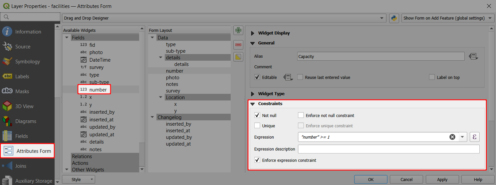

Now we will set up a *soft* constraint to a photo field. A photo should be taken during the survey, but the feature can be saved without one.

1. In the **Attributes form** tab, select a photo field in the **Available Widgets** column (here: `photo`)
2. In the **Constraints** tab:
   - Check the **Not null** constraint :heavy_check_mark:


In the <MobileAppNameShort />, you will be unable to save a feature unless the field value meets the *enforced* constraint (here: `Capacity`). If the constraint is *not enforced* (here: `photo`), there will be a warning, but the feature can be saved regardless.

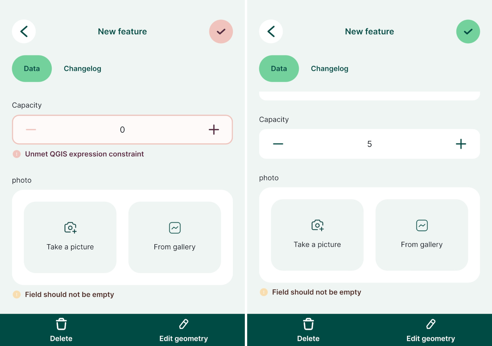

## Drill-down forms
Drill-down or cascade forms enable to list values in a field depending on a value selected in another field.

:::tip Example project available
Clone <MerginMapsProject id="documentation/form_setup" /> to explore examples of drill-down forms.
:::

Here, we will work with a layer named `landuse`. It has fields such as **Land use**, **Type** or **Plant type** that refer to non-spatial tables using [value relations](../form-widgets/#value-relation), so they are filled in by selecting a value from a drop-down menu.

In this case, it is beneficial to use the value that is entered as **Land use** field to filter choices in the **Type**: if we select *Vineyard* as the land use, it is not relevant to offer, e.g., *nut trees* in the following fields. Similarly, the **Type** value can limit the drop-down menu of **Plant type**, showing only applicable plant types.

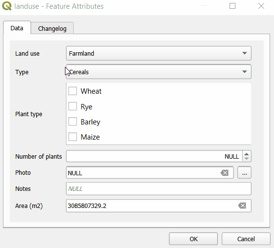

At first, let us explore the structure of value tables that is used to set up drill-down forms. In the example project, **Land use** field uses `plant-habitat` value table that has following fields:

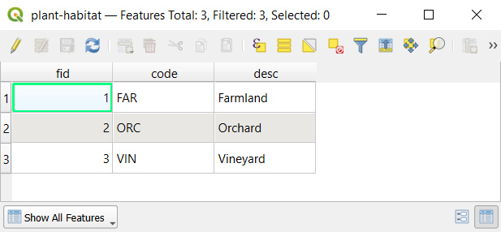

The following field **Type** uses `plant-type` value table. In this table, there is a field `habitat-code` that refers to a specific category from the `plant-habitat` table.

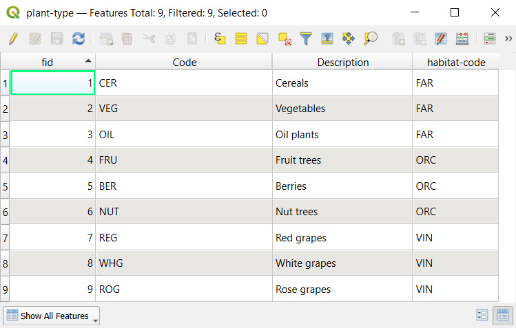

Similarly, the **Plant type** field uses `plant-sub-type` value table that contains a `Code` field that ties values to specific types from the `plant-type` table.

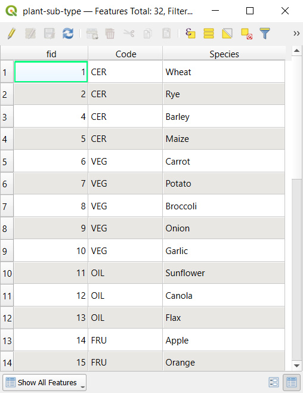

Now we can set up the drill-down form:
1. Go to the **Attributes form** tab in the **Properties** of `landuse` polygon layer

2. The `habitat` field aliased as **Land use** is set up using **Value relation** widget. Values are defined in the `plant-habitat` table.

   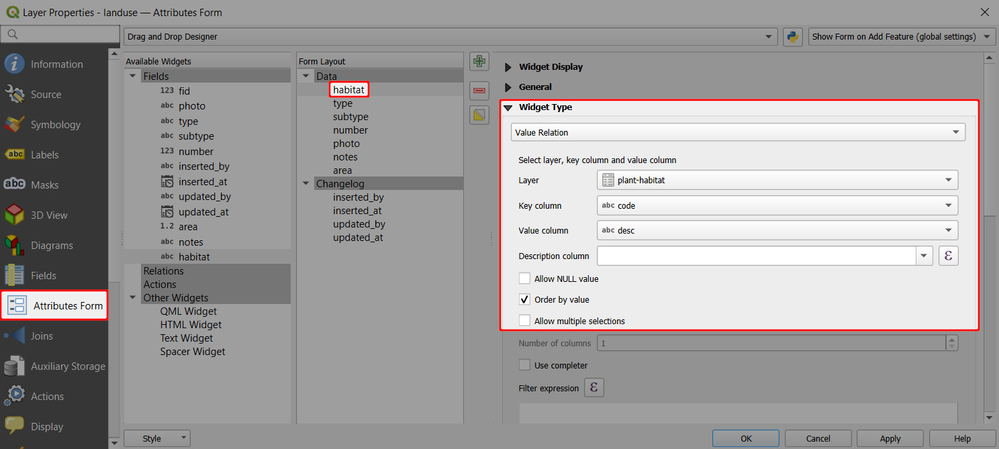

3. The `type` field (aliased as **Type**) uses **Value relation** widget with values from the `plant-type` table. However, here we use **Filter expression**: `"habitat-code"= current_value('habitat')`
   
   This means that the drop-down menu will only display values where the `habitat-code` value of the `plant-type` value table is the same as the current value of the `habitat` field.
   
   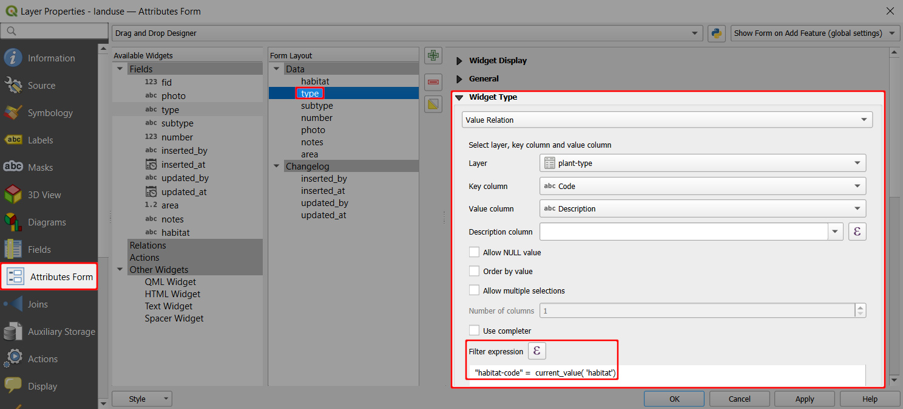

4. The **Car-manufacturer** field refers to the **car-manufacturer** table. This table contains the fields `fid`, `name`, and `type`.
   

   - Set the `fid` field as the key column and `name` as the value column. 
   - Use the `type` field to define which values will be shown in the form based on the selected **Car-type** by entering this **Filter expression**: 
   `"type" = current_value('Car-Type')`


   Now, the form will offer only options, where the **Type** field of the **car-manufacturer** table matches the current value of the **Car-type**. When entering data, we will get a drill-down form: since *Truck* is selected as the **Car type**, only three manufacturers are available in the **Car-Manufacturer** field.


5. **Car-model** works similarly. It refers to the **car-model** table, limiting options based on the **Car-manufacturer** field.
   - Set the `fid` field as the key column and `name` as the value column. 
   - Use the `manufacturer` field to filter the values using this **Filter expression**:
   `"manufacturer" = current_value('Car-Manufacturer')`


When doing the survey <MobileAppName />, you will see that after selecting **Car-type: Car**, the **Manufacturer** field will only offer **Mercedes-Benz**, **Skoda** and **Audi**. After selecting **Audi**, the **Car-Model** field will only offer the appropriate car models.


