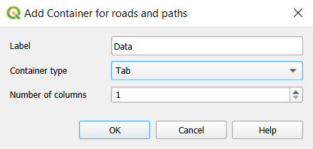
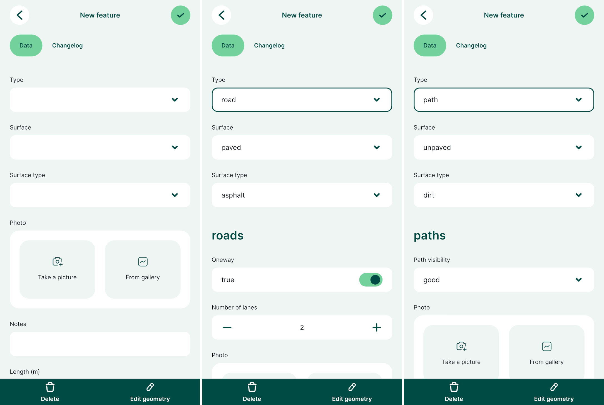
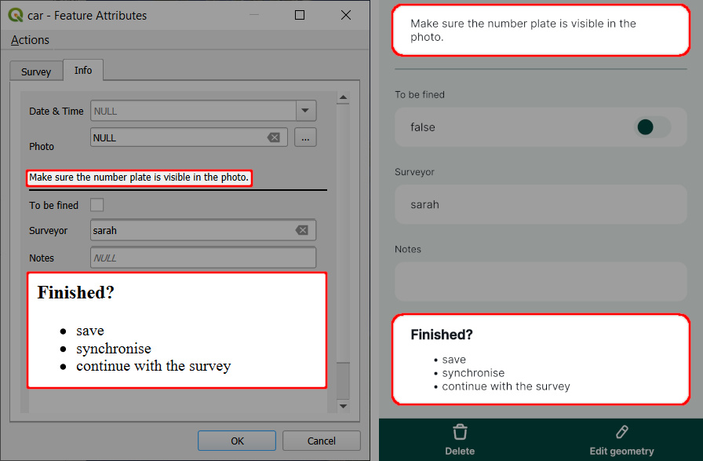
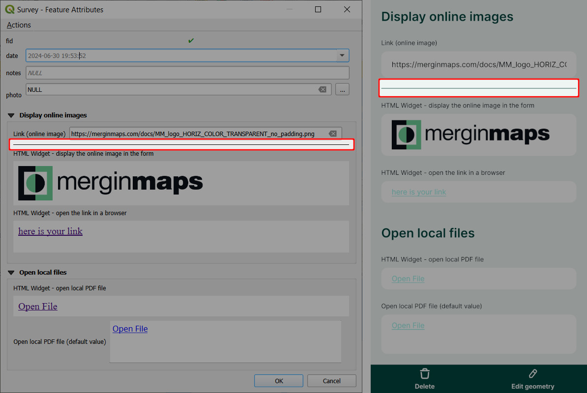

# Attributes Form Layout
[[toc]]

Collecting and editing data in the field can be more efficient with forms that are easy to navigate. QGIS offers a lot of options for improving the layout of your forms, such as using groups and tabs to keep related fields together, displaying or hiding a group of fields based on conditional visibility, or displaying tips and instructions in the forms.


## QGIS Drag and Drop Designer
By default, the form is automatically generated and contains all the fields in the layer. However, you might want to change the order of the fields. Also, there may be some fields that do not need to be displayed during the survey, such as fields with [default values](../settingup_forms_settings/#default-values) that are calculated from the geometry.

QGIS Drag and Drop designer is an easy tool for defining the form layouts:
1. Open your <MainPlatformNameLink /> project in QGIS
2. Right-click on a layer and select **Properties**
3. Navigate to the **Attributes form** tab. Here, switch to **Drag and Drop Designer**
4. Fields can be added and removed from the **Form Layout**. The order of the fields can be changed by simply dragging them higher or lower in the list.

   Only fields that are in the **Form layout** will appear in the form.

5. Click **OK** to confirm your changes.


   
## Tabs and groups
Using QGIS Drag and Drop designer, fields can be arranged into groups and tabs.

1. Click on the **+** button to add new group or a tab to the form layout
   
2. Choose the container type, add a label, and if needed, the number of columns.

   A group can be placed inside a tab or another group.
   
   
3. Drag and drop fields that should be in the tab or the group

:::tip
To see an example of tabs and groups, you can clone <MerginMapsProject id="documentation/form_setup" />. 
:::

In this project, we created two tabs, *Information* and *Data* and a group *Location* placed in the *Information* tab:


The form with tabs and groups will appear in QGIS like this:


And this is how the same form looks like in <MobileAppName />:


## Show and hide fields depending on a field value
Conditional visibility can be applied to groups and tabs, meaning they will be displayed or hidden depending on the value of a field.

We can set the visibility of **Location** tab depending on the value of the `survey` field:
  - If `survey` is set to `False`, the **Location** tab will not appear in the form,
  - If `survey` is set to `True`, the **Location** tab will show up in the form.

1. Select the **Location** tab in the **Form Layout** column
2. Check the **Control Visibility by Expression** option
3. Type the following expression in the box below: `"survey" IS TRUE`
4. Background colour can be set in the **Style** tab.


In the <MobileAppNameShort />, the tab **Location** is displayed only when the `survey` field (aliased here as *Does it need surveying*) is toggled to `true`.



## Display instructions in the form using Text and HTML widget
Sometimes, you may want to include instructions or tips for surveyors in your forms. <QGIS link="" text="QGIS" /> offers Text and HTML widgets that can be used for this purpose. Your text instructions can include [expressions and field values](#using-expressions-in-text-and-html-widgets) as well. The HTML widget supports various [HTML tags](https://doc.qt.io/qt-6/richtext-html-subset.html#supported-tags), so it can be also used, for instance, to display [online images](#using-html-widget-to-display-online-images-and-other-online-resources).

These widgets can be found in **Available Widgets** in the **Other Widgets** section when using the [Drag and Drop Designer](#qgis-drag-and-drop-designer).


To configure the **Text** widget, enter the text you want to display in the form. On the right, you will see the preview.


If you prefer your text to be formatted, you may do so in the **HTML** widget. HTML widget supports these [HTML tags](https://doc.qt.io/qt-6/richtext-html-subset.html#supported-tags).


...and this is how the Text and HTML widgets look like in the form in QGIS (left) and in the mobile app (right).


### Using expressions in Text and HTML widgets
Expressions and variables can be used both in the Text and the HTML widget.


:::tip
Clone <MerginMapsProject id="documentation/form_cascade" /> to follow this example.
:::

1. When configuring the Text or HTML widget, click on the **Expression Builder** button
2. Enter the expression that will be used in your text and click **OK**.

   Field values can be selected from the **Fields and Values** list. There are other variables and expressions that can be used.

3. Click on the **+** button to add the expression to the text.

   Here, we configured the widget with this text:
   `Make sure the number plate [% "VRP" %] is visible in the photo.`
   
   In this case, `VRP` is the name of a field aliased as `Vehicle Registration Plate` in the form.

4. Save and synchronise your project. 

... and this is how it works during the field survey. `[% "VRP" %]` expression displays the current value of the `Vehicle Registration Plate` field.


### Using HTML widget to display online images and other online resources
The **HTML widget** can be also used to display online images in the mobile app or open online resources, such as PDF files, videos or websites, in the browser of your device.

::: tip
Clone <MerginMapsProject id="documentation/forms-display-images-and-files" /> to how this works.
:::

Here are HTML samples you can use to [configure the HTML widget](#using-expressions-in-text-and-html-widgets). Your form should contain a text field for storing the full URL link (here: `link`).

To use these samples, replace `link` by the name of the appropriate field in your layer. 

- show image in the form

```html
<script>document.write(expression.evaluate("'<a href=\"'||attribute( @feature, 'link' )||'\"></a>'"));</script>
```

- display a text (`here is your link`) with a link that can be opened in a browser
```html
<script>document.write(expression.evaluate("'<a href=\"'||attribute( @feature, 'link' )||'\">here is your link</a>'"));</script>
```

Make sure that the HTML widget works before taking it to the field by testing it in the <MobileAppNameShort />. It should look something like this:


::: warning Image preview in QGIS 3.36+
QGIS may not display the preview of the online image if you use QGIS 3.36 or higher. Despite this behaviour, the <MobileAppNameShort /> displays it correctly. Therefore we recommend trying the setup by opening the form in the <MobileAppNameShort /> to make sure it works as intended.
:::


### Using HTML widget to open local files
The HTML widget can also be used to open local files: for instance, a locally stored PDF file can be opened from within the form during the survey.

::: tip
Clone <MerginMapsProject id="documentation/forms-display-images-and-files" /> to how this works.
:::

- A PDF file named `my-pdf.pdf` is stored in the main [project folder](../../manage/project/#mergin-maps-project-folder) as it needs to be packaged with the project.
- The HTML Widget is added to the **Attributes Form** and configured as follows:
   ```
   <a href="project://my-pdf.pdf">Open File</a>
   ```


In the <MobileAppNameShort />, you can tap the *Open File* link to open the PDF file using the default application of your device.


::: tip Open local files using default values
Local files can be displayed in the form also using [default values](../settingup_forms_settings/#open-local-files-using-default-values). 

In the <MerginMapsProject id="documentation/forms-display-images-and-files" /> project, you can explore and compare both alternatives.
:::

## Spacer widget
<Badge text="since QGIS 3.30" type="tip"/>
The Spacer widget can be useful if you want to have some space between the fields in your form or add a horizontal line. 

It can be found in *Available Widgets* in the *Other Widgets* section when using the [Drag and Drop Designer](#qgis-drag-and-drop-designer).


When adding the spacer widget to the form, there is an option to check the **Draw horizontal line** option. Otherwise, a vertical space will be added to the form.


And this how the spacer widget looks like in the form in QGIS (left) and in the mobile app (right).

