# Setting Up Widgets in Attributes Form

[[toc]]

Capturing field data often requires filling some attributes in the form to record the properties of surveyed points, lines or polygons. Attribute forms can simplify the data entry and even ensure to some extent that the correct information is filled in. Here, we will explore the possibilities of various <QGISHelp ver="latest" link="user_manual/working_with_vector/vector_properties.html#attributes-form-properties" text="QGIS widgets" /> that can be used in <MobileAppName />. 

Extra configuration of attribute forms can be done to make data collection easier and more consistent, such as using default values, conditional visibility or constraint enforcement. These topics are covered in [Attributes Form Configuration](../form-configuration/) and [Attributes Form Layout](../form-layout/).

Prefer video? Check out this tutorial on how to configure QGIS widgets for survey forms.
<YouTube id="jc4p1PpXj3k" />

## Widget gallery
Attributes forms can be configured using <QGISHelp ver="latest" link="user_manual/working_with_vector/vector_properties.html#edit-widgets" text="QGIS widget types" /> in the **Attributes Form** tab in the **Layer Properties**.

Here is an overview of widgets commonly used both in QGIS and the <MobileAppNameShort />. Note that the widget has to be compatible with the data type of a field. 

|QGIS widget  | Description  |
Preview in <MobileAppName /> 
 |
|:---:|:---:|:---:|
|Text Edit  |[Text](#text)   |  |
|Text Edit  |[Multiline Text](#multiline-text)   |  |
|QR & barcode scanner  |[Camera to scan QR and barcode](#qr-code)   |  |
|Range - Editable   |[Enter a number](#numbers)   |   |
|Range - Slider  |[Select a number using the slider](#slider)   |   |
|Date/Time   |[Calendar with time](#date-and-time)  |   | 
|Checkbox   |[Checkbox](#checkbox)   |   |
|Value Map   |[Drop-down menu with predefined values](#value-map) |   |
|Value Relation   |[Drop-down menu with values from another table](#value-relation) |   |
|Attachment   |[Photos from device's camera or gallery](#attachment) |     |
|Relations - Gallery |[Multiple photos from device's camera or gallery](../attach-multiple-photos-to-features/) |  |
|Relations |[Multiple records linked to one feature](../one-to-n-relations/) |   |

::: tip Public project available
:bulb: These widgets can be explored in this project: <MerginMapsProject id="documentation/form-widgets" />.
:::

## Text

<YouTube id="0Y5GKyjmfqo" />

Adding or editing text is the most common method for inserting information within the forms. In QGIS, the default widget for most types of fields is the **Text Edit**. It can be used for single line or [multiline](#multiline-text) text inputs. 

In the <MobileAppNameShort />, the text can be entered manually or using voice-to-text (if your mobile device supports this feature).

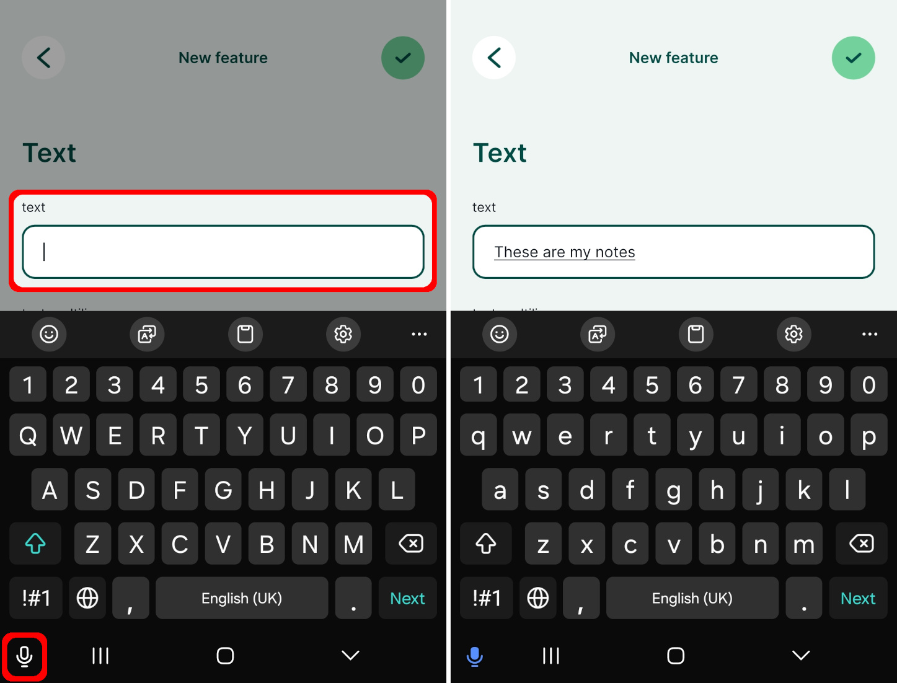

### Multiline text

:::tip Example project available
Multiline text option is used in this public project: <MerginMapsProject id="documentation/form-widgets" />. Download or clone it to see this setup.
:::

The **Text Edit** widget offers the option to store multiple lines within a single field.
1. Right-click on a layer, select **Properties** and go to the **Attributes form** tab.
2. In the list of **Available Widgets** select the field you want to work with (here: `text-multiline`)
3. In the **Widget Type** tab:
   - Ensure that **Text Edit** is selected
   - Check the **Multiline** option :heavy_check_mark:
4. **Apply** the changes. Don't forget to save and sync your project!

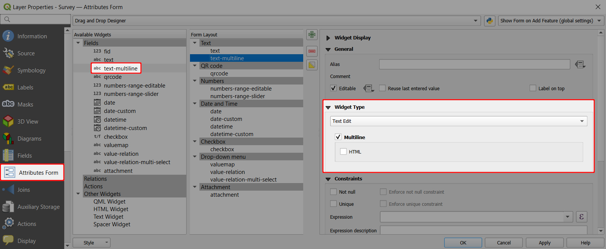

In the <MobileAppNameShort />, the **multiline text edit widget** will look like this:
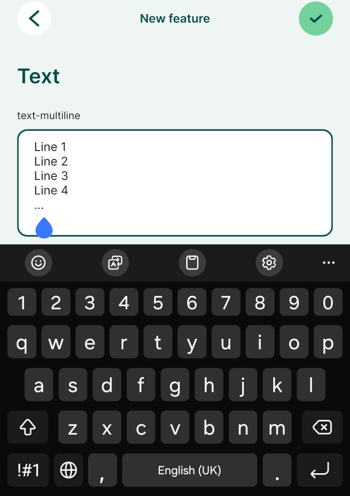

## QR code

:::tip Example project available
A QR code field is used in this public project: <MerginMapsProject id="documentation/form-widgets" />. Download or clone it to see this setup.
:::

<YouTube id="HptECoMY8ow" />

To be able to scan QR codes using your camera, the field name or the field alias has to contain the word `qrcode` (the text is not case sensitive, it can be in combination of lower or upper case letters). 

In the <MobileAppNameShort />, there will be a QR code icon next to the field. Tap on it to scan the QR code using your camera and the content (a number, text, link, etc.) will be filled in automatically to your field.

## Numbers

:::tip Example project available
This public project: <MerginMapsProject id="documentation/form-widgets" /> uses various options for entering numerical data. Download or clone it to see this setup.
:::

Number fields can be handled by the **Range** widget. Two options are supported by the <MobileAppNameShort />: [editable range](#range) and [slider](#slider). 

<YouTube id="woZX3L33xh0" />

### Range
To set up the **editable range widget**:

1. Right-click on a layer, select **Properties** and go to the **Attributes form** tab.
2. In the list of **Available Widgets** select the integer field you want to work with (here: `numbers-range-editable`). 
3. In the **Widget Type** tab the **Range** widget and the **Editable** option should be selected by default. If this is not the case, select these options from the drop-down menus.
4. **Apply** the changes. Don't forget to save and sync your project!

In the <MobileAppNameShort />, the numbers can be entered manually or by using the +/- buttons:

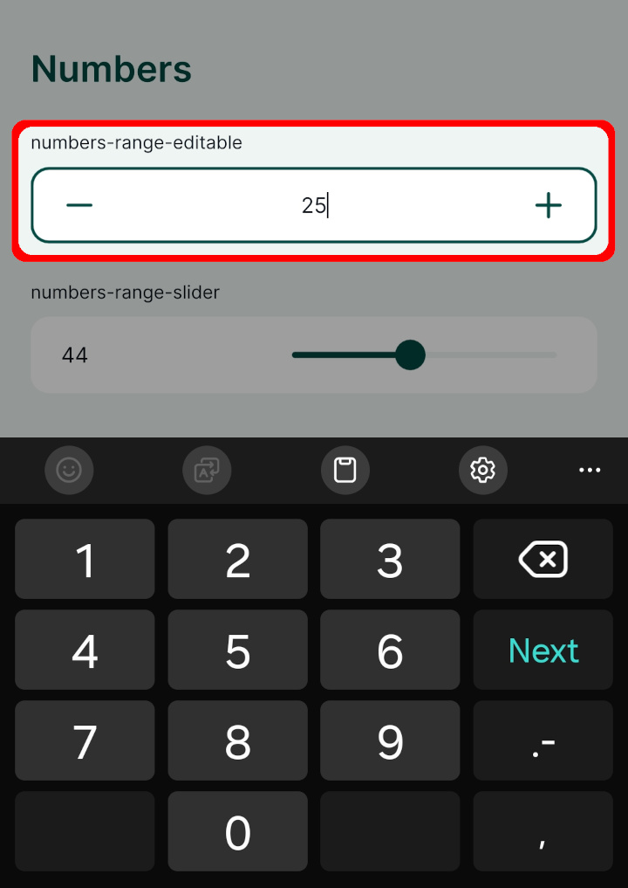

### Slider
To set up the **Slider**:

1. Right-click on a layer, select **Properties** and go to the **Attributes form** tab.
2. In the list of **Available Widgets** select the numeric field you want to work with (here: `numbers-range-slider`).
3. In the **Widget Type** tab:
   - the **Range** widget should be selected by default (if not, select it from the menu)
   - set the edit widget to **Slider**
   - set the **Minimum**, **Maximum** and **Step** values of the slider
4. **Apply** the changes. Don't forget to save and sync your project!

In the <MobileAppNameShort />, the **Slider** looks like this. The number can be filled in by moving the slider:

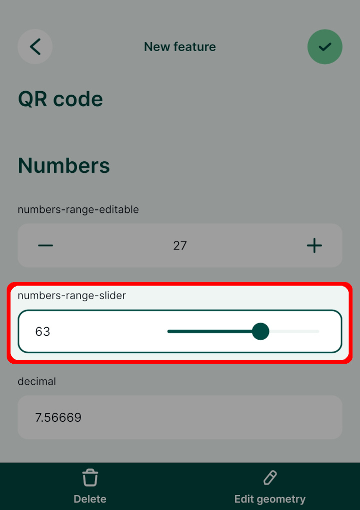

## Date and time

:::tip Example project available
Various options of setting up Date and Date&Time fields are included in this public project: <MerginMapsProject id="documentation/form-widgets" />. Download or clone it to explore it in more detail.
:::

<YouTube id="EoIqYIl4-Xk" />

**Date** or **Date and Time** fields can be used to record date and time. The most common use is to record when a feature was created or updated. This can be done manually or automatically by using [default values](../form-configuration/#default-values).

To set up the **Date/Time** widget:

1. Right-click on a layer, select **Properties** and go to the **Attributes form** tab.
2. In the list of **Available Widgets** select the Date and Time field you want to work with (here: `datetime`).
3. In the **Widget Type** tab and select the **Date/Time** widget. 
   - use the default or custom  **Display Format**
   - check the **Calendar popup** option :heavy_check_mark:
   - use the preview to confirm that this is the format you want to use to store your timestamps
4. If you want to automatically insert the date (or date and time) when the feature is created, use `now()` as a [default value](../form-configuration/#default-values) in the **Defaults** tab.
5. **Apply** the changes. Don't forget to save and sync your project!

In the <MobileAppNameShort />, the date can be edited using a calendar pop up. If you tap the icon next to field, the current date and time will be filled in.

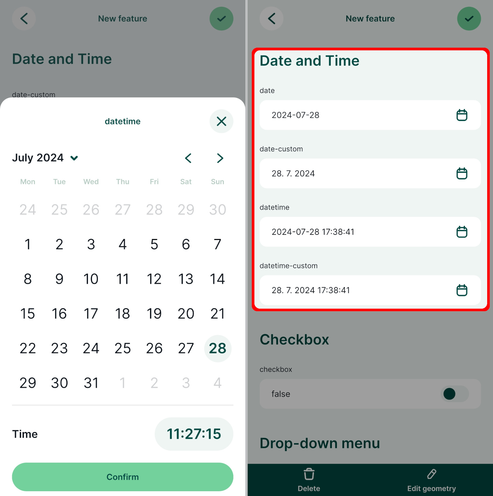

### Custom date and time formats
Date and time fields can use custom display format.

Here are some examples:

|   Custom Display Format   |    Preview   |
|:-------------------------------:|:-------------------:|
|   `dd.MM.yyyy`   |   12.01.2024   |
|   `MMMM d yyyy`   |   January 12 2024   |
|   `HH:mm:ss`   |   12:34:56   |
|   `yyyy-MM-dd HH:mm:ss`   | 2020-09-09 12:34:56   |
|   `dd/MM/yyyy HH-mm-ss`   | 09/09/2020 12-34-56   |

## Checkbox

:::tip Example project available
Checkbox widget is used in this public project <MerginMapsProject id="documentation/form-widgets" />. Download or clone it to see the setup.
:::

<YouTube id="rtBdJzizdug" />

Checkbox field becomes handy when you want to set up a Yes/No, True/False or On/Off in your field. 

If you have a field set as **Boolean** in your GeoPackage layer, QGIS assigns the checkbox widget type by default.

1. Right-click on a layer, select **Properties** and go to the **Attributes form** tab.
2. In the list of **Available Widgets** select the field you want to work with (here: `checkbox`).
3. In the **Widget Type** tab, the **Checkbox** widget should be set by default (if not, select it from the drop-down menu).
4. **Apply** the changes. Don't forget to save and sync your project!

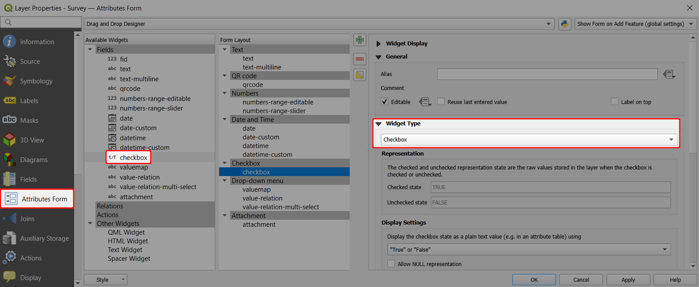

Checkbox widget can be also used for **Text** (string) fields:
1. Right-click on a layer, select **Properties** and go to the **Attributes form** tab.
2. In the list of **Available Widgets** select the field you want to work with (here: `checkbox-string`).
3. In the **Widget Type** tab, select the **Checkbox** widget and define values for the *Checked* and for the *Unchecked* state. Here we use `Yes` and `No`.
4. **Apply** the changes. Don't forget to save and sync your project!

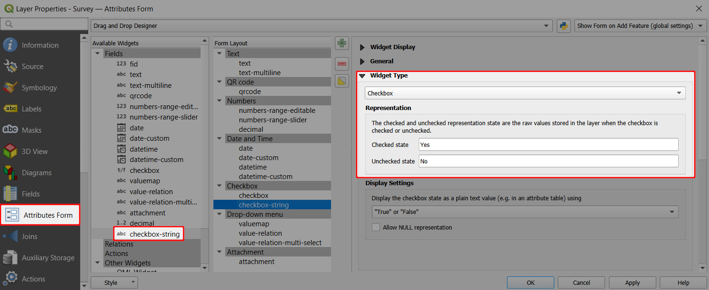

In the <MobileAppNameShort />, the status of the checkbox field can be easily toggled on/off.

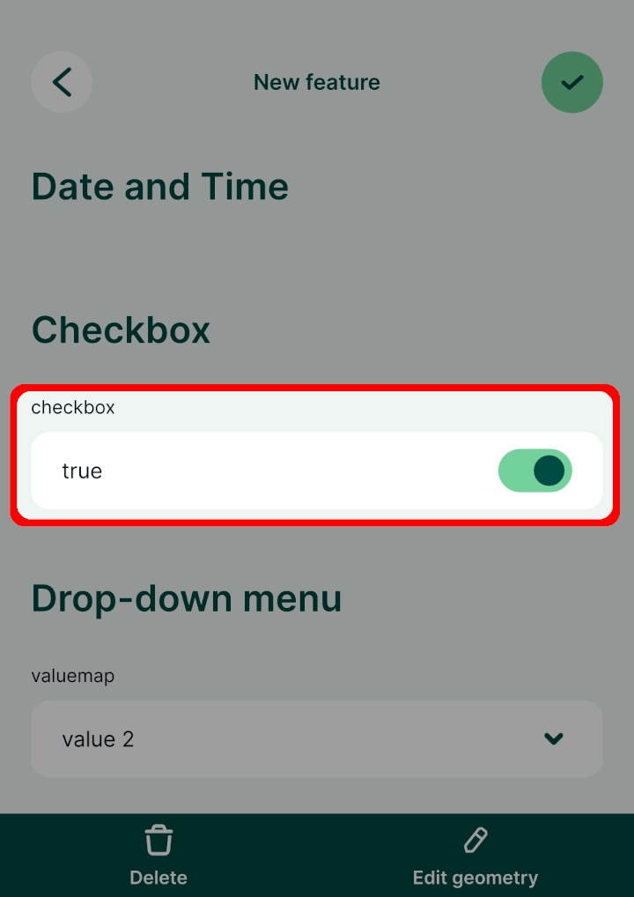

## Select value from a drop-down menu

Selecting values from a drop-down menu is faster then typing them in manually and it also ensures that there are no typos or spelling variations. To present the options as a drop-down menu in the form, you can use the [Value Map](#value-map) or [Value Relation](#value-relation) widgets in QGIS.

There are some benefits of using the Value Relation widget, such as:
- Option to select multiple values from the list (in this case, the field needs to be of `text` data type).
- The layer that contains values can be edited in the field. For example, if you have missed a value in your list for the drop-down menu, you can edit the table in the <MobileAppNameShort />, add the value and use it during your survey. See [Working with non-spatial tables](../non-spatial-data/) for more details.
- Searching the values: if you have a large list of values, it will become cumbersome to find the right value. With Value Relation widget, you have the option to search for values in the list in the <MobileAppNameShort />.

### Value Map

<YouTube id="WjotOTIKaNo" />

Value map widget is used to select a value from a drop-down menu. Values are defined in the widget. They cannot be changed or added from the <MobileAppNameShort /> and only one value can be selected. 

If you want to use multiple selections in a field or need to add new values during the survey, check out the [Value Relation](#value-relation) widget.

:::tip Example project available
This public project <MerginMapsProject id="documentation/form-widgets" /> contains a Value Map field. Download or clone it to see the setup.
:::

1. Right-click on a layer, select **Properties** and go to the **Attributes form** tab.
2. In the list of **Available Widgets** select the field you want to work with (here: `valuemap`)
3. In the **Widget Type** tab, select the **Value Map** option from the drop-down menu and fill in the table below. 
   **Value** is what will be stored in the field (these can be coded values or shortened names, here we use `1`, `2`, `3`). **Description** is what will be displayed in the form and in the attributes table (here: `value 1`, `value 2`, `value 3`).
4. **Apply** the changes. Don't forget to save and sync your project!

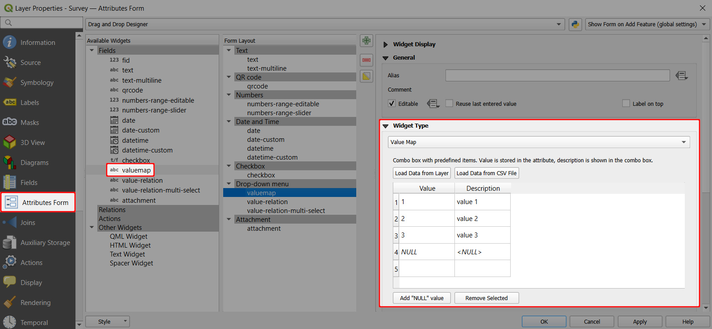

Now you can select the value from a drop-down menu in the <MobileAppNameShort />:
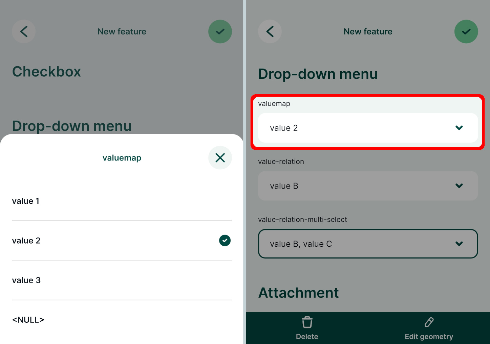

### Value Relation

<YouTube id="Sm1PZRN8rLw" />

:::tip Example project available
This public project <MerginMapsProject id="documentation/form-widgets" /> contains a Value Relation setup. Download or clone it to explore it in more detail.
:::

The **Value Relation** widget is similar to the [Value Map](#value-map) widget, but the values for the drop-down menu come from another layer (usually a non-spatial table). 

To have the option to safely add new values when working collaboratively, the value table should have a unique field with UUID values. This field should use the `uuid()` function as a [default value](../attach-multiple-photos-to-features/), so that every new entry has its UUID.

To set up **Value Relation** in QGIS:

1. Right-click on a layer, select **Properties** and go to the **Attributes form** tab.
2. In the list of **Available Widgets** select the field you want to work with (here: `value-relation-multi-select`)
3. In the **Widget Type** tab, select **Value Relation** from the drop-down menu and set it up as follows:
   - Select the **Layer** that contains the values (here: `value-relation-table`)
   - **Key column** is the field that contains the values (here: `uuid`)
   - **Value column** is the field that contains the alias (description) of the value (here: `value`)
   - Check the **Allow multiple selections** option :heavy_check_mark: if you want to have the option to select multiple values
4. **Apply** the changes. Don't forget to save and sync your project!

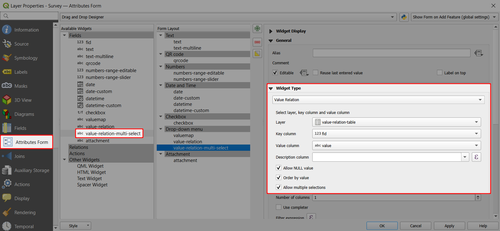

:::danger Using UUID as key field
**Why UUID?** FID can be changed during [synchronisation](../../manage/synchronisation/). If multiple surveyors add new entries to the value table, features can end up with wrong values. 

On the other hand, <QGISHelp ver="latest" link="user_manual/expressions/functions_list.html#uuid" text="UUID" /> (Universally Unique Identifier) is guaranteed to be unique and will not be changed when synced. Therefore, we recommend using UUID if you want to add new values during the survey.
:::

When you open the field with **Value Relation** in the <MobileAppNameShort />, you will be able to select values from the list.

## Attachment

:::tip Example project available
Basic attachment widget is set up in the public project <MerginMapsProject id="documentation/form-widgets" />.
:::

When there is a field with the **Attachment** widget type in a survey layer, the <MobileAppNameShort /> automatically sees it as a field to **capture photos**. Such field exists in a survey layer in the basic <MainPlatformName /> project (created by using *New basic QGIS project* option when [creating a project in QGIS](../../manage/create-project/)). If you create your survey layers manually, you will need to set it up.

1. Right-click on a layer, select **Properties** and go to the **Attributes form** tab.
2. In the list of **Available Widgets** select the text field you want to work with (here: `attachment`)
3. In the **Widget Type** tab, select **Attachment** from the drop-down menu:
   - Default path defines where images will be saved. If it is not defined, the project home folder will be used.
   - Store the path as **Relative to project path** or **Relative to default path** depending on how you want to store the paths.
4. **Apply** the changes. Don't forget to save and sync your project!

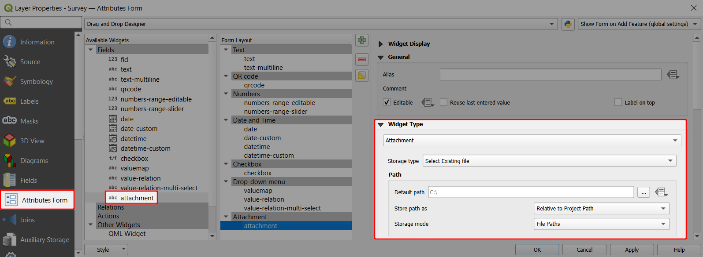

In the <MobileAppNameShort />, you have the option to take a picture using the camera or upload a picture from the gallery of your mobile device:

:::tip More about this topic
There are much more settings related to photos that can improve your workflow, such as storing them in a custom folder, resize them automatically or customise their name. Learn more about this topic in [Capturing Photos](../photos/).
:::

## Cascade forms, 1-N relations, form layout,...

There is much more you can do to set up your forms efficiently, such as:
- Create advanced forms with drill-down menu by setting up a [cascade form](../form-configuration/#drill-down-forms).
- Use 1-N relations to [link multiple records to one feature](../one-to-n-relations/) or to [attach multiple photos to one feature](../attach-multiple-photos-to-features/).
- Design an appropriate [form layout](../form-layout/) with groups and tabs, conditional visibility of fields or instructions for the fieldwork.
