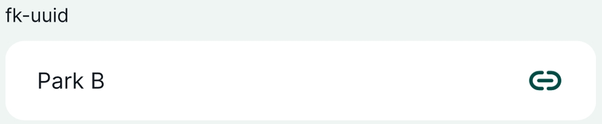
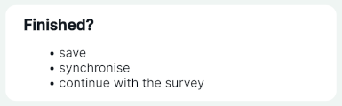

# Form Widgets Gallery

Form widgets define the way you can enter values in the form, both in QGIS and in the <MobileAppNameShort />. The configuration of form widgets in your <MainPlatformNameLink /> project is done in QGIS.

Here is an overview of widgets that are commonly used both in QGIS and the <MobileAppNameShort />.

::: tip Public project available
:bulb: These widgets can be explored in this project: <MerginMapsProject id="documentation/form-widgets" />.
:::

|QGIS widget  | Description  |
Preview in <MobileAppName /> 
 |
|:---:|:---:|:---:|
|Text Edit  |[Text](../text)   |  |
|Text Edit  |[Multiline Text](../text#multiline-text)   |  |
|Date/Time   |[Calendar with time](../date-time)  |   |
|Relations |[Multiple records linked to one feature](../relations/) |   |
|Relation reference | [Reference to feature from another layer](../relations/)   |   |
|Range - Editable   |[Enter a number](../numbers)   |   |
|Range - Slider  |[Select a number using the slider](../numbers#slider)   |   |
|Checkbox   |[Checkbox](../checkbox)   |   |
|QR & barcode scanner  |[Camera to scan QR and barcode](../qr-code)   |  |
|Value Map   |[Drop-down menu with predefined values](../value-select/#value-map) |   |
|Value Relation   |[Drop-down menu with values from another table](../value-select/#value-relation) |   |
|Attachment   |[Photos from device's camera or gallery](../photos) |     |
|Relations - Gallery |[Multiple photos from device's camera or gallery](../photos/#how-to-attach-multiple-photos-to-one-feature) |  |
| Text and HTML Widgets |[Informational Widgets](../info-widgets/) |  |
