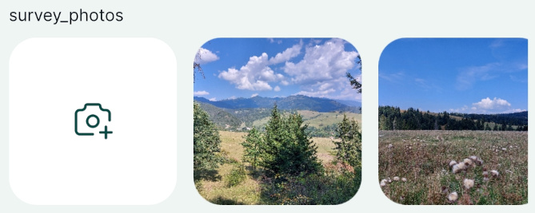
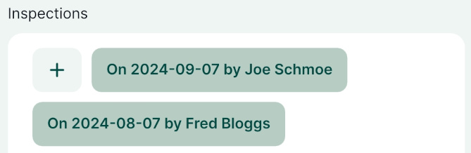

# Widgets

Attributes forms can be configured using <QGISHelp ver="latest" link="user_manual/working_with_vector/vector_properties.html#edit-widgets" text="QGIS widget types" /> in the **Attributes Form** tab in the **Layer Properties**.

Here is an overview of widgets commonly used both in QGIS and the <MobileAppNameShort />. Note that the widget has to be compatible with the data type of a field. 

::: tip Public project available
:bulb: These widgets can be explored in this project: <MerginMapsProject id="documentation/form-widgets" />.
:::

|QGIS widget  | Description  |
Preview in <MobileAppName /> 
 |
|:---:|:---:|:---:|
|Text Edit  |[Text](../text)   |  |
|Text Edit  |[Multiline Text](../text#multiline-text)   |  |
|QR & barcode scanner  |[Camera to scan QR and barcode](../qr-code)   |  |
|Range - Editable   |[Enter a number](../numbers)   |   |
|Range - Slider  |[Select a number using the slider](../numbers#slider)   |   |
|Date/Time   |[Calendar with time](../date-time)  |   | 
|Checkbox   |[Checkbox](../checkbox)   |   |
|Value Map   |[Drop-down menu with predefined values](../value-select/#value-map) |   |
|Value Relation   |[Drop-down menu with values from another table](../value-select/#value-relation) |   |
|Attachment   |[Photos from device's camera or gallery](../photos) |     |
|Relations - Gallery |[Multiple photos from device's camera or gallery](../relations/) |  |
|Relations |[Multiple records linked to one feature](../relations/) |   |

Prefer video? Check out this tutorial on how to configure QGIS widgets for survey forms.
<YouTube id="jc4p1PpXj3k" />

