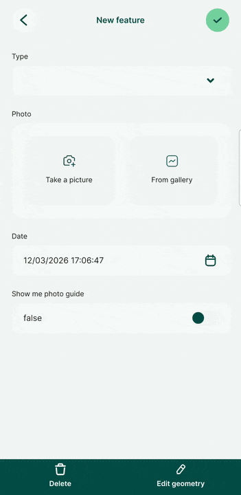
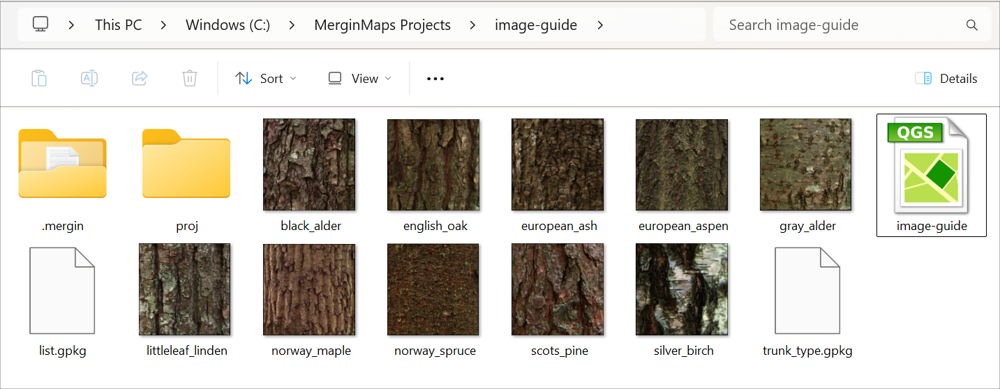
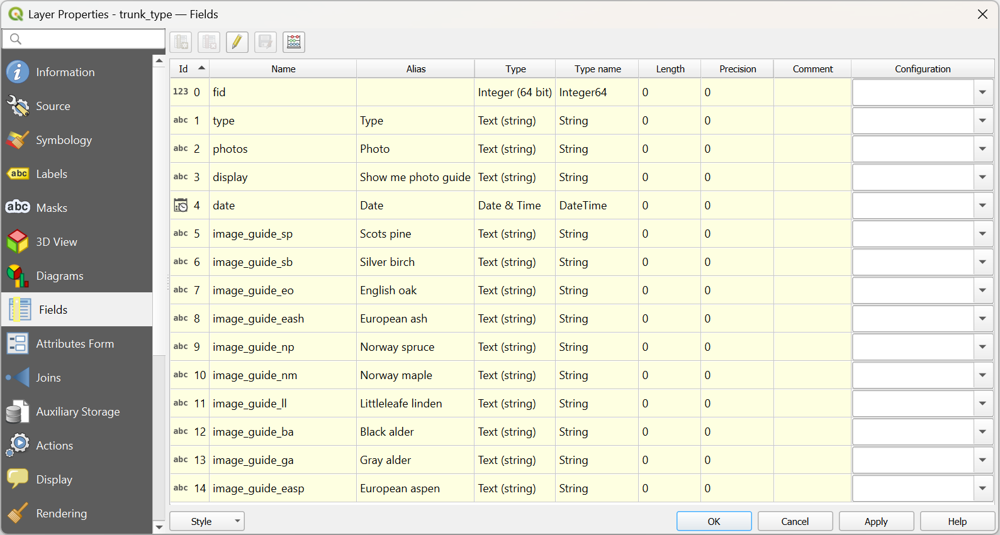
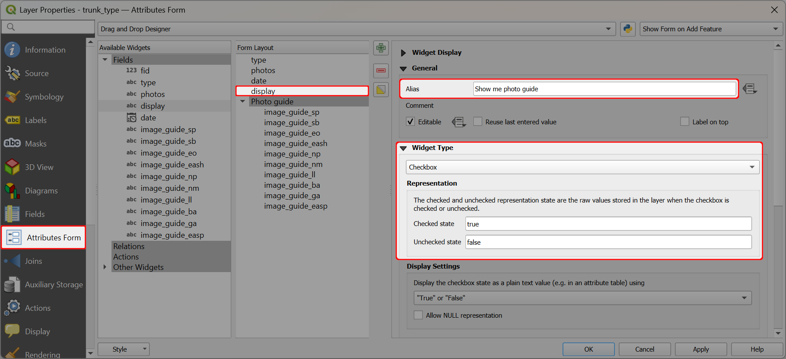
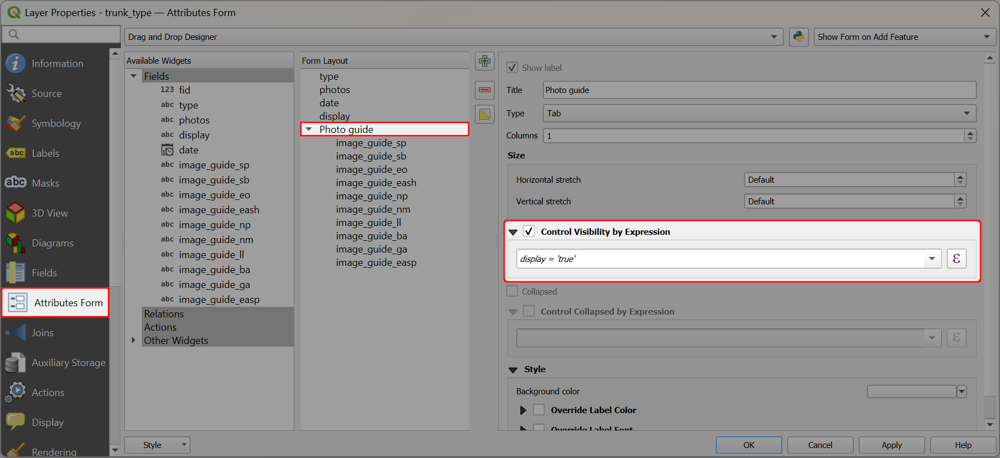
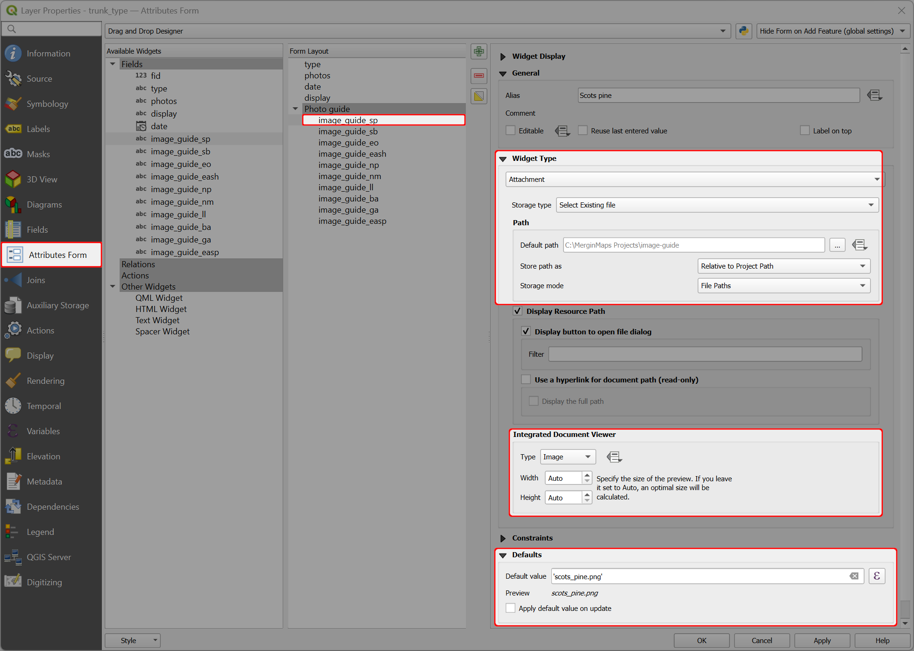
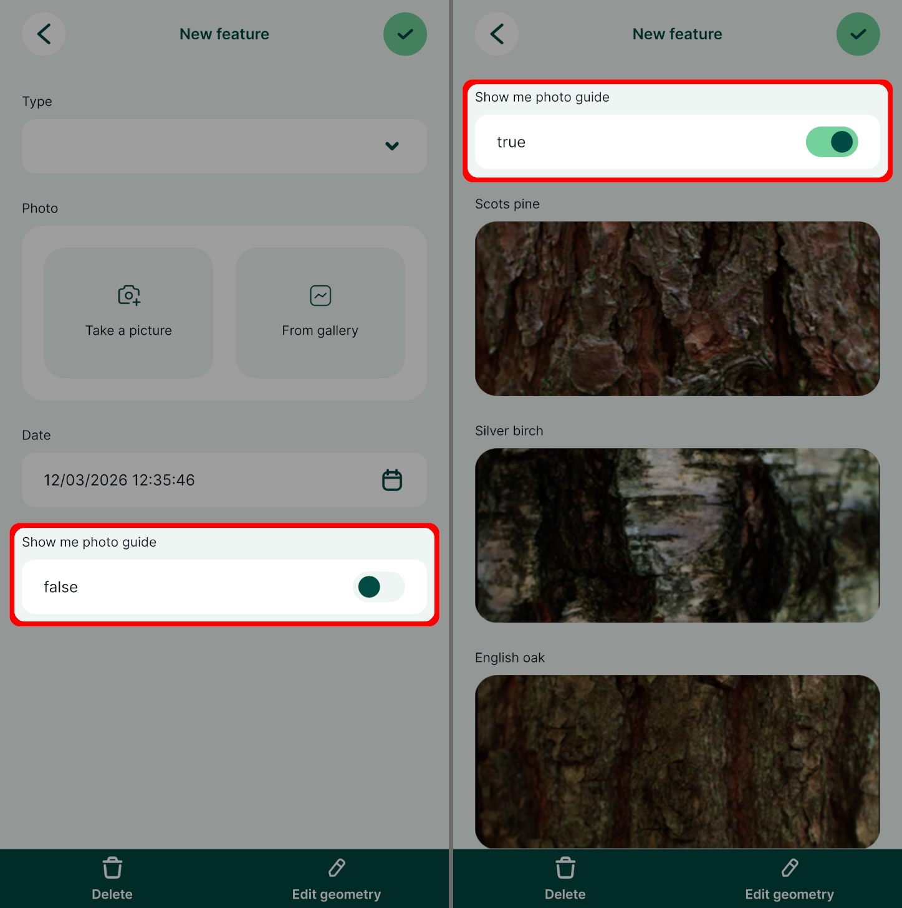

# How to Use Image Guides in the Form

When collecting data in the field, it may be useful to have a visual guide as a reference to ensure that correct information is entered in the form. For example, when collecting information about trees, it may help to see a reference photo of the tree trunk to identify the type of tree correctly.

:::tip Example project available
Clone <MerginMapsProject id="documentation/image_guide" /> to explore this setup.
:::

## Data, layers, and attributes
In this scenario, we want to include a photo guide in the form so that users can compare the type of a tree trunk to a reference picture while collecting data in the field.

The <MainPlatformName />  project contains:
- a survey layer (here: `trunk_type.gpkg`) with the form configured to display or hide the image guide
- a table (here: `list.gpkg`) that is used as a [value relation](../value-select/#value-relation) in the survey layer's attributes form, so that users can choose a tree type from a drop-down menu
- a reference photo for each type of tree, stored in the <MainPlatformName /> project folder and packaged with the project

The survey layer (here: `trunk_type`) has following fields:
- `type` to store a the tree type
- `photos` to store a photo of the surveyed tree
- `display` used to display or hide the image guide
- `date` to store the survey date
- `image_guide_xy` to display the reference image of the specific tree trunk type. There is a separate field for each type.

## Attributes form configuration in QGIS

We use the **Drag and Drop Designer** option in the **Attributes Form** tab of **Layer Properties** to configure the form.

The image guide is set up as follows:
- The `display` field uses the [checkbox](../checkbox/) widget with *true* and *false* values. 

  The alias of the field is set to *Show me photo guide*.

  

- The [tab](../tabs-and-groups/) named `Photo guide` is used to group all `image_guide_xy` fields.

  The tab uses [conditional visibility](../conditional-visibility/) so that the image guide is displayed only when `display = 'true'`
  
  

- The photo guide fields `image_guide_xy` use the [Attachment](../photos/#photo-attachment-widget-in-qgis) widget with *Relative* paths.

  The [Integrated Document Viewer](../photos/#displaying-photos-in-qgis) is set to *Image* to display the picture in the form.
  
  The [default values](../default-values/) contain the name of the reference picture (such as `scots_pine.png`). This ensures that the image guide is present when a new feature is created.

   

## Image guide in the mobile app

When the form is opened in the <MobileAppNameShort />, the image guide can be easily displayed and hidden by toggling the **Show me photo guide** checkbox.

