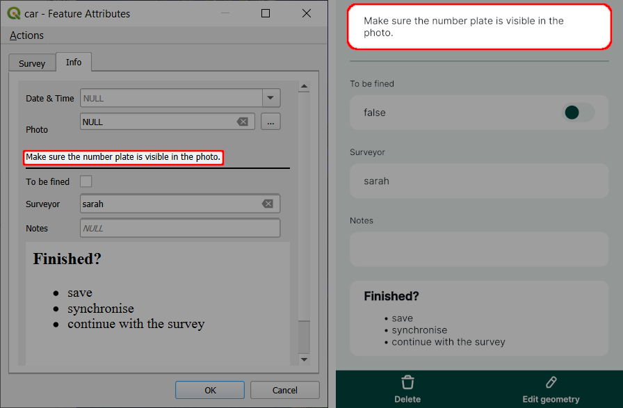
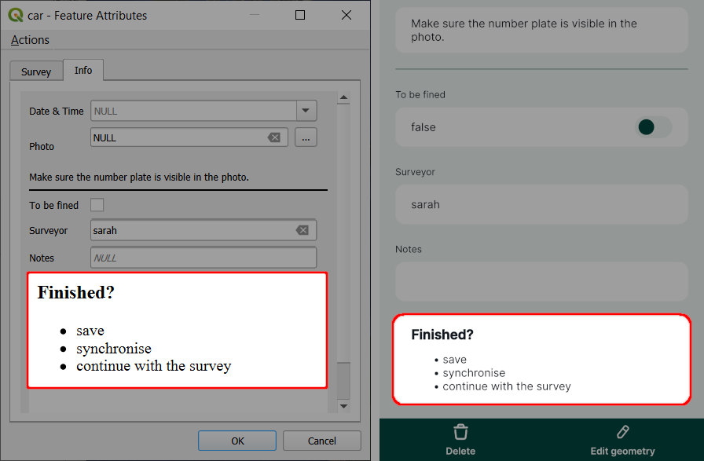

# Informational Widgets
[[toc]]

<QGISHelp ver="latest" link="/user_manual/working_with_vector/vector_properties.html#other-widgets" text="QGIS" /> also offers widgets that can be added to the form to display values or text, but are not connected to a specific field of the layer, such as the Text or HTML widget. These widgets are also supported by <MainPlatformName />. 

HTML and Text widgets can be used, e.g., to display instructions in the form. They can include [expressions and field values](#using-expressions-in-text-and-html-widgets) as well. The HTML widget supports various [HTML tags](https://doc.qt.io/qt-6/richtext-html-subset.html#supported-tags), so it can also be used, for instance, to display [online images](../embed-image/) or [open local files](../open-file/).

|
 Widget 
 |Preview in the <MobileAppNameShort />|
|:---:|:---:|
Text |   |
HTML Widget |   |

These widgets can be found in **Available Widgets** in the **Other Widgets** section when using the [Drag and Drop Designer](../form-layout/#qgis-drag-and-drop-designer). Simply add them to the form layout and double click to configure them as needed.

## Text widget

To configure the **Text** widget, enter the text you want to display in the form. On the right, you will see the preview.

...and this is how the Text widget looks like in the form in QGIS (left) and in the mobile app (right):

## HTML Widget
The **HTML** widget offers the option to format the text as needed. HTML widget supports these [HTML tags](https://doc.qt.io/qt-6/richtext-html-subset.html#supported-tags).

...and this is how the HTML widget looks like in the form in QGIS (left) and in the mobile app (right):

## Using expressions in Text and HTML widgets
Expressions and variables can be used in the Text and the HTML widget.

:::tip Example project available
Clone <MerginMapsProject id="documentation/form_cascade" /> to follow this example.
:::

1. When configuring the Text or HTML widget, click on the **Expression Builder** button

2. Enter the expression that will be used in your text and click **OK**.

   Field values can be selected from the **Fields and Values** list. There are other variables and expressions that can be used.

3. Click on the **+** button to add the expression to the text.

   Here, we configured the widget with this text:
   
   `Make sure the number plate [% "VRP" %] is visible in the photo.`
   
   In this case, `VRP` is the name of a field aliased as `Vehicle Registration Plate` in the form.

4. Save and synchronise your project. 

... and this is how it works during the field survey. `[% "VRP" %]` expression displays the current value of the `Vehicle Registration Plate` field.

