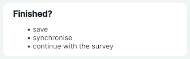

# Informational Widgets
[[toc]]

<QGISHelp ver="latest" link="/user_manual/working_with_vector/vector_properties.html#other-widgets" text="QGIS" /> also offers widgets that can be added to the form to display values or text, but are not connected to a specific field of the layer. <MainPlatformName /> supports the HTML, Text and [Spacer](../form-layout/#spacer-widget) widget. 

HTML and Text widgets can be used, e.g., to [display instructions](#text-and-html-widget) in the form. The HTML widget supports various [HTML tags](https://doc.qt.io/qt-6/richtext-html-subset.html#supported-tags), so it can be also used, for instance, to display [online images](#using-html-widget-to-display-online-images-and-other-online-resources) or [open local files](#using-html-widget-to-open-local-files).

|<div style="width:150px"> Widget </div> |Preview in the <MobileAppNameShort />|
|:---:|:---:|
[Text and HTML Widgets](#text-and-html-widget) |   |


## Text and HTML widget
The **Text** and **HTML widgets** provide an option to include instructions or tips for surveyors in your attributes forms. These text instructions can include [expressions and field values](#using-expressions-in-text-and-html-widgets) as well. 

These widgets can be found in **Available Widgets** in the **Other Widgets** section when using the [Drag and Drop Designer](../form-layout/#qgis-drag-and-drop-designer).


To configure the **Text** widget, enter the text you want to display in the form. On the right, you will see the preview.


If you prefer your text to be formatted, you may do so in the **HTML** widget. HTML widget supports these [HTML tags](https://doc.qt.io/qt-6/richtext-html-subset.html#supported-tags).


...and this is how the Text and HTML widgets look like in the form in QGIS (left) and in the mobile app (right).


### Using expressions in Text and HTML widgets
Expressions and variables can be used both in the Text and the HTML widget.

:::tip Example project available
Clone <MerginMapsProject id="documentation/form_cascade" /> to follow this example.
:::


1. When configuring the Text or HTML widget, click on the **Expression Builder** button
2. Enter the expression that will be used in your text and click **OK**.

   Field values can be selected from the **Fields and Values** list. There are other variables and expressions that can be used.

3. Click on the **+** button to add the expression to the text.

   Here, we configured the widget with this text:
   
   `Make sure the number plate [% "VRP" %] is visible in the photo.`
   
   In this case, `VRP` is the name of a field aliased as `Vehicle Registration Plate` in the form.

4. Save and synchronise your project. 

... and this is how it works during the field survey. `[% "VRP" %]` expression displays the current value of the `Vehicle Registration Plate` field.


## Display online images and other online resources using HTML widget {#using-html-widget-to-display-online-images-and-other-online-resources}
The **HTML widget** can be also used to display online images in the mobile app or open online resources, such as PDF files, videos or websites, in the browser of your device.

::: tip
Clone <MerginMapsProject id="documentation/forms-display-images-and-files" /> to how this works.
:::

Here are HTML samples you can use to [configure the HTML widget](#using-expressions-in-text-and-html-widgets). Your form should contain a text field for storing the full URL link (here: `link`).

To use these samples, replace `link` by the name of the appropriate field in your layer. 

- show image in the form

```html
<script>document.write(expression.evaluate("'<a href=\"'||attribute( @feature, 'link' )||'\"></a>'"));</script>
```

- display a text (`here is your link`) with a link that can be opened in a browser
```html
<script>document.write(expression.evaluate("'<a href=\"'||attribute( @feature, 'link' )||'\">here is your link</a>'"));</script>
```

Make sure that the HTML widget works before taking it to the field by testing it in the <MobileAppNameShort />. It should look something like this:


::: warning Image preview in QGIS 3.36+
QGIS may not display the preview of the online image if you use QGIS 3.36 or higher. Despite this behaviour, the <MobileAppNameShort /> displays it correctly. Therefore we recommend trying the setup by opening the form in the <MobileAppNameShort /> to make sure it works as intended.
:::


## Open local files using HTML widget {#using-html-widget-to-open-local-files}
The HTML widget can also be used to open local files: for instance, a locally stored PDF file can be opened from within the form during the survey.

::: tip
Clone <MerginMapsProject id="documentation/forms-display-images-and-files" /> to how this works.
:::

- A PDF file named `my-pdf.pdf` is stored in the main [project folder](../../manage/project/#mergin-maps-project-folder) as it needs to be packaged with the project.
- The HTML Widget is added to the **Attributes Form** and configured as follows:
   ```
   <a href="project://my-pdf.pdf">Open File</a>
   ```


In the <MobileAppNameShort />, you can tap the *Open File* link to open the PDF file using the default application of your device.


::: tip Open local files using default values
Local files can be displayed in the form also using [default values](../open-file/#open-local-files-using-default-values). 

In the <MerginMapsProject id="documentation/forms-display-images-and-files" /> project, you can explore and compare both alternatives.
:::
