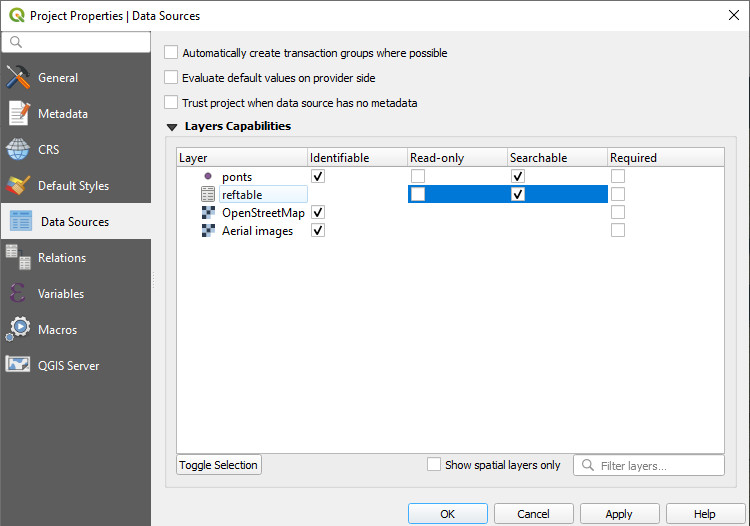

# Working with Non-spatial Tables
[[toc]]

Non-spatial tables are often a key part of a survey project. The tables can be used either on their own to add new data or linked to a spatial layer, e.g. when linking multiple [photos](../attach-multiple-photos-to-features/) or [records](../one-to-n-relations/). They can be also used in [value relation](../form-widgets/#value-relation) widgets.

We recommend using **GeoPackage** format to save your non-spatial table. With this format, you can collaboratively edit the data and track changes.

## Enable editing and browsing of non-spatial layers
Ensure you have [enabled editing and browsing](../../gis/search_data/) of your non-spatial table in **Project Properties** in QGIS.

## Non-spatial layers in Mergin Maps mobile app
Non-spatial tables can be browsed, searched and edited in the <MobileAppNameShort />.

Tap the [**Layers**](../../field/layers/) button to open the list of layers, including non-spatial tables, in the project.

Tap on a layer to open its attributes table where you can browse the data and [search for values](../../field/layers/#browsing-features). It is also possible to [add and edit](../../field/mobile-features/#add-or-edit-non-spatial-features) entries in the table.

