# Numbers

Number fields, both *integers* and *decimal numbers*, can be handled by the **Range** widget that offers two options supported by the <MobileAppNameShort />: [editable range](#range) and [slider](#slider). 

For decimal numbers, it can sometimes be useful to use the [Text edit](#text-edit) widget.

|
 Widget 
 |Preview in the <MobileAppNameShort />|
|:---:|:---:|
| Editable range  | 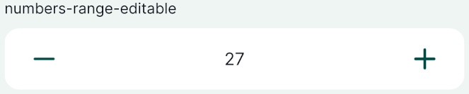  |
| Slider  | 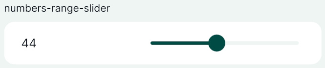  |
| Decimal numbers - Text edit | 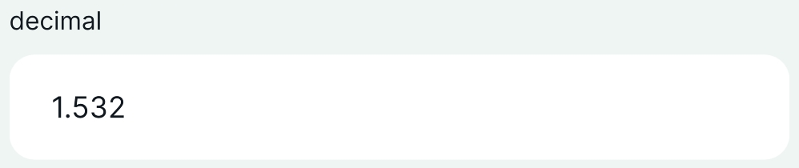  |

:::tip Example project available
This public project: <MerginMapsProject id="documentation/form-widgets" /> uses various options for entering numbers. Download or clone it to see this setup.
:::

Prefer a video? Here is a short tutorial about number widgets:
<YouTube id="woZX3L33xh0" />

## Range
To set up the **editable range widget**:

1. Right-click on a layer, select **Properties** and go to the **Attributes form** tab.
2. In the list of **Available Widgets**, select the integer field you want to work with (here: `numbers-range-editable`). 
3. In the **Widget Type** tab, select the **Range** widget with the **Editable** option.
   
   If needed, you can define the **Minimum**, **Maximum**, and **Step** values.
   
   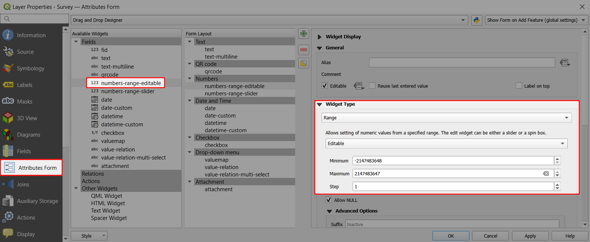

   For *decimal numbers*, the **Precision** (the number of decimal digits) needs to be specified in the **Advanced Options** of the widget, so that the **Minimum**, **Maximum**, and **Step** values can be set as decimal numbers.
   
   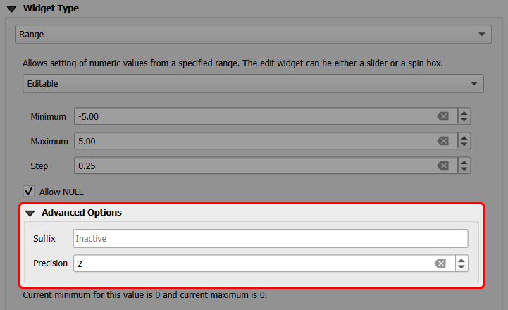

4. **Apply** the changes. Don't forget to save and sync your project!

In the <MobileAppNameShort />, the numbers can be entered manually or by using the +/- buttons:

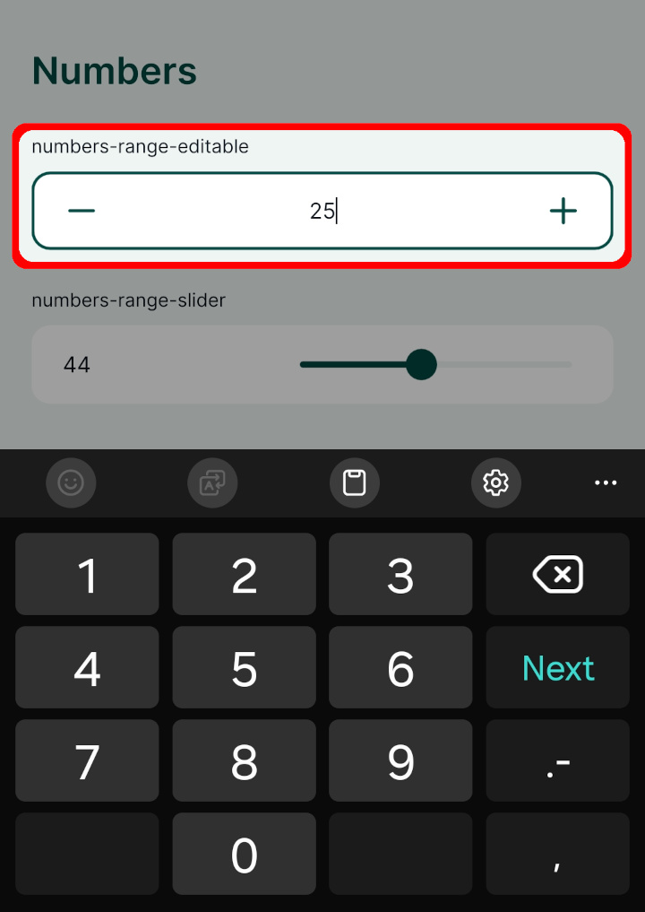

## Slider
To set up the **Slider**:

1. Right-click on a layer, select **Properties** and go to the **Attributes form** tab.
2. In the list of **Available Widgets**, select the numeric field you want to work with (here: `numbers-range-slider`).
3. In the **Widget Type** tab, select the **Range** widget with the **Slider** option.

   Set the **Minimum**, **Maximum**, and **Step** values of the slider as needed.
   
   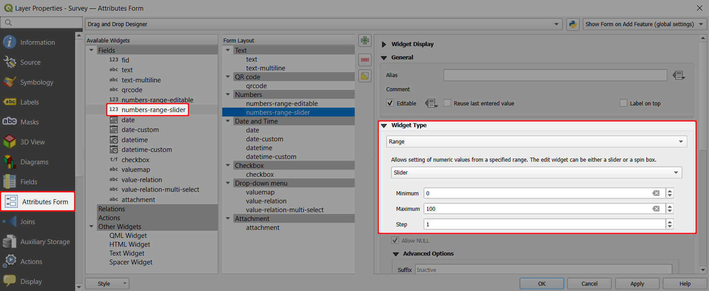

   For *decimal numbers*, the **Precision** (the number of decimal digits) needs to be specified in the **Advanced Options** of the widget, so that the **Minimum**, **Maximum**, and **Step** values can be set as decimal numbers.
   
   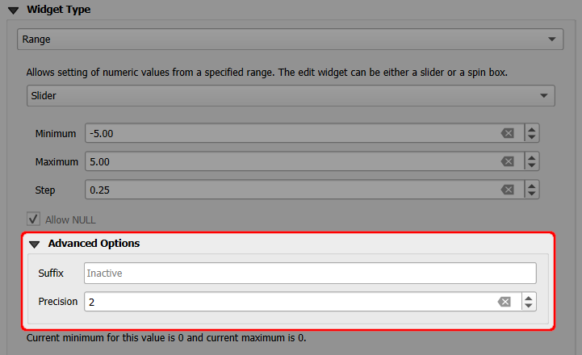
   
4. **Apply** the changes. Don't forget to save and sync your project!

In the <MobileAppNameShort />, the **Slider** looks like this. The number can be filled in by moving the slider:

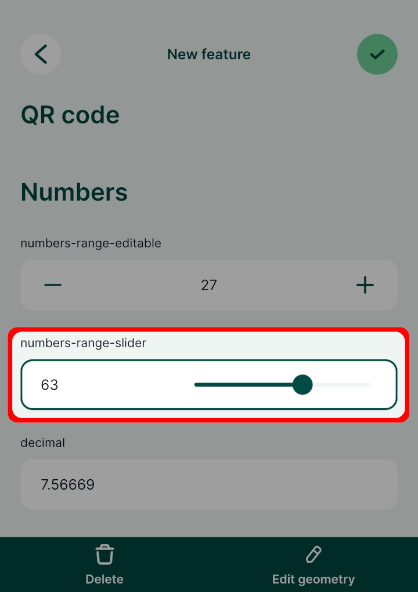

## Text edit
The **Text edit** widget can be used for a simple entry of a decimal number.

1. Right-click on a layer, select **Properties** and go to the **Attributes form** tab.
2. In the list of **Available Widgets**, select the numeric field you want to work with (here: `decimal`).
3. In the **Widget Type** tab, select the **Text edit** widget.
   
   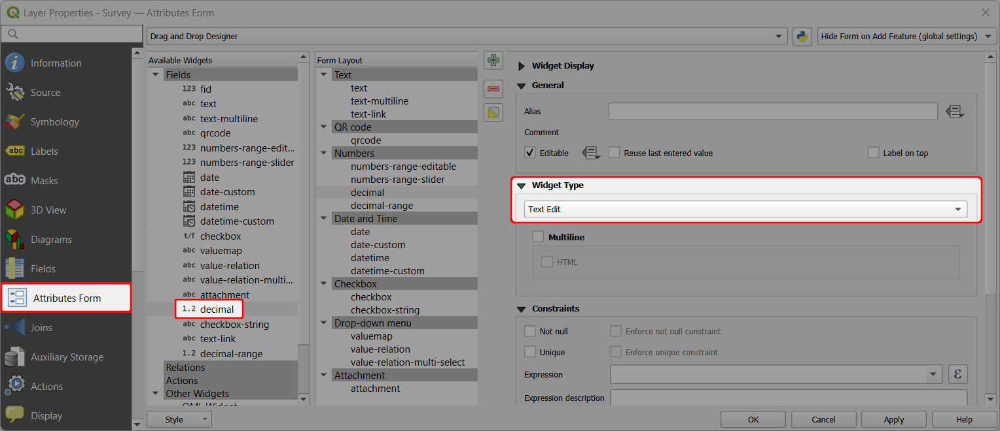

4. **Apply** the changes. Don't forget to save and sync your project!

In the <MobileAppNameShort />, the **Text widget** for a decimal number looks like this. The number can be filled in manually using the keyboard:

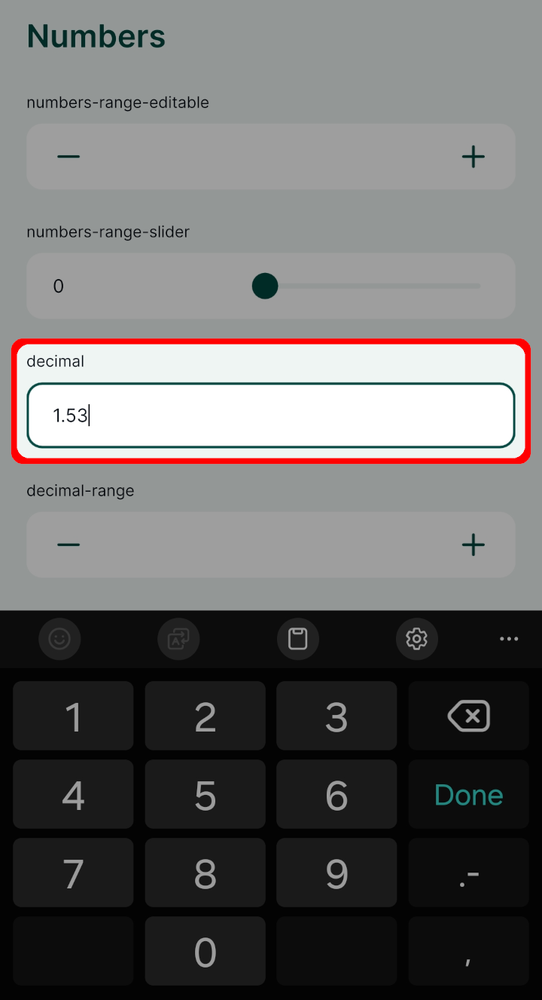

