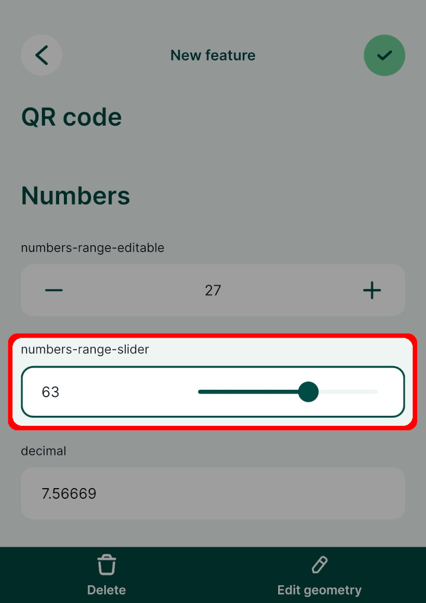

# Numbers

:::tip Example project available
This public project: <MerginMapsProject id="documentation/form-widgets" /> uses various options for entering numerical data. Download or clone it to see this setup.
:::

Number fields can be handled by the **Range** widget. Two options are supported by the <MobileAppNameShort />: [editable range](#range) and [slider](#slider). 

<YouTube id="woZX3L33xh0" />

## Range
To set up the **editable range widget**:

1. Right-click on a layer, select **Properties** and go to the **Attributes form** tab.
2. In the list of **Available Widgets** select the integer field you want to work with (here: `numbers-range-editable`). 
3. In the **Widget Type** tab the **Range** widget and the **Editable** option should be selected by default. If this is not the case, select these options from the drop-down menus.
4. **Apply** the changes. Don't forget to save and sync your project!

In the <MobileAppNameShort />, the numbers can be entered manually or by using the +/- buttons:

## Slider
To set up the **Slider**:

1. Right-click on a layer, select **Properties** and go to the **Attributes form** tab.
2. In the list of **Available Widgets** select the numeric field you want to work with (here: `numbers-range-slider`).
3. In the **Widget Type** tab:
   - the **Range** widget should be selected by default (if not, select it from the menu)
   - set the edit widget to **Slider**
   - set the **Minimum**, **Maximum** and **Step** values of the slider
4. **Apply** the changes. Don't forget to save and sync your project!

In the <MobileAppNameShort />, the **Slider** looks like this. The number can be filled in by moving the slider:

