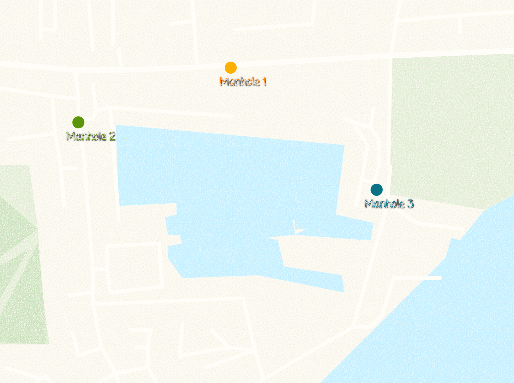
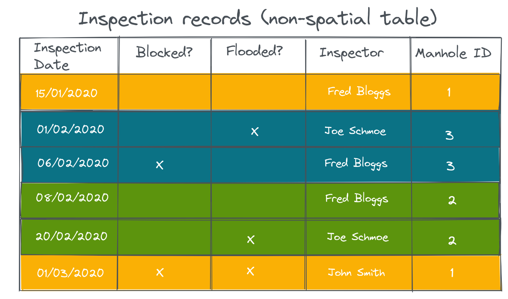
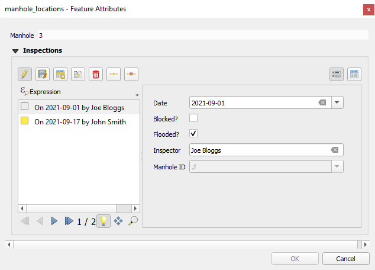

# How to Link Multiple Records to One Feature (1-N Relations)
[[toc]]

:::tip
You can clone these projects to take a closer look on 1-N relations:
   - Assigning multiple inspections to a single feature: <MerginMapsProject id="documentation/forms_one-to-many-relations" />
   - Adding multiple photos to a single feature: <MerginMapsProject id="documentation/forms_multiple_photos" />
:::

It is often the case that you have a set of spatial features and you want to record some parameters every now and then. For example, there is a GIS layer representing the manholes and the surveyors carry out regular inspections of the manholes. Instead of duplicating the manhole layer and recording each inspection, you can create a non-spatial table and store each inspection as a new row.

The image below shows the manholes locations:

The manhole point layer has the following attribute table:

In a separate [non-spatial table](../working_with_nonspatial_data/), we can record the inspections:

In QGIS, we are using the **Manhole ID** from the point layer and the inspection table to create a 1-N relation between the two tables.

The same principle can be used when you want to capture [multiple photos for a single feature](../attach-multiple-photos-to-features/).

## Project setup in QGIS
You can follow this example by cloning <MerginMapsProject id="documentation/forms_one-to-many-relations" />.

To configure 1-N relations in QGIS:
1. From the main menu, select **Projects** > **Properties ...**
2. In the new window, select the **Relations** tab
3. Select **Add Relation** to create a new one
4. A new window will appear, where we can define the parent and child layers and the fields to link the two layers:
   - **Name** is the name of the relation, e.g. `Inspection`
   - **Referenced (parent)** is the spatial layer `manhole_locations`
   - **Field 1** of the **Referenced(parent)** is the field `Manhole` that contains the ID 
   - **Referencing (child)** is the non-spatial layer `inspections`
   - **Field 1** of the **Referencing(child)** layer is the `Manhole ID`, which acts as a foreign key to link inspections to spatial features.

This now allows you to add multiple inspections for each manhole location (**manhole_locations** point layer). The inspections records will be stored in the **inspections** table.

When you open the form for an existing record in the **manhole_locations** point layer, you will be able to see the existing inspection records and optionally add, delete or edit the records:

In <MobileAppName />, the form will look like this:

