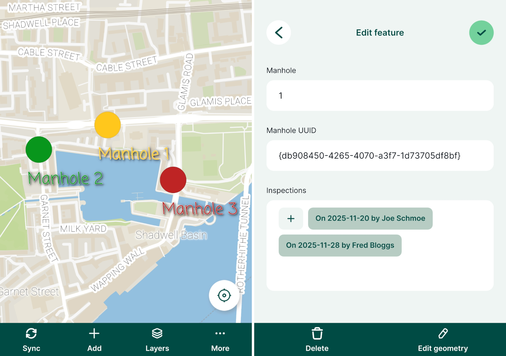
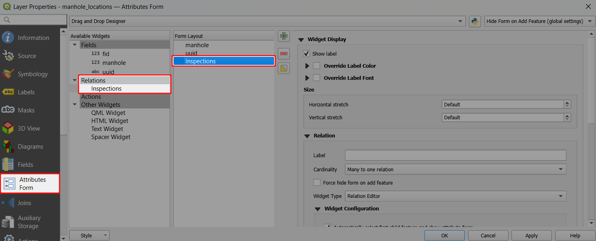
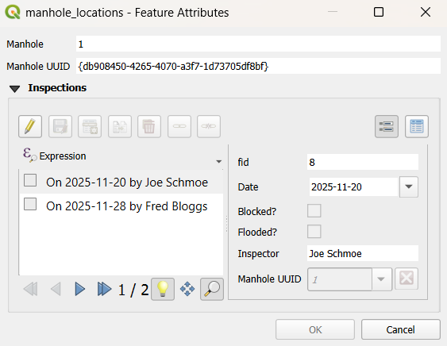

# How to Link Multiple Records to One Feature
[[toc]]

It is often the case that you have a set of spatial features and you want to record their status every now and then. 

For example, there is a GIS layer representing the manholes and the surveyors carry out regular inspections of the manholes using <MainPlatformNameLink />. Instead of duplicating the manhole layer and recording each inspection as a new feature, inspections can be recorded in a non-spatial table that is linked to the spatial layer. This way, multiple records can be linked to one feature as a [one to many relation](../relations/).

The image below shows the manhole locations and a form with listed inspections in <MobileAppName />.

:::tip Example project available
Clone our public project <MerginMapsProject id="documentation/forms_one-to-many-relations" /> to follow this setup. The project includes a data sample.
:::

The **manhole point layer** has the following attribute table:

| fid | Manhole | Manhole uuid (`uuid`) |
|:---:|:---:|:---:|
| 1 | 1 | `{db908450-4265-4070-a3f7-1d73705df8bf}` |
| 2 | 2 | `{aeea4c7d-e7c5-4638-8207-53fa469ccddd}` |
| 3 | 3 | `{042a715a-73ac-4bff-9bb0-7f598d216ec9}` |

This layer contains only information about the manholes. **Manhole uuid** (`uuid`) values are unique values generated using the [`uuid()` function](../relations/#generating-unique-ids-uuid) when a feature is created. This field will be used to link inspections and manholes.

:::danger Using UUID
**Why UUID?** FID can be changed during [synchronisation](../../manage/synchronisation/). As a result, records can end up being linked to wrong features. 

On the other hand, <QGISHelp ver="latest" link="user_manual/expressions/functions_list.html#uuid" text="UUID" /> (Universally Unique Identifier) is generated to be unique and will not be changed when synced. Therefore, we recommend always using UUID to link layers.
:::

The **non-spatial inspections table** has the following attributes. **Manhole uuid** (`parent-uuid`) are references to manholes.
| fid | Date | Blocked? | Flooded? | Inspector | Manhole uuid (`parent-uuid`) |
|:---:|:---:|:---:|:---:|:---:|:---:|
| 8 | 2025-11-20 | false |false| <NoSpellcheck id="Joe Schmoe"/> | `{db908450-4265-4070-a3f7-1d73705df8bf}` |
| 9 | 2025-11-28 | false |true | <NoSpellcheck id="Fred Bloggs"/> | `{db908450-4265-4070-a3f7-1d73705df8bf}` |
| 10 | 2025-12-01 | true |true| <NoSpellcheck id="Fred Bloggs"/> | `{aeea4c7d-e7c5-4638-8207-53fa469ccddd}` |
| 11 | 2025-12-03 | false |false| <NoSpellcheck id="Joe Schmoe"/> | `{042a715a-73ac-4bff-9bb0-7f598d216ec9}` |

To configure 1-N relations in QGIS (detailed steps can be found in [Relations](../relations/#setting-up-relation-in-qgis)):
1. From the main menu, select **Projects** > **Properties ...**
2. In the **Relations** tab, select  **Add Relation**
3. Define the parent and child layers and the fields to link the two layers:
   - **Name** is the name of the relation, e.g. `Inspection`
   - **Referenced (parent)** is the spatial layer `manhole_locations`
   - **Field 1** of the **Referenced (parent)** is the field `Manhole UUID` that contains the **unique** UUID 
   - **Referencing (child)** is the non-spatial layer `inspections`
   - **Field 1** of the **Referencing (child)** layer is the `Manhole UUID`, which acts as a foreign key to link inspections to spatial features

   

4. Navigate to the **Attributes form** tab in Layer **Properties** of the survey layer (`manhole_locations`)
5. Add the **Inspections** relation to the **Form Layout**
   

Now you can add multiple inspections for each manhole location. The inspections records will be stored in the `inspections` table.

When you open the form for an existing record in the `manhole_locations` point layer, it will display existing inspection records and you can also add, delete or edit the records:

In the <MobileAppNameShort />, the form will display all linked inspection records. Tapping the **+** button opens the inspection form and a new inspection record can be added.

