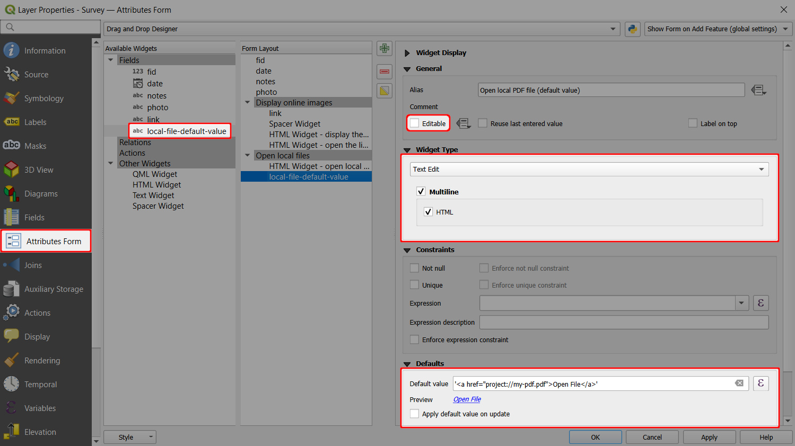
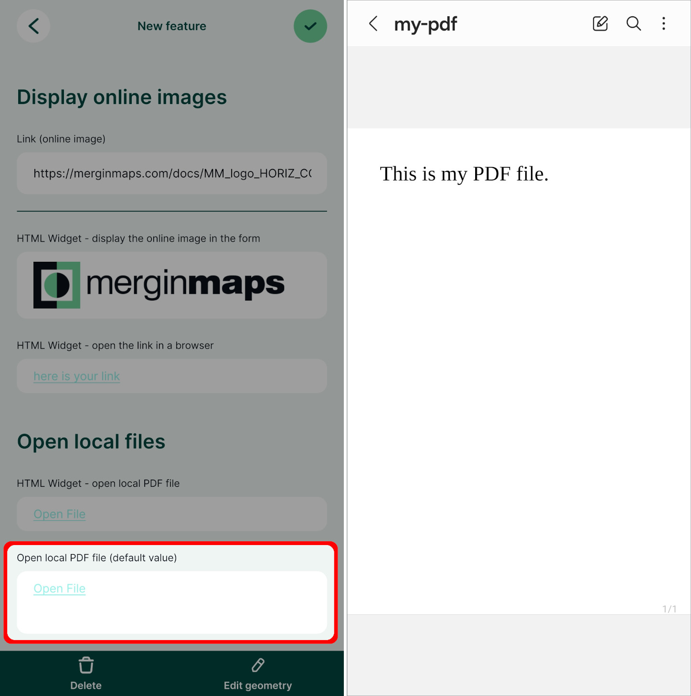

# How to Open a File
[[toc]]

A local file, e.g. a PDF stored in the project folder, can be opened from within the form using [the HTML widget](../info-widgets/#html-widget). There is an alternative setting that uses [default values](#open-local-files-using-default-values) that may be useful for specific scenarios.

::: tip Public project available
Download or clone our public project <MerginMapsProject id="documentation/forms-display-images-and-files" />  to explore both options and see what works the best for you.
:::

## Using HTML widget to open local files
The HTML widget can be used to open local files: for instance, a locally stored PDF file can be opened from within the form during the survey.

::: tip Example project available
This setup is used in our public project <MerginMapsProject id="documentation/forms-display-images-and-files" />.
:::

- A PDF file named `my-pdf.pdf` is stored in the main [project folder](../../manage/project/#mergin-maps-project-folder) as it needs to be packaged with the project.
- The HTML Widget is added to the **Attributes Form** and configured as follows:
   ```
   <a href="project://my-pdf.pdf">Open File</a>
   ```


In the <MobileAppNameShort />, you can tap the *Open File* link to open the PDF file using the default application of your device.


## Open local files using default values <Badge text="Advanced" type="warning"/>

Local files (e.g. a PDF file) can also be opened from within the form using default values. This file needs to be packaged with the project, so it should be stored somewhere in the [project folder](../../manage/project/#mergin-maps-project-folder).

::: tip Example project available
This setup is used in our public project <MerginMapsProject id="documentation/forms-display-images-and-files" />.
:::

- A PDF file named `my-pdf.pdf` is stored in the main project folder.
- The survey layer has a field named `local-file-default-value` with **Text (string)** data type.
   - This field is set to *not editable* (the form will refer to the same file for all features and does not need to be changed).
   - This field uses the **Text Edit** widget with the *Multiline* and *HTML* options enabled.
   - The **default value** is set to:
   ```
   '<a href="project://my-pdf.pdf">Open File</a>'
   ```



In the <MobileAppNameShort />, you can tap the *Open File* link to open the PDF file using the default application of your device.



