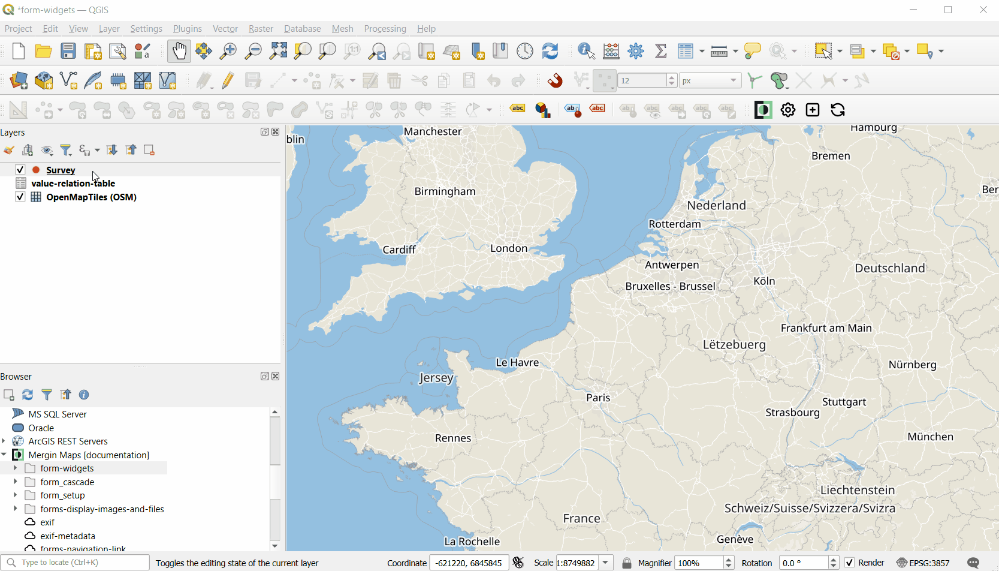

# Configure Forms Overview

Capturing field data includes recording some information about surveyed points, lines, polygons or non-spatial features by filling in attributes form. This section will guide you through various settings of attributes forms for spatial and non-spatial layers.

:::tip Mergin Maps project setup in QGIS
In this section, we focus specifically on configuring forms for field survey layers. We recommend using **GeoPackage** format for your layers.

To learn how to create your project and add survey layers, follow our tutorial [Creating a Project in QGIS](../../tutorials/creating-a-project-in-qgis/). Additional tips for project setup can be found in [QGIS project preparation](../../gis/features/).
:::

Just as other project settings, the forms for data collection are configured in <QGIS link="en/site/forusers/download.html" text="QGIS" /> and <MobileAppName /> follows these settings. 

Each layer has its own form. By default, the form is automatically generated, contains all the fields and these fields have a default type of data input. This means that even without a special configuration, you are able to fill in the form with valid input values. These default options can be changed to fit the needs of your field survey. You can define the type of data input for each field by choosing a <QGISHelp ver="latest" link="user_manual/working_with_vector/vector_properties.html#attributes-form-properties" text=" QGIS widget" />. See our [widget gallery](../form-widgets/) for a quick overview of available widgets. 

Do you prefer a video? Check out this tutorial on how to configure QGIS widgets for survey forms.
<YouTube id="jc4p1PpXj3k" title="Widgets for survey forms" />

## Setting up form widgets

Attributes forms can be configured using <QGISHelp ver="latest" link="user_manual/working_with_vector/vector_properties.html#edit-widgets" text="QGIS widget types" /> in the **Attributes Form** tab in the **Layer Properties**. Note that the widget has to be compatible with the field data type. 

Each data type has a default widget: for instance, text fields use *Text edit* widget by default and are filled in by manually typing the value, while date fields use *Date/Time* widget and the value is selected using a calendar pop-up.

## Layout and configuration

Extra configuration of attribute forms can be done to make data collection easier and more consistent, such as:
- using [default values](../default-values/) to automatically record attribute's values
- setting [constraints](../constraints/) to define valid inputs for the attributes
- designing the [attributes forms layout](../form-layout/) so that the forms are easy to work with

In [Use Cases](../use-cases), you can find step-by-step guides to deal with specific scenarios, such as [opening files](../open-file/) from within the form, [using hyperlinks](../external-link/), [open a link to a navigation app](../link-to-navigation/) in the form and much more.

