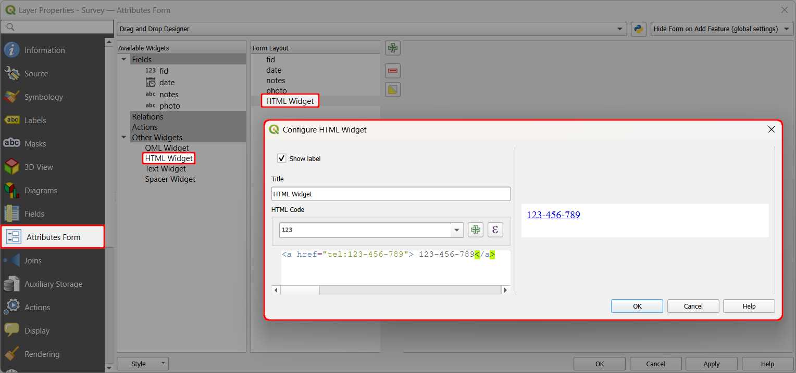
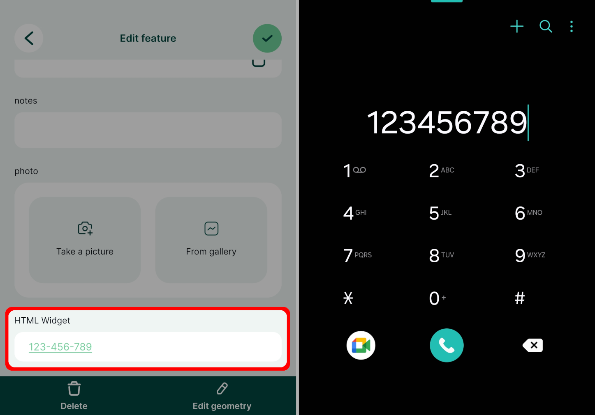

# How to Use a Phone Call Link

The HTML widget can be used to display a link that will trigger a phone call directly from the form in <MobileAppName />.

:::tip Example project available
Clone <MerginMapsProject id="documentation/phone-call-link" /> to see how this works.
:::

Add the [HTML widget](../info-widgets/) to the **Attributes form** of your survey layer. Use the following configuration (replace `123-456-789` by the phone number you want to use):
```
<a href="tel:123-456-789">123-456-789</a>
```



In the <MobileAppNameShort />, the form now contains a link that can initiate a phone call.



