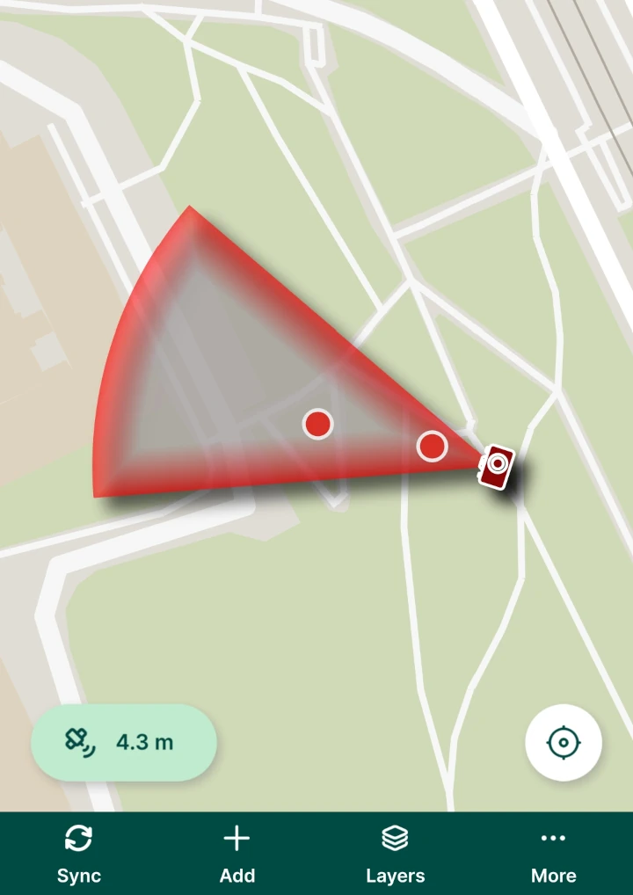
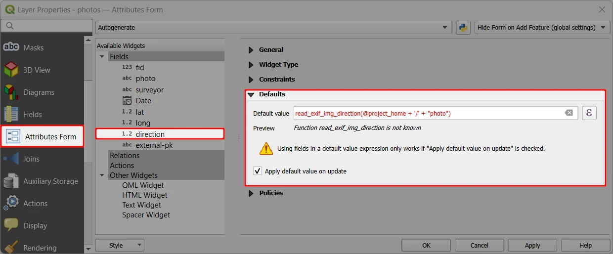
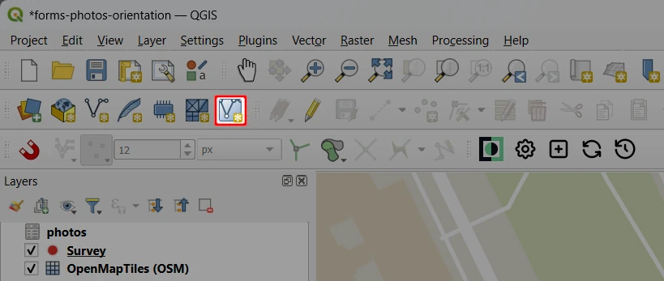
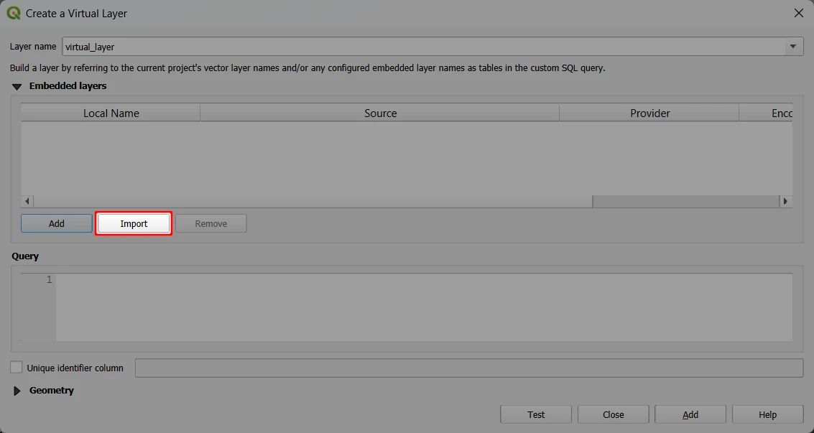
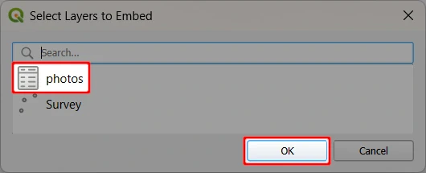
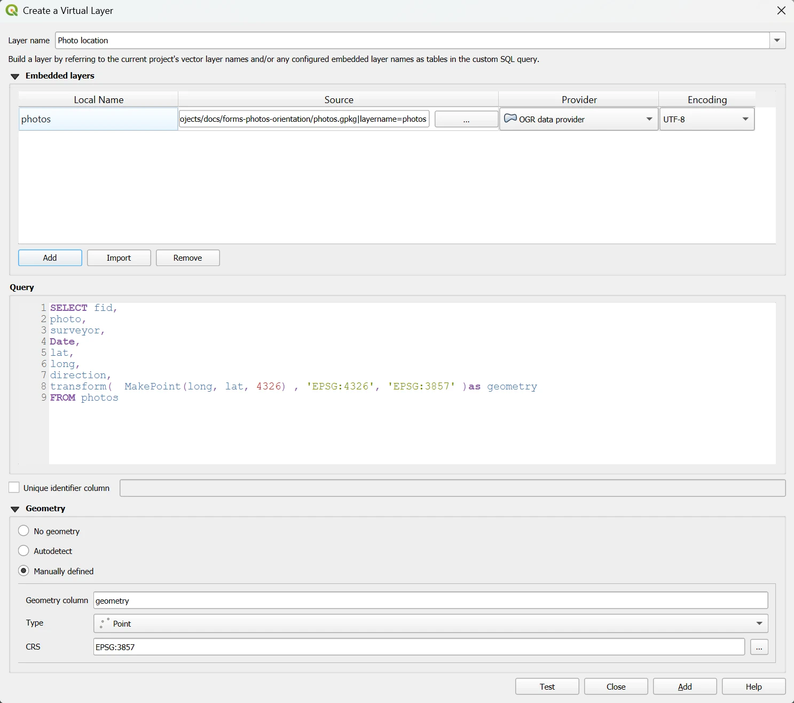
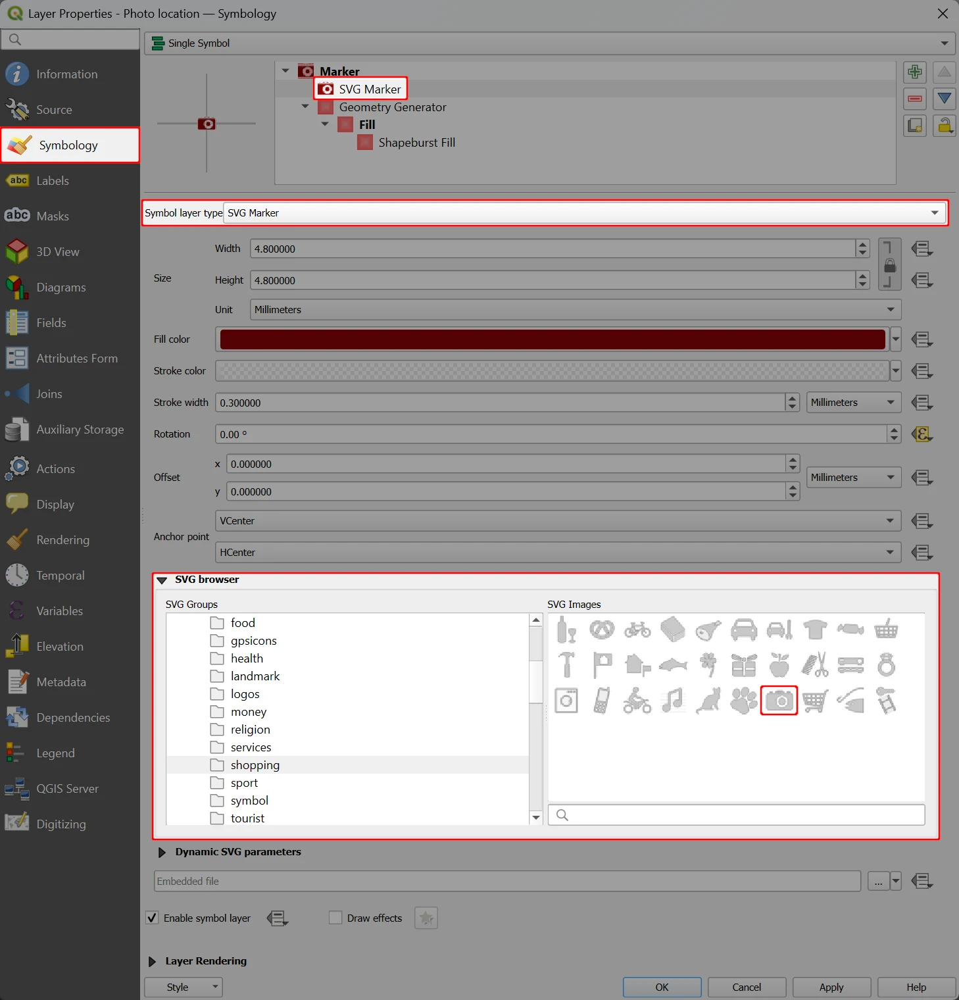
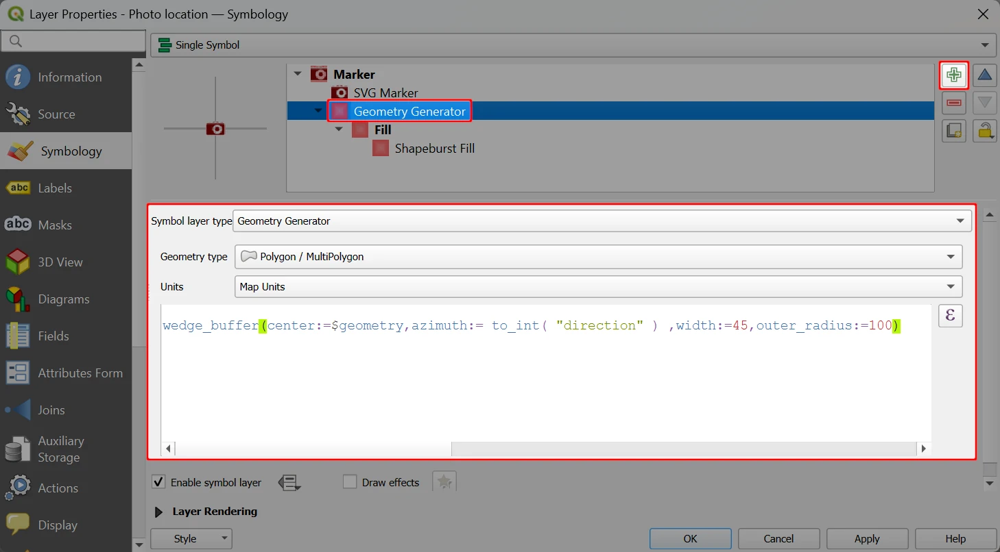
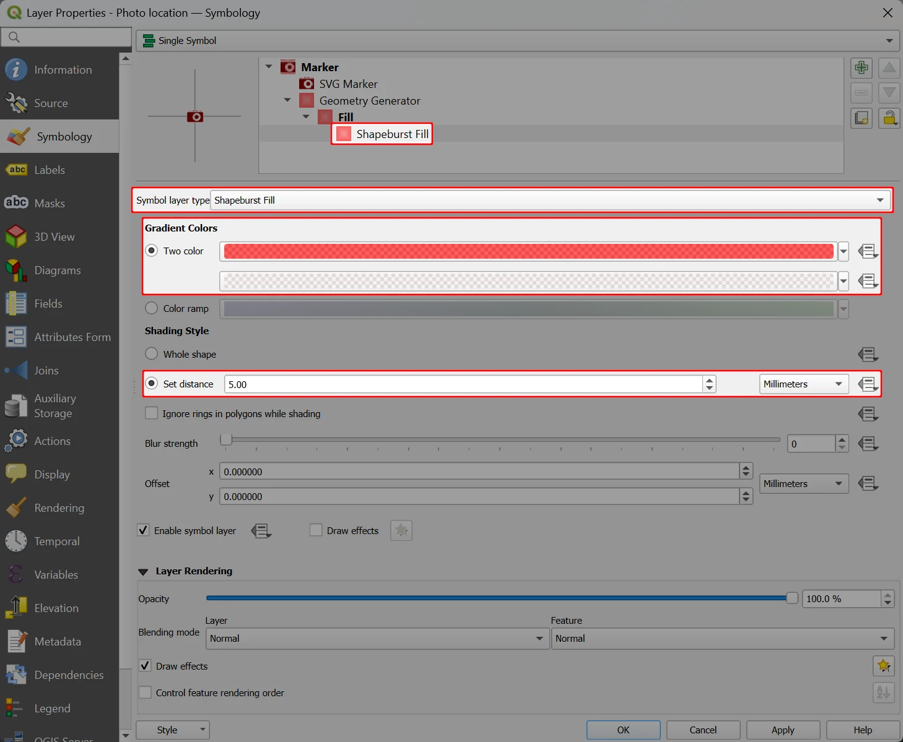
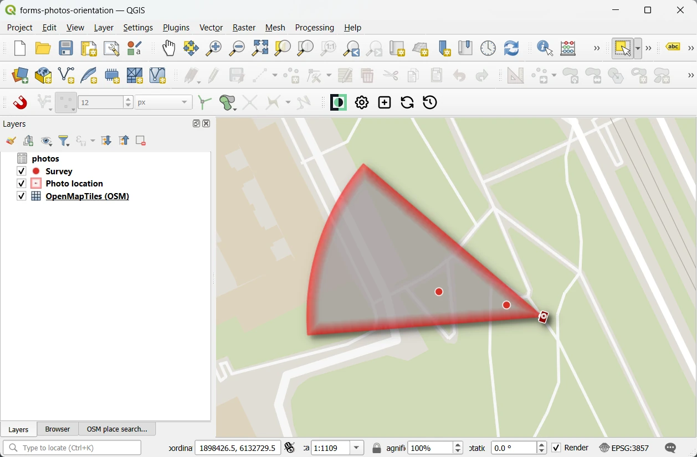

# How to Display Photo Location and Direction

[[toc]]

The orientation of photos captured using the <MobileAppNameShort /> can be displayed in the project to see the camera's pointing direction.



To do so, we will:
- use EXIF metadata to store the location and direction of photos
- use a virtual layer to display a point for each photo (location where the photo was taken)
- style the virtual layer to visualise the photo direction

:::tip Example project available
To explore this setup, download this public project <MerginMapsProject id="documentation/forms_multiple_photos" />.
:::

## Storing photo direction and location
Here, we use a project that allows attaching [multiple photos to one feature](../photos/#how-to-attach-multiple-photos-to-one-feature). It contains a point survey layer (here: `Survey`) and a non-spatial table for photos (here: `photos`).

The photos layer has fields for storing location (latitude `lat`, longitude `long`) and direction (`direction`) of the photos. These values are stored automatically, using EXIF metadata as default values (see [Geotagging](../exif/) for more details).

We use following default values as photos are stored in [a custom folder](../photos/#how-to-set-up-a-custom-folder-for-storing-photos) named `photo`:
- latitude: `read_exif_latitude(@project_home + '/' + "photo")`
- longitude: `read_exif_longitude(@project_home + '/' + "photo")`
- direction: `read_exif_img_direction(@project_home + '/' + "photo")`



:::warning Location tags
To store EXIF metadata values, [location tags have to be allowed in the camera settings](../exif/#allowing-location-tags).
:::

## Virtual layer of photo locations
The location and direction of photos is stored in a non-spatial table `photos`. Here, we will create a virtual layer, in which every photo has its location displayed as a point. 

:::tip Virtual layers
Virtual layers are in essence database views. They are created as a result of an SQL query, so they do not contain any data themselves and cannot be edited.

Virtual layers can be embedded in the project, synchronised and used in the <MobileAppNameShort />.

See <QGISHelp ver="latest" link="user_manual/managing_data_source/create_layers.html#creating-virtual-layers" text="QGIS User Manual" /> for more information about virtual layers.

:::

1. Create a **New Virtual Layer**
   

2. Click on the **Import** button to choose a layer from the project
   

3. Select the layer that contains photos (here: `photos`)
   
   
4. Define the virtual layer:
   - **Layer name** can be set as needed (here: `Photo location`)
   - **Embedded layers** should contain the imported layer (here: `photos`)
   - **Query** for the virtual layer. In this case:
      - the virtual layer will have the same fields as the `photos` layer
      - `geometry` is derived from the longitude and latitude of the photos (see [storing photo direction and location](#storing-photo-direction-and-location))

```
SELECT fid,
photo,
surveyor,
Date,
lat,
long,
direction, 
transform(  MakePoint(long, lat, 4326) , 'EPSG:4326', 'EPSG:3857' )as geometry
FROM photos
```

   - **Geometry** of the virtual layer is **Manually defined** as:
      - **Geometry column**: `geometry` (as defined in the query)
      - **Type**: Point
      - **CRS**: EPSG: 3857 (as used by the `MakePoint` function in the query)
 
      

5. Use the **Add** button to add the virtual layer to the project. 

   It should appear as a point layer with the same data as the `photos` layer.

## Symbology for photo location and direction
Here we will define the symbology of the virtual layer. We will use an SVG marker for the photo location combined with a visualisation of the photo direction.

1. Navigate to the **Symbology** tab of the **Layer Properties**

2.  First we will create a symbol for photo location.

    In the **Symbol layer type**, switch the *Simple Marker* to ***SVG Marker*** and:
      - Find an appropriate symbol in the **SVG Browser**. Here we use a photo symbol from the *App Symbols* > *shopping* folder.
      - Set appropriate size and colour of the symbol

     

3. Now we will create a visualisation of the photo direction.

   Use the **Add symbol layer** button to add a new marker located under the SVG marker. 
   
   Set it up as follows:
   - **Symbol layer type**: *Geometry Generator*
   - **Geometry type**: *Polygon / MultiPolygon*
   - **Expression**:
   ```
   wedge_buffer(center:=$geometry,azimuth:= to_int( "direction" ) ,width:=45,outer_radius:=100)
   ``` 

   

   This defines the geometry of the symbol. You can modify its size by changing the `width` and `outer_radius` variables in the `wedge_buffer` function.
   
4. Finally, we will style this symbol. 
   - Switch the **Symbol layer type** from *Simple Fill* to *<NoSpellcheck id="Shapeburst"/> Fill*
   - For **Gradients <NoSpellcheck id="colors"/>** use the *Two <NoSpellcheck id="color"/>* option and choose the colours. We recommend using semi-transparent colours.
   - For **Shading Style**, **Set distance** as needed, here we use 5.00
   
   

And this is how our setup looks like in QGIS:



When you add a photo in the <MobileAppNameShort />, it will be displayed in this virtual layer:


