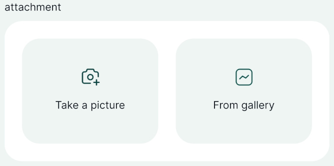
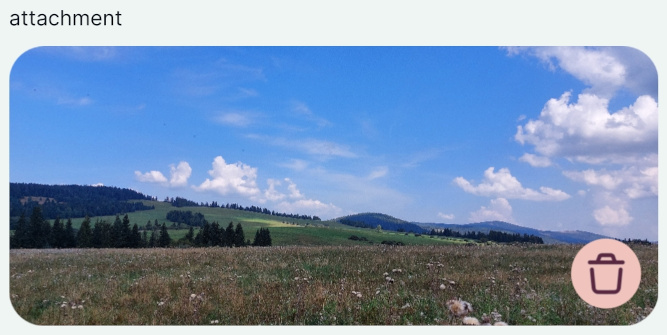
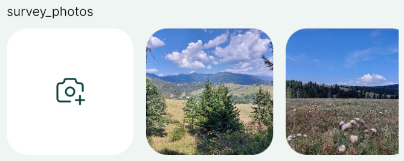
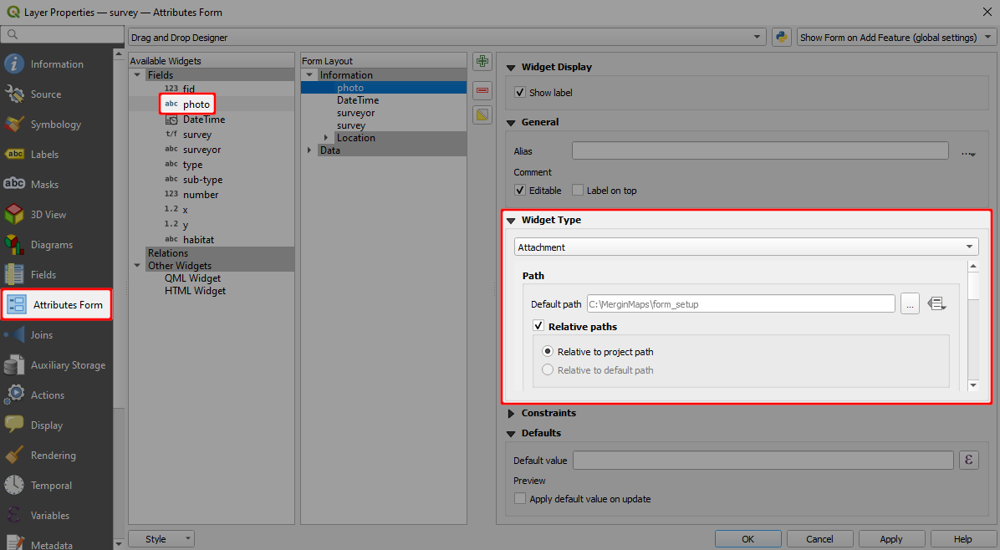
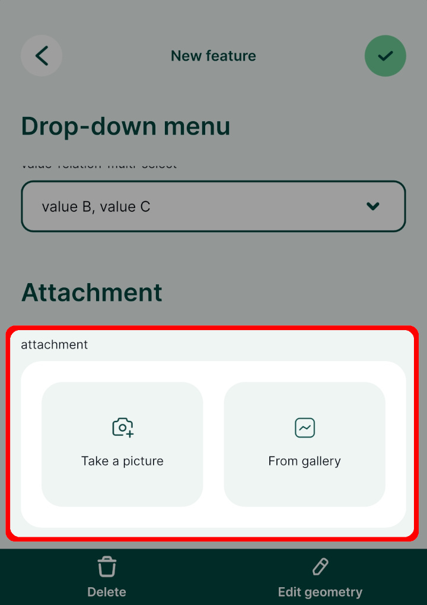
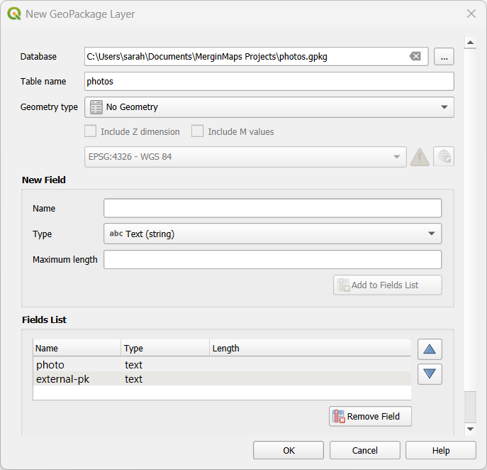
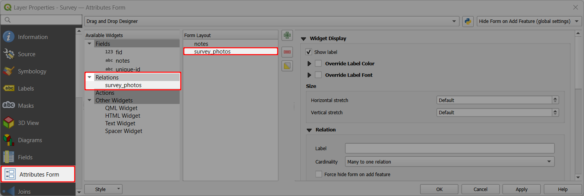

# Photos
[[toc]]

Adding photos to a surveyed feature can be really helpful. With <MainPlatformName />, you can quickly take photos during the survey, share them with your team and store them in the cloud. You can either capture a photo using your camera or select existing photos from the gallery.

<MainPlatformName /> offers some useful functionalities for capturing photos:
- More than one photo can be attached to one feature. Follow our guide [How to attach multiple photos to features](#how-to-attach-multiple-photos-to-one-feature) to do so.
- Photos can be named automatically based on a [customised names format](#customising-photo-name-format-with-expressions).
- Synchronising photos during the field survey can use up a lot of mobile data, depending on the amount of pictures taken and their size. To reduce the data usage, you may use [selective synchronisation](../../manage/selective_sync/), [resizing pictures automatically](../../gis/features/#photo-quality) or following the [offline field survey workflow](../../field/offline-use/#offline-field-survey-workflow). 

|
 Widget 
 |Preview in the <MobileAppNameShort />|
|:---:|:---:|
[Attachment - Photos from device's camera or gallery](#photo-attachment-widget-in-qgis) |     |
|[Relation - Gallery ](#how-to-attach-multiple-photos-to-one-feature) |  |

:::tip Example projects available
To see the basic [attachment widget](#photo-attachment-widget-in-qgis) setup for photos, clone <MerginMapsProject id="documentation/form_setup" />.

If you want to [attach multiple photos to one feature](#how-to-attach-multiple-photos-to-one-feature) explore the public project <MerginMapsProject id="documentation/forms_multiple_photos" />.
:::

## Photo attachment widget in QGIS

:::tip Example project available
Clone <MerginMapsProject id="documentation/form_setup" /> to follow this example!
:::

To add photos to features using the <MobileAppNameShort />, the attributes form of a survey layer needs to have a field with data type `Text (string)` configured with the **Attachment** widget in QGIS as follows:

To set up the attachment widget:
1. Right-click on a layer, select **Properties** and go to the **Attributes form** tab.
2. In the list of **Available Widgets** select the text field you want to work with.
3. In the **Widget Display** tab:
   - From the drop-down menu, select **Attachment**
   - **Default path** defines where images will be saved. If it is not defined, the project home folder will be used.
   - Store the path as **Relative to project path** or **Relative to default path** depending on how you want to store the paths.

   

   :::danger Avoid using absolute paths
   Using *absolute paths* causes issues when working with your projects on different devices or working in a team: as each device or team member can use different paths, they may be unable to display the images.
   :::

4. **Apply** the changes. Don't forget to save and sync your project!

In the <MobileAppNameShort />, this field will provide two options:
- **Take a picture** to use your camera app for taking a photos 
- **From gallery** to attach an existing photo from your device

## Custom folder for storing photos {#how-to-set-up-a-custom-folder-for-storing-photos}
It can be useful to set up a custom folder for photos, e.g. if you want to use [selective synchronisation](../../manage/selective_sync/) or if you simply want to have your data organised.

To set up a custom folder:
1. Create a subfolder in the project folder (here: `photos`)
2. Open your project in QGIS
3. Open the **Properties** of the survey layer and navigate to the **Attributes form** tab.

   Select the field, where photos are stored (here: `photo`) and make sure that the widget type is set to [**Attachment**](#photo-attachment-widget-in-qgis)
   

5. Now we need to change the **Default path** to the folder we have created. Click on the *Data defined override* icon and choose **Edit...**
   

6. In **Expression String Builder** enter the expression `@project_folder + '/photos'` (replace `photos` by the name of your folder). Click **OK**.
   

7. The **Default path** now refers to the custom folder.
   

8. **Apply the changes**. Don't forget to save and sync your project!

### Overview of paths for attachment widget

Here is an overview of paths that can be stored in various settings of the attachment widget.

|        Default path       	|  Store path as 	|                Value               	|
|:-------------------------:	|:------------:	|:----------------------------------:	|
|             -             	| Relative to project path |              `image.jpg`             	|
|             -             	| Relative to default path |              `image.jpg`             	|
|      `@project_folder`      	| Relative to project path |              `image.jpg`             	|
|      `@project_folder`      	| Relative to default path |              `image.jpg`             	|
| `@project_home + '/photos'` 	| Relative to project path |          `/photos/image.jpg`         	|
| `@project_home + '/photos'` 	| Relative to default path |               `image.jpg`             	|

## Resizing pictures automatically
Photos that are captured during the field survey or uploaded using <MobileAppName /> can be automatically resized, e.g. to save up storage space. The quality of the photos can be set up in the [<MainPlatformName /> project properties](../../gis/features/#photo-quality) using <QGISPluginName />.

## Customising photo name format with expressions
Photos taken in the field using <MobileAppName /> can be automatically renamed. This can be useful when browsing pictures in your <MainPlatformNameLink /> project and keeping them organised.

[**How to Set Photo Names Format**](../../gis/photo-names/) will guide you through the setup and provide examples of expressions that can be used to name your photos.

## Displaying photos in QGIS
Photos taken using <MobileAppName /> during the survey can be displayed in the feature's form in QGIS.

1. In QGIS, double click on a survey layer to open **Layer Properties**
2. In the **Attributes Form** tab, select the field that contains the path to the photo.

   Scroll to the **Integrated Document Viewer** in the panel on the right. Set the **Type** to *Image*.
   

3. **Apply** the changes and click **OK**.

Now when you click on a feature that contains a photo, it will be displayed in the form.

::: warning Image preview in QGIS 3.36+
QGIS may not display the preview of the image if you use QGIS 3.36 or higher. Despite this behaviour, the <MobileAppNameShort /> displays it correctly. Therefore we recommend trying the setup by opening the form in the <MobileAppNameShort /> to make sure it works as intended.
:::

## How to attach multiple photos to one feature

In some situations, it might be useful to take more than one picture of a feature during the field survey. Attaching multiple photos to one feature is a **one to many relation**. You can read more about this topic in general in [Relations](../relations).

|
 Widget 
 |Preview in the <MobileAppNameShort />|
|:---:|:---:|
|Relation - Gallery |  |

:::tip Example project available
To see this setup in practice, you can download this public project <MerginMapsProject id="documentation/forms_multiple_photos" />.
:::

<YouTube id="NCa_Nb_CYno" />

### Non-spatial layer for storing photos
To link multiple photos to a single feature, we need to have a non-spatial layer (table) to store the paths to the photos. 

1. Here we will create a new GeoPackage layer named `photos` with following attributes:
   - `photo` with `Text (string)` data type to store the photo path
   - `external-pk` with `Text (string)` data type to store the reference to the feature from the survey layer

   

   ::: tip Using default values
   You may add other attributes as needed, e.g. to record the username or dates automatically using [default values](../default-values/).
   :::

2. Now we need to configure the attributes form: set the `photo` field to store photo paths as described in the [photo attachment widget](#photo-attachment-widget-in-qgis).

### Relation setup
The `photos` layer will be linked to the survey layer using an UUID: the survey layer needs to have a **unique UUID** field generated by the `uuid()` function (see how to set it up [here](../relations/#generating-unique-ids-uuid)) and the [`photos` layer](#non-spatial-layer-for-storing-photos)  has a field to store the foreign key (here: `external-pk`).

:::danger Use UUIDs to link layers
**Do not use the FID field to link these tables**. FIDs can be changed during synchronisation, which can result in having photos linked to the incorrect feature. See [Behind Data Synchronisation](../../manage/synchronisation/) for more details.

You should always use unique UUIDs generated by the `uuid()` function to link layers as they do not change during the sync.
:::

Navigate to the [**Relations**](../relations/#setting-up-relation-in-qgis) tab in **Project Properties** and **Add Relation** as follows:
- **Name** is the name of the relation, can be left blank
- **Referenced (parent)** is the spatial layer `Survey`
- **Field 1** of the **Referenced (parent)** is the field `unique-id` that contains the UUID 
- **Referencing (child)** is the non-spatial layer `photos`
- **Field 1** of the **Referencing (child)** layer is the `external-pk` that contains the foreign key to link photos with surveyed features.

### Relations widget (gallery) in the form

Check the **Attributes form** tab in the **Layer Properties** of your survey layer and make sure that the [relation widget](../relations/#attributes-forms-configuration-for-1-n-relations) is included in the form. 

If you use [Drag and Drop Designer](../form-layout/#qgis-drag-and-drop-designer), you may need to add it to the form manually.

The <MobileAppNameShort /> detects the relation widget and allows to add multiple images to one feature, displaying them in a gallery form.

