# Working with Photos (all settings, 1-N relations, exif)
[[toc]]

When surveying, you might want to take a photo from your camera or attach an existing photo from the device gallery to your survey feature.

To capture and save photos using the <MobileAppNameShort />, the survey layer needs to have a field configured with the [attachment widget](../form-widgets/#attachment). 

In the <MobileAppNameShort />, this field will provide two options:
- **Take a picture** to use your camera app for taking a photos 
- **From gallery** to attach an existing photo from your device

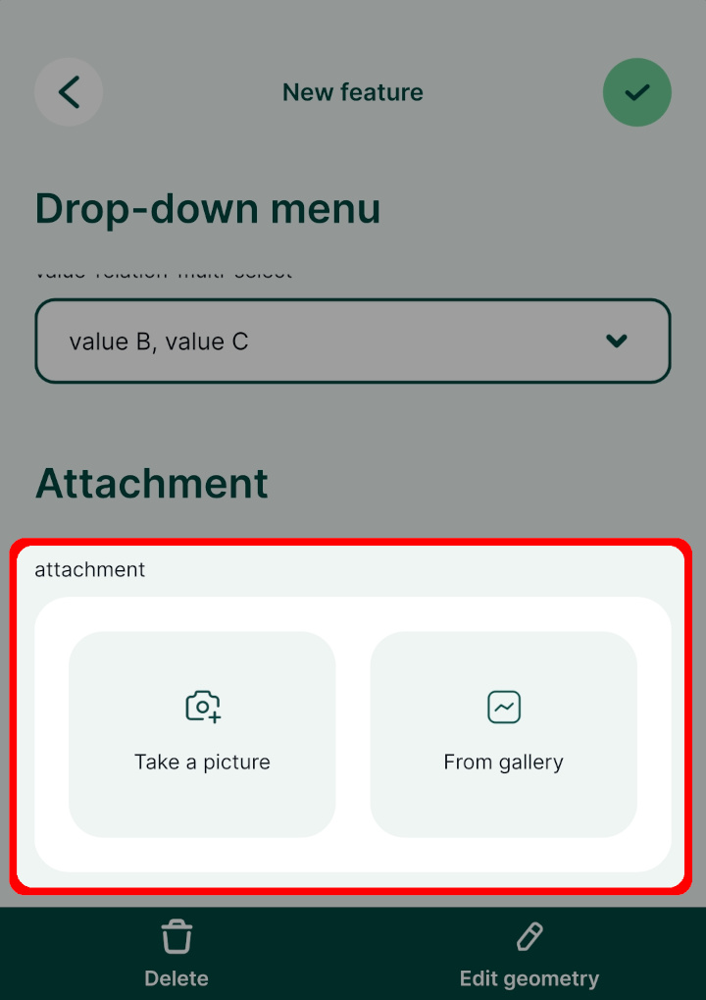

:::tip
Do you need to attach multiple pictures to one feature? [How to attach multiple photos to features](../attach-multiple-photos-to-features/) will guide you through the setup.# How to Attach Multiple Photos to Features


In some situations, it might be useful to take more than one picture of a feature during the field survey. Attaching multiple photos to one feature is a 1-N relation. You can read more about 1-N relations and how they can be used in <MainPlatformNameLink /> in [How to link multiple records to one feature](../one-to-n-relations/).

<YouTube id="NCa_Nb_CYno" />

:::tip Example project available
To see this setup in practice, you can download the following project: 
<MerginMapsProject id="documentation/forms_multiple_photos" />.
:::

To link multiple photos to a single feature, we need a **unique field** to link following tables:
- Survey layer containing spatial information
- A non-spatial table containing path to the photos (see [how to setup simple photo forms](../photos/))

:::danger WARNING
**Do not use the FID field to link these tables**. FIDs can be changed during synchronisation, which can result in having photos linked to the incorrect feature. You can learn more about synchronisation in [Behind Data Synchronisation](../../manage/synchronisation/#synchronisation). 
:::

To set 1:N relation between these tables correctly:
1. Create a new text field in the survey layer, here: `unique-id`
   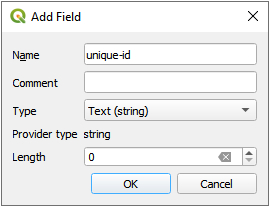
2. Use the `uuid()` as the **default value** for this field in **Layer Properties**. This function assigns a unique identifier to every created feature, even when different surveyors create features simultaneously.
   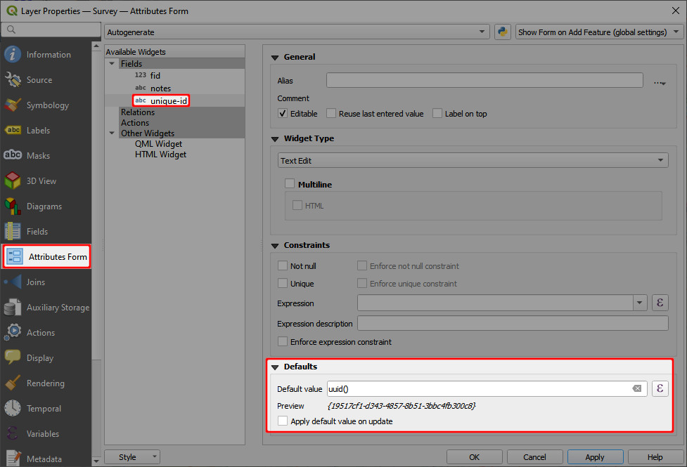
3. Create a new text field in the non-spatial table (here: `photos`) that will be used to store the UUID of features from the survey layer (the foreign key), here: `external-pk`.

Now we need to configure a [1-N relation](../one-to-n-relations/):
4. From the main menu, select **Project** > **Properties ...**
5. In the **Relations** tab, select **Add Relation**
   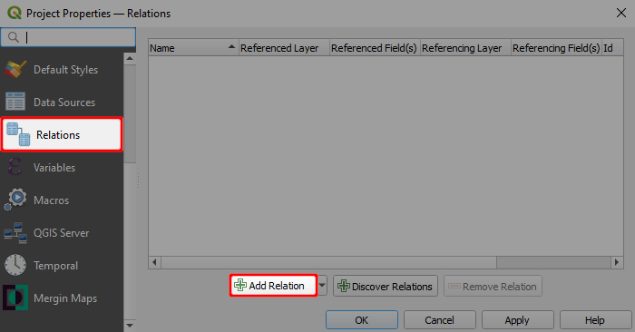

6. Define the parent and child layer and the fields to link these layers. Here:
   - **Name** is the name of the relation, can be left blank
   - **Referenced (parent)** is the spatial layer `Survey`
   - **Field 1** of the **Referenced (parent)** is the field `unique-id` that contains the UUID 
   - **Referencing (child)** is the non-spatial layer `photos`
   - **Field 1** of the **Referencing (child)** layer is the `external-pk` that contains the foreign key to link photos with surveyed features.
   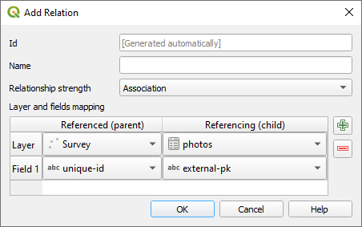

7. Navigate to the **Attributes Form** tab in the **Properties** of the `photos` layer. Set the **Widget Type** of the foreign key `external-pk` to **Relation Reference**:
   

The <MobileAppNameShort /> detects the type of 1-N relation and displays the image viewer for the relations. 
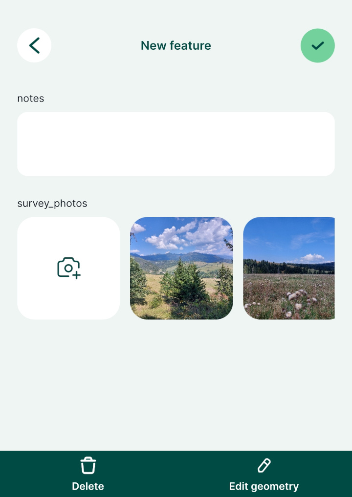

:::

::: warning
Keep in mind that synchronising photos during the field survey can use up a lot of mobile data - depending on the amount of pictures taken and their size.

To reduce the data usage, you may consider using [selective synchronisation](../../manage/selective_sync/), [resizing pictures automatically](#resizing-pictures-automatically) or following the [offline field survey workflow](../../field/offline-use/#offline-field-survey-workflow). 
:::

## Photo attachment widget in QGIS

:::tip Example project available
Clone <MerginMapsProject id="documentation/form_setup" /> to follow this example!
:::

In QGIS, the [attachment widget](../form-widgets/#attachment) is used to set up a field to capture photos.

To set up the attachment widget:
1. Right-click on a layer, select **Properties** and go to the **Attributes form** tab.
2. In the list of **Available Widgets** select the text field you want to work with.
3. In the **Widget Display** tab:
   - From the drop-down menu, select **Attachment**
   - **Default path** defines where images will be saved. If it is not defined, the project home folder will be used.
   - Store the path as **Relative to project path** or **Relative to default path** depending on how you want to store the paths.
4. **Apply** the changes. Don't forget to save and sync your project!
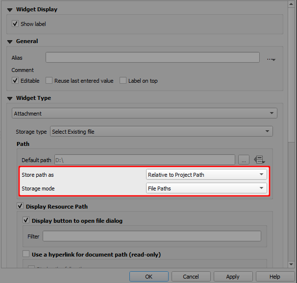

Here is an overview of paths that will be stored in various settings of the attachment widget. `path/to/project` represents the project home folder, where the project file is located. 

|        Default path       	|  Store path as 	|                Value               	|
|:-------------------------:	|:------------:	|:----------------------------------:	|
|             -             	| Relative to project path |              `image.jpg`             	|
|             -             	| Relative to default path |              `image.jpg`             	|
|      `@project_folder`      	| Relative to project path |              `image.jpg`             	|
|      `@project_folder`      	| Relative to default path |              `image.jpg`             	|
| `@project_home + '/photos'` 	| Relative to project path |          `/photos/image.jpg`         	|
| `@project_home + '/photos'` 	| Relative to default path |               `image.jpg`             	|

:::danger Avoid using absolute paths
Using *absolute paths* causes issues when working with your projects on different devices or working in a team: as each device or team member can use different paths, they may be unable to display the attachments.
:::

## How to set up a custom folder for storing photos
It can be useful to set up a custom folder for photos, e.g. if you want to use [selective synchronisation](../../manage/selective_sync/) or if you simply want to have your data organised.

To set up a custom folder:
1. Create a subfolder in the project folder (here: `photos`)
2. Open your project in QGIS
3. Open the **Properties** of the survey layer and navigate to the **Attributes form** tab. 
   Select the field, where photos are stored (here: `photo`) and make sure that the widget type is set to **Attachment**:
   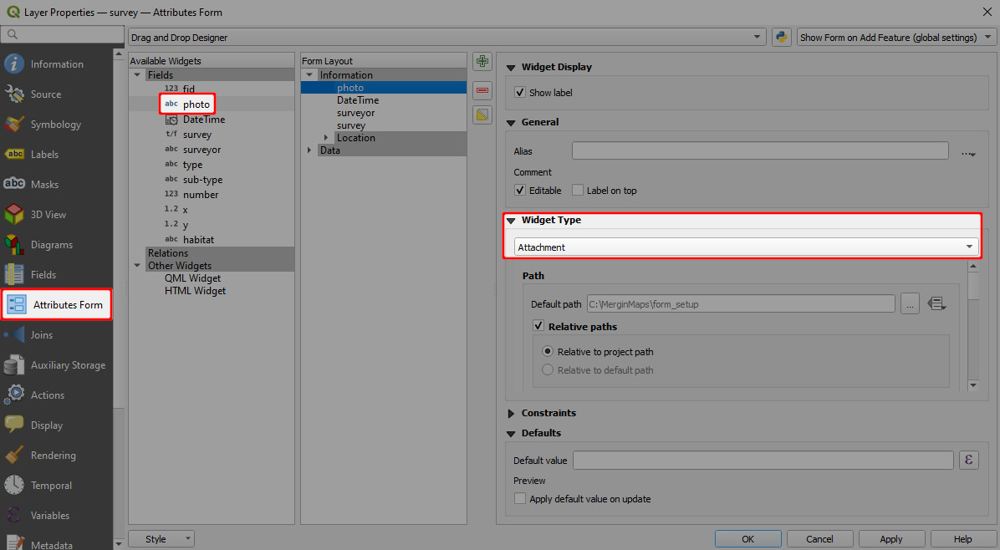
5. Now we need to change the **Default path** to the folder we have created. Click on the *Data defined override* icon and choose **Edit...**
   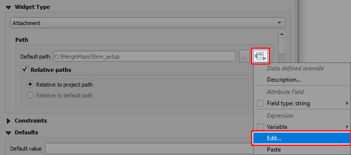

6. In **Expression String Builder** enter the expression `@project_folder + '/photos'` (replace `photos` by the name of your folder). Click **OK**.
   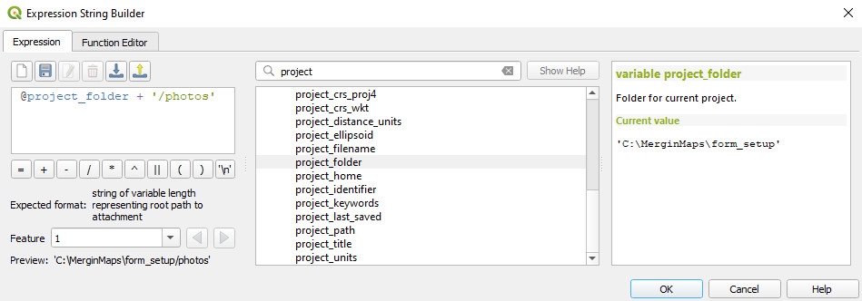

7. The **Default path** now refers to the custom folder.
   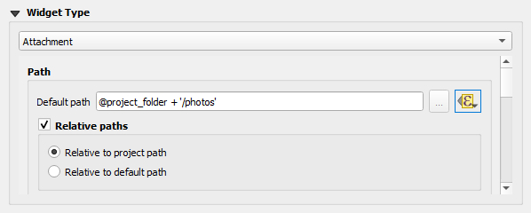

8. **Apply the changes**. Don't forget to save and sync your project!

## Resizing pictures automatically
Photos that are captured during the field survey or uploaded using <MobileAppName /> can be automatically resized, e.g. to save up storage space. The quality of the photos can be set up in the [<MainPlatformName /> project properties](../../gis/features/#photo-quality) using <QGISPluginName />.

## Customising photo name format with expressions
Photos taken in the field using <MobileAppName /> can be automatically renamed. This can be useful when browsing pictures in your <MainPlatformNameLink /> project and keeping them organised.

[**How to Set Photo Names Format**](../../gis/photo-names/) will guide you through the setup and provide examples of expressions that can be used to name your photos.

## Displaying photos in QGIS
Photos taken using <MobileAppName /> during the survey can be displayed in the feature's form in QGIS.

1. In QGIS, double click on a survey layer to open **Layer Properties**
2. In the **Attributes Form** tab, select the field that contains the path to the photo.

   Scroll to the **Integrated Document Viewer** in the panel on the right. Set the **Type** to *Image*.
   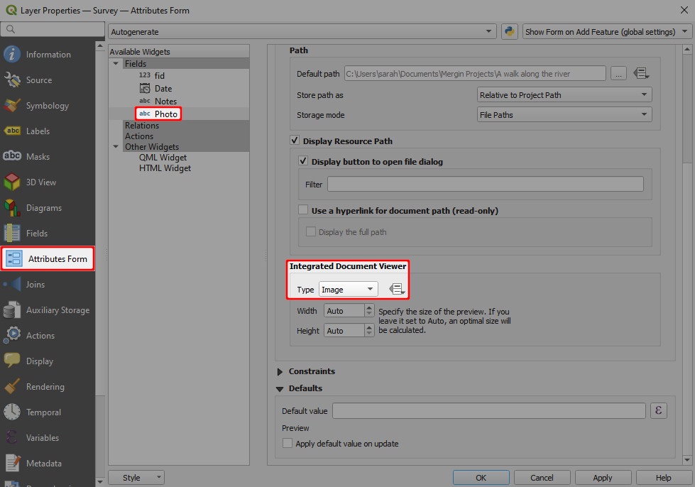

3. **Apply** the changes and click **OK**.

Now when you click on a feature that contains a photo, it will be displayed in the form.

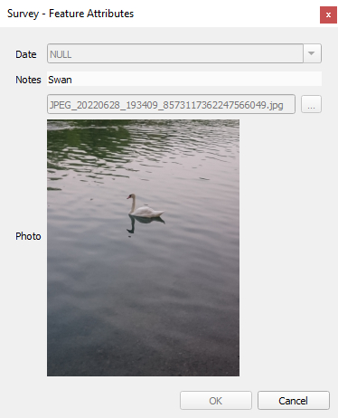

::: warning Image preview in QGIS 3.36+
QGIS may not display the preview of the image if you use QGIS 3.36 or higher. Despite this behaviour, the <MobileAppNameShort /> displays it correctly. Therefore we recommend trying the setup by opening the form in the <MobileAppNameShort /> to make sure it works as intended.
:::

## How to Attach Multiple Photos to Features


In some situations, it might be useful to take more than one picture of a feature during the field survey. Attaching multiple photos to one feature is a 1-N relation. You can read more about 1-N relations and how they can be used in <MainPlatformNameLink /> in [How to link multiple records to one feature](../one-to-n-relations/).

<YouTube id="NCa_Nb_CYno" />

:::tip Example project available
To see this setup in practice, you can download the following project: 
<MerginMapsProject id="documentation/forms_multiple_photos" />.
:::

To link multiple photos to a single feature, we need a **unique field** to link following tables:
- Survey layer containing spatial information
- A non-spatial table containing path to the photos (see [how to setup simple photo forms](../photos/))

:::danger WARNING
**Do not use the FID field to link these tables**. FIDs can be changed during synchronisation, which can result in having photos linked to the incorrect feature. You can learn more about synchronisation in [Behind Data Synchronisation](../../manage/synchronisation/#synchronisation). 
:::

To set 1:N relation between these tables correctly:
1. Create a new text field in the survey layer, here: `unique-id`
   
2. Use the `uuid()` as the **default value** for this field in **Layer Properties**. This function assigns a unique identifier to every created feature, even when different surveyors create features simultaneously.
   
3. Create a new text field in the non-spatial table (here: `photos`) that will be used to store the UUID of features from the survey layer (the foreign key), here: `external-pk`.

Now we need to configure a [1-N relation](../one-to-n-relations/):
4. From the main menu, select **Project** > **Properties ...**
5. In the **Relations** tab, select **Add Relation**
   

6. Define the parent and child layer and the fields to link these layers. Here:
   - **Name** is the name of the relation, can be left blank
   - **Referenced (parent)** is the spatial layer `Survey`
   - **Field 1** of the **Referenced (parent)** is the field `unique-id` that contains the UUID 
   - **Referencing (child)** is the non-spatial layer `photos`
   - **Field 1** of the **Referencing (child)** layer is the `external-pk` that contains the foreign key to link photos with surveyed features.
   

7. Navigate to the **Attributes Form** tab in the **Properties** of the `photos` layer. Set the **Widget Type** of the foreign key `external-pk` to **Relation Reference**:
   

The <MobileAppNameShort /> detects the type of 1-N relation and displays the image viewer for the relations. 


## Exif Metadata
[[toc]]

EXIF is a file format for storing metadata in image files, such as the camera settings, image metrics, date and time or location information (see, e.g., [Wikipedia](https://en.wikipedia.org/wiki/Exif)). 

The <MobileAppNameShort /> supports some default value expression functions that can be used to read EXIF metadata and store their values in the fields of your survey layer.

To store GPS EXIF metadata, both the <MobileAppNameShort /> and your camera app have [location permissions](#allowing-location-tags) allowed on your mobile device.

## Allowing location tags
**Location tags have to be allowed** in the camera settings to store GPS EXIF metadata in the photos.

- **Android**: Open Camera app -> Camera settings -> Location tags. 
   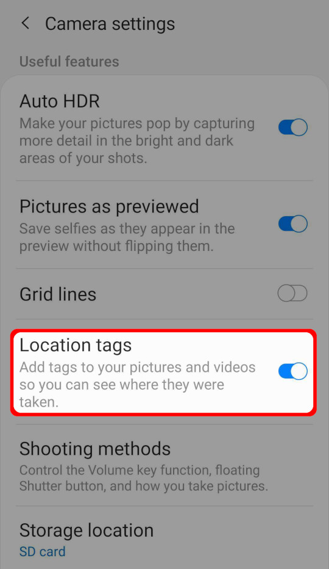

- **iOS**: Open Settings -> Privacy -> Location Services -> Camera (app).
   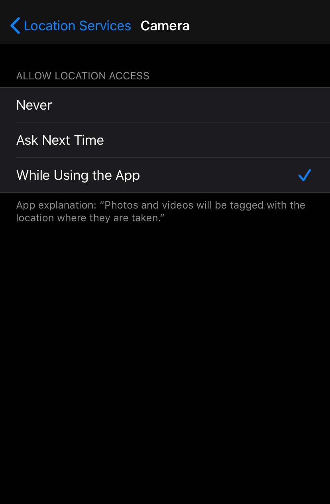

## How to use EXIF metadata in Mergin Maps mobile app

::: tip Example project available
Clone <MerginMapsProject id="documentation/exif-metadata" /> to see how it works!
:::

To store EXIF metadata values in the fields of your survey layer:
1. In QGIS, open the **Properties** of your survey layer and navigate to the **Attributes Form** tab.
2. Now we need to set the [default values](../form-configuration/#default-values) of fields that should store EXIF metadata. 
   
   [Supported EXIF functions](#supported-exif-functions) are listed below. In general, EXIF functions looks like this: 
   `read_exif('<ABSOLUTE_PATH_TO_IMAGE>', '<EXIF_TAG_STRING>')` 
   
   This expression requires the **absolute path** to an image. The absolute path can be defined using the field where the image is stored (here: `photo`, this is a [text field with attachment widget](../photos/)) and the `@project_home` variable that refers to the project home folder. 
   
   For example, the default value expression for the direction of the image (EXIF tag `GPSImgDirection`) can be defined as follows:
   
   `read_exif(@project_home + '/' + "photo", 'GPSImgDirection')`
      
   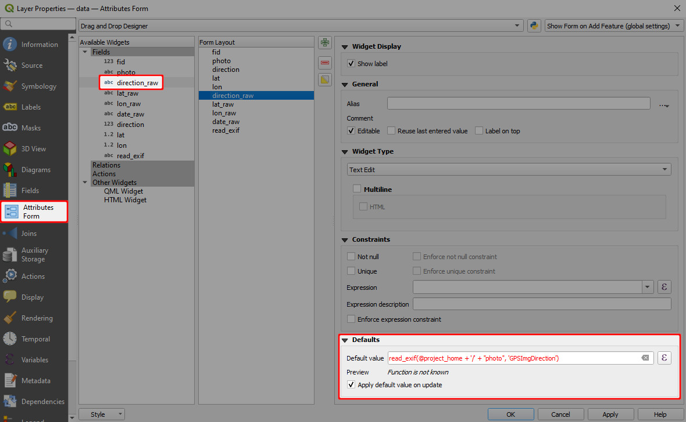
   
   The preview shows a warning *Function is not known*. **This is OK, <MobileAppName /> will know what to do with it!**

3. Save and sync your project. 

4. Open the project in <MobileAppName />. Once you capture a photo during the field survey, the EXIF metadata values will be automatically filled in:
   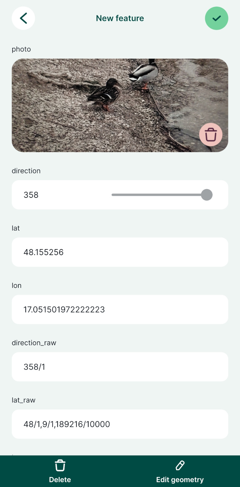

## Supported EXIF functions
EXIF function supported by <MobileAppName />:
- `read_exif_img_direction('<ABSOLUTE_PATH_TO_IMAGE>')` returns the direction of the image when captured. The direction is represented by a number.
- `read_exif_latitude('<ABSOLUTE_PATH_TO_IMAGE>')` returns GPS Latitude as a decimal number.
- `read_exif_longitude('<ABSOLUTE_PATH_TO_IMAGE>')` returns GPS Longitude as a decimal number.
- `read_exif('<ABSOLUTE_PATH_TO_IMAGE>', '<EXIF_TAG_STRING>')`, where **EXIF tag string** defines the EXIF property, such as:
   - `GPSImgDirection` returns the direction of the image when captured as a rational. The direction is represented by a rational, e.g. 350/1.
   - `GPSLatitude` returns GPS Latitude as rationals, e.g. 48/1, 6/1, 309275/10000.
   - `GPSLongitude` returns GPS Longitude as rationals, e.g. 17/1, 6/1, 244907/10000.
   - `ImageWidth` returns the image width in pixels.

The list of **EXIF tags** can be found in the Android developer documentation for [<NoSpellcheck id="ExifInterface" /> ](https://developer.android.com/reference/android/media/ExifInterface) or in [ExifTool documentation](https://exiftool.org/TagNames/EXIF.html). 

Note that some of the tag names listed in [ExifTool documentation](https://exiftool.org/TagNames/EXIF.html) can differ from the EXIF specification. As an example, while `ImageWidth` tag is valid, `ImageHeight` is not and you have to use `ImageLength` tag name (defined by EXIF specification) when [recording EXIF metadata](#how-to-use-exif-metadata-in-mergin-maps-mobile-app) in <MobileAppName />.

:::details
EXIF tags that can be retrieved from your images can vary depending on how they were created (e.g. what type of device you used to capture photos). EXIF tags that are recorded in your image can be displayed, e.g., using [ExifTool](https://exiftool.org/):
```
exiftool -n -S <PATH_TO_IMAGE>
```

However, keep in mind that the EXIF tag names that you get from ExifTool can differ from EXIF specification. To store EXIF metadata using <MainPlatformNameLink />, you have to use the latter.
:::

